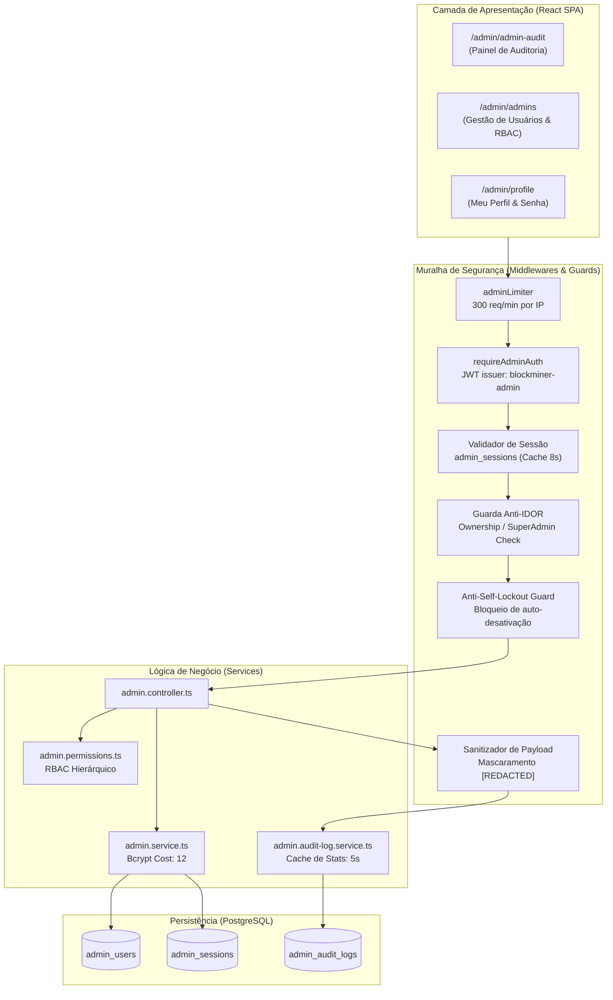

# Manual Técnico de Governança, Segurança e Auditoria Administrativa

**BlockMiner 2.1 — Sistema de Governança Administrativa**  
*Documentação Técnica Oficial de Arquitetura, Segurança e Auditoria*

---

## 1. Visão Geral da Arquitetura

O módulo administrativo (`server/modules/admin`) é o núcleo de controle e governança do BlockMiner. Ele gerencia o ciclo de vida dos administradores, sessões ativas, controle de acesso baseado em papéis (RBAC) e o registro imutável de todas as ações de impacto através do **Admin Audit Log**.

---

## 2. Controle de Acesso Baseado em Papéis (RBAC)

O sistema define papéis explícitos com princípio de menor privilégio:

| Papel | Descrição | Permissões Padrão |
|---|---|---|
| `super_admin` | Acesso total e irrestrito ao sistema | `["*"]` (Wildcard) |
| `admin` | Gestão operacional de usuários, mineradoras e economia | `["dashboard", "users", "miners", "inventory", "store", "payments", "withdrawals", "deposits", "support", "logs", "monitoring", "promotions", "events", "offerwall", "ptc", "shortlinks", "checkin", "mining", "tournaments", "banners", "config", "audit", "admins"]` |
| `moderator` | Moderação de usuários e chamados de suporte | `["dashboard", "users.view", "users.ban", "support", "logs.view"]` |
| `finance` | Operações financeiras, depósitos e saques | `["dashboard", "users.view", "payments", "withdrawals", "deposits"]` |
| `support` | Atendimento a jogadores e chamados | `["dashboard", "users.view", "support"]` |
| `readonly` | Visualização de métricas e dashboards | `["dashboard"]` |

### 2.1 Catálogo de Permissões Granulares (`AVAILABLE_PERMISSIONS`):
O sistema conta com 24 chaves de permissão distribuídas em 8 categorias funcionais:
- **Sistema:** `dashboard`, `logs`, `logs.view`, `monitoring`, `config`
- **Usuários:** `users`, `users.view`, `users.ban`
- **Financeiro:** `finance`, `payments`, `withdrawals`, `deposits`
- **Mineração:** `miners`, `mining`, `inventory`
- **Monetização:** `store`, `offerwall`, `ptc`, `shortlinks`
- **Engajamento:** `checkin`, `tournaments`
- **Suporte:** `support`
- **Administração:** `audit`, `admins`

### 2.2 Regras de Proteção de Super Administradores:
- **Proteção contra Rebaixamento Acidental:** O sistema rejeita o rebaixamento ou desativação do último `super_admin` ativo no banco de dados.
- **Proteção Anti-Self-Lockout:** Um administrador autenticado não pode desativar a própria conta (`id === ctx.adminId && isActive === false`) nem rebaixar seu próprio papel caso seja o único super admin ativo.
- **Isolamento de Criação:** Apenas usuários com papel `super_admin` podem criar novos administradores ou alterar privilégios existentes.

---

## 3. Ciclo de Vida de Autenticação e Sessões

1. **Hash de Senhas:** Utiliza **bcrypt com fator de custo 12** para todas as contas administrativas (superior ao fator de custo 10 dos usuários comuns), proporcionando tempo de cálculo de ~270ms, inviabilizando ataques de força bruta com GPUs.
2. **Requisitos de Senha Forte:** Mínimo de 12 caracteres contendo obrigatoriamente maiúsculas (`A-Z`), minúsculas (`a-z`), dígitos (`0-9`) e caracteres especiais (`!@#$%...`).
3. **Sessão Baseada em Banco de Dados (`admin_sessions`):**
   - Cada login bem-sucedido gera um registro exclusivo em `admin_sessions` com ID aleatório criptográfico (hex de 48 caracteres).
   - O identificador da sessão (`sessionId`) é embutido no JWT assinado com `issuer: "blockminer-admin"`.
   - Cookie seguro com flags: `HttpOnly`, `SameSite=None`, `Path=/`, `Secure`, `Partitioned`.
4. **Revogação Instantânea e Proteção IDOR:**
   - **Revogação Individual:** Administradores podem revogar qualquer sessão própria individualmente.
   - **Prevenção IDOR (Insecure Direct Object Reference):** Administradores comuns são bloqueados com `403 Forbidden` ao tentar revogar sessões de terceiros via `DELETE /api/admin/sessions/:sessionId`. Apenas `super_admin` pode revogar sessões de outros administradores.
   - **Revogação em Massa:** Ao redefinir a senha de um administrador, todas as sessões ativas anteriores dele são automaticamente invalidadas no banco de dados (`revokedAt = NOW()`).

---

## 4. Dicionário de Eventos de Auditoria (`admin_audit_logs`)

Todas as operações administrativas geram registros imutáveis na tabela `admin_audit_logs`.

| Ação | Módulo | Descrição | Dados Registrados |
|---|---|---|---|
| `ADMIN_LOGIN_SUCCESS` | `auth` | Autenticação bem-sucedida de administrador | IP, User-Agent, AdminId, SessionId |
| `ADMIN_LOGIN_FAILURE` | `auth` | Tentativa de login rejeitada | IP, User-Agent, Email tentado, Erro (`WRONG_PASSWORD`, etc.) |
| `ADMIN_LOGOUT` | `auth` | Encerramento de sessão administrativa | AdminId, SessionId, IP |
| `ADMIN_CREATE` | `admins` | Criação de novo administrador | `newValue`: Nome, Email, Role |
| `ADMIN_UPDATE` | `admins` | Atualização de papel ou status de admin | `oldValue` vs `newValue` (Nome, Role, IsActive) |
| `ADMIN_PASSWORD_RESET` | `admins` | Redefinição de senha de administrador | AdminId do alvo (sem vazamento de senha) |
| `ADMIN_PROFILE_UPDATE` | `admins` | Atualização de perfil próprio | Nome alterado |
| `ADMIN_CHANGE_OWN_PASSWORD` | `admins` | Alteração de senha pelo próprio admin | AdminId |
| `ADMIN_SESSION_REVOKE` | `admins` | Revogação de sessão específica | SessionId, TargetAdminId |
| `ADMIN_SESSIONS_REVOKE_OTHER` | `admins` | Revogação de todas as outras sessões | Contagem de sessões revogadas |
| `ADMIN_SESSIONS_REVOKE_ALL` | `admins` | Revogação forçada de todas as sessões de um admin | Contagem de sessões revogadas |
| `ADMIN_GRANT_MINER` | `users` | Concessão manual de mineradora a jogador | `minerId`, `quantity`, `minerName` |
| `ADMIN_UNLOCK_ACCOUNT` | `users` | Desbloqueio manual de conta de usuário | `rowsDeleted` |
| `ADMIN_MINER_CREATE` | `miners` | Criação de máquina no catálogo | Dados da máquina criada |
| `ADMIN_MINER_UPDATE` | `miners` | Modificação de máquina no catálogo | `oldValue` vs `newValue` |

---

## 5. Blindagem e Segurança Defensiva (OWASP)

### 5.1 Sanitização Automática de Dados (`sanitizeAuditPayload`)
O serviço de auditoria possui um interceptor recursivo que analisa todos os payloads (`oldValue` e `newValue`) antes de persistir no banco. Chaves contendo termos confidenciais como:
- `password`, `userPassword`, `newPassword`, `passwordHash`
- `token`, `jwt`, `secret`, `apiKey`
- `privateKey`, `mnemonic`, `seed`
- `creditCard`, `cvv`

São automaticamente substituídas pelo valor `[REDACTED]`. Isso elimina o risco de vazamento de credenciais na visualização do histórico.

### 5.2 Defesa contra IDOR e Escalonamento de Privilégios
- Endpoints de alteração de papéis, reset de senha e criação de contas exigem rigorosamente `isSuperAdmin(req)`.
- Endpoint de revogação de sessão individual (`DELETE /api/admin/sessions/:sessionId`) valida se `session.adminId === req.admin.adminId` antes de proceder, bloqueando tentativas de administradores secundários revogarem sessões de super admins.

### 5.3 Truncamento Seguro de Entradas
Para evitar ataques de negação de serviço por estouro de payload (Buffer Overflow / Memory Bloat):
- `name`: Entre 2 e 100 caracteres.
- `email`: Máximo 150 caracteres com validação regex RFC 5322.
- `action`: Máximo 100 caracteres.
- `module`: Máximo 50 caracteres.
- `resource`: Máximo 100 caracteres.
- `ipAddress`: Máximo 64 caracteres.
- `userAgent`: Máximo 500 caracteres.
- `errorMsg`: Máximo 500 caracteres.

### 5.4 Cache de Agregação de Alta Performance
O endpoint `GET /api/admin/admin-audit/stats` processa múltiplos `COUNT` e `GROUP BY`. Para proteger o banco PostgreSQL contra exaustão de conexões durante o uso do **Auto-refresh (10s)** na interface, os resultados são cacheados em memória por **5 segundos**.

---

## 6. Métricas de Performance & Benchmarks de Carga

Resultados dos benchmarks automatizados (`tests/perf/*.bench.mjs`):
- **Avaliação de Permissões RBAC (`hasPermission`):** > 8.400.000 ops/seg (300.000 verificações em ~35ms).
- **Validação de Política de Senhas Fortes (`isStrongPassword`):** > 7.200.000 ops/seg (50.000 verificações em ~6.8ms).
- **Serialização de Linhas de Auditoria (`serializeAuditRow`):** > 4.000.000 ops/seg (10.000 registros em ~2.4ms).
- **Sanitização Recursiva de Payloads (`sanitizeAuditPayload`):** > 240.000 ops/seg (10.000 payloads em ~40ms).
- **Tempo de Hashing Bcrypt (Cost 12):** ~278ms por hash (tempo ideal de proteção contra GPUs).

---

## 7. Catálogo de Endpoints da API

Todas as rotas exigem cabeçalho de autenticação ou cookie `blockminer_admin_session`.

### Gestão de Administradores (Restrito a `super_admin`):
- `GET /api/admin/admins` — Lista todos os administradores com contadores agregados de sessões ativas (`activeSessionsCount`) e auditorias (`auditCount`).
- `POST /api/admin/admins` — Cadastra novo administrador com validação RFC de e-mail, senha forte e permissões granulares.
- `PATCH /api/admin/admins/:id` — Atualiza nome, papel, permissões ou status ativo/inativo (com salvaguarda anti-self-lockout).
- `POST /api/admin/admins/:id/reset-password` — Gera e redefine a senha do admin alvo, revogando todas as suas sessões anteriores.
- `GET /api/admin/admins/:id/sessions` — Lista sessões ativas do admin especificado com detalhes de IP, dispositivo e validade.
- `DELETE /api/admin/admins/:id/sessions` — Revoga todas as sessões do admin especificado.

### Gestão de Sessões & Perfil:
- `GET /api/admin/profile` — Carrega dados da conta logada.
- `PATCH /api/admin/profile` — Altera nome da conta logada.
- `POST /api/admin/change-password` — Altera a própria senha (valida senha atual e complexidade da nova).
- `GET /api/admin/sessions` — Lista sessões da conta logada.
- `DELETE /api/admin/sessions/other` — Revoga todas as outras sessões abertas.
- `DELETE /api/admin/sessions/:sessionId` — Revoga uma sessão específica (com proteção anti-IDOR).
- `GET /api/admin/my-audit` — Histórico de ações exclusivas do admin autenticado.

### Gestão de Auditoria:
- `GET /api/admin/admin-audit` — Consulta paginada com múltiplos filtros (`page`, `pageSize`, `adminId`, `action`, `module`, `search`, `success`, `from`, `to`).
- `GET /api/admin/admin-audit/stats` — Agregados em tempo real (total de eventos, taxa de sucesso, top módulos e distribuição por papel) com cache TTL de 5s.
