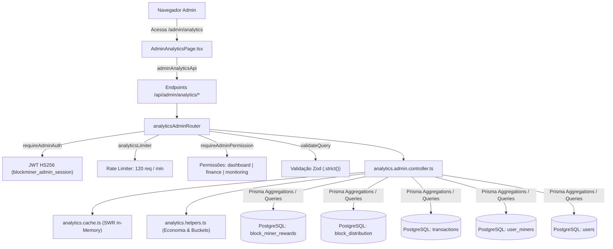

# Documentação Técnica: Analytics e Economia Administrativa (`/admin/analytics`)

## 1. Visão Geral e Arquitetura do Domínio

O módulo administrativo de Analytics (`/admin/analytics`) centraliza a inteligência financeira, o balanço de custódia e a auditoria econômica da plataforma BlockMiner. Ele monitora a emissão monetária simulada de blocos de mineração, a relação entre depósitos externos e saques efetuados, a taxa de inflação líquida e as projeções de retorno de hashrate (teóricas e empíricas), tanto a nível global da rede quanto granular por jogador.

### Componentes Principais

- **Roteador Administrativo (`analytics.admin.routes.ts`):**
  - Montado em `/api/admin`.
  - Protegido por autenticação administrativa (`requireAdminAuth`), rate limiting distribuído (`analyticsLimiter`, 120 req/min) e matriz de controle de acesso RBAC com guarda de permissões (`dashboard`, `finance`, `monitoring`).
- **Validação de Entrada com Zod (`analytics.schemas.ts`):**
  - Esquemas estritos (`.strict()`) contra mass assignment: `analyticsQuerySchema` e `executiveQuerySchema`.
  - Normalização segura de parâmetros de período (`day`, `week`, `month`, `year`, `all`) e conversão estrita de `userId` para inteiros positivos de 32 bits (1 a 2.147.483.647).
- **Cache Stale-While-Revalidate (`analytics.cache.ts`):**
  - Cache em memória com deduplicação de requisições concorrentes (`inFlight` promises).
  - Janelas diferenciadas de TTL: 45 segundos para consultas dinâmicas de período e 300 segundos (5 minutos) para agregações massivas all-time (25M+ linhas em `block_miner_rewards`).
- **Helper Centralizado de Economia e Datas (`analytics.helpers.ts`):**
  - `getMiningEconomySnapshot()`: obtém os parâmetros do motor de mineração (`rewardBase`, `blockDurationMs`, blocos/dia) e a cotação POL/USD em tempo real.
  - `resolveAnalyticsPeriod()` / `buildBuckets()`: compila buckets temporais idênticos em todas as abas.
  - `bucketKeyFor()`: formatação determinística de chaves temporais (`hour`, `day`, `month`).
- **Controlador Administrativo (`analytics.admin.controller.ts`):**
  - Agregações com tipagem estrita TypeScript, sem `@ts-nocheck` e sem `any`.
  - Consultas parametrizadas com `Prisma.sql` eliminando riscos de SQL Injection.
- **Cliente e DTOs Frontend (`adminAnalytics.types.ts` / `adminAnalytics.api.ts`):**
  - Contratos 1:1 rigorosamente tipados com o servidor.
  - Funções de API dedicadas com carregamento progressivo sob demanda por aba.
- **Interface Intuitiva (`AdminAnalyticsPage.tsx` / `adminAnalytics.tabs.tsx`):**
  - Layout ergonômico com pílula de cotação POL em tempo real e hashrate global.
  - Seletor rápido de períodos (24H, 7D, 30D, 12M, Tudo).
  - Campo de busca e filtro de usuário com chip destacável.
  - 6 abas temáticas com carregamento progressivo assíncrono.

---

### Diagrama de Fluxo Arquitetural



---

## 2. Modelos de Dados (Prisma) Envolvidos

O módulo de analytics consolida dados das seguintes tabelas principais do banco de dados:

```prisma
model User {
  id             Int       @id @default(autoincrement())
  username       String    @unique
  email          String    @unique
  polBalance     Decimal   @default(0) @map("pol_balance")
  isBanned       Boolean   @default(false) @map("is_banned")
  lastLoginAt    DateTime? @map("last_login_at")
  createdAt      DateTime  @default(now()) @map("created_at")
}

model BlockDistribution {
  id             Int       @id @default(autoincrement())
  blockNumber    BigInt    @unique @map("block_number")
  reward         Decimal   @map("reward")
  createdAt      DateTime  @default(now()) @map("created_at")
}

model BlockMinerReward {
  id             BigInt    @id @default(autoincrement())
  userId         Int       @map("user_id")
  blockId        Int       @map("block_id")
  rewardAmount   Decimal   @map("reward_amount")
  percentage     Decimal   @map("percentage")
  createdAt      DateTime  @default(now()) @map("created_at")
}

model Transaction {
  id             Int       @id @default(autoincrement())
  userId         Int       @map("user_id")
  type           String    // "deposit", "withdrawal", "admin_credit", etc.
  status         String    // "pending", "approved", "completed", "failed", "rejected"
  amount         Decimal
  txHash         String?   @map("tx_hash")
  createdAt      DateTime  @default(now()) @map("created_at")
  completedAt    DateTime? @map("completed_at")
}

model UserMiner {
  id             Int       @id @default(autoincrement())
  userId         Int       @map("user_id")
  hashRate       Decimal   @map("hash_rate")
  isActive       Boolean   @default(true) @map("is_active")
}
```

---

## 3. Especificação OpenAPI 3.0.0

```yaml
openapi: 3.0.0
info:
  title: BlockMiner 2.1 — Admin Analytics API
  version: 1.0.0
  description: Endpoints analíticos administrativos para métricas de mineração, emissão, depósitos, saques e projeções financeiras.

paths:
  /api/admin/stats:
    get:
      summary: Consulta as métricas de destaque da plataforma
      tags:
        - Admin Analytics
      security:
        - AdminSessionCookie: []
      responses:
        '200':
          description: Estatísticas gerais carregadas com sucesso
        '401':
          description: Administrador não autenticado
        '403':
          description: Permissão insuficiente

  /api/admin/analytics/executive:
    get:
      summary: Consulta KPIs executivos e balanço consolidado de custódia
      tags:
        - Admin Analytics
      security:
        - AdminSessionCookie: []
      parameters:
        - in: query
          name: period
          schema:
            type: string
            enum: [day, week, month, year, all]
            default: month
          description: Período de cálculo
      responses:
        '200':
          description: Resumo executivo retornado com sucesso
        '400':
          description: Parâmetro inválido

  /api/admin/analytics:
    get:
      summary: Consulta a visão geral de emissão e ranking de usuários
      tags:
        - Admin Analytics
      security:
        - AdminSessionCookie: []
      parameters:
        - in: query
          name: period
          schema:
            type: string
            enum: [day, week, month, year, all]
            default: month
        - in: query
          name: userId
          schema:
            type: integer
            minimum: 1
          description: Filtro opcional por jogador
      responses:
        '200':
          description: Dados de visão geral

  /api/admin/analytics/inflation:
    get:
      summary: Consulta emissão vs saques e curva cumulativa de suprimento líquido
      tags:
        - Admin Analytics
      security:
        - AdminSessionCookie: []
      parameters:
        - in: query
          name: period
          schema:
            type: string
            enum: [day, week, month, year, all]
            default: month
      responses:
        '200':
          description: Série de inflação e suprimento líquido

  /api/admin/analytics/projections:
    get:
      summary: Consulta previsões teóricas e empíricas de rendimento
      tags:
        - Admin Analytics
      security:
        - AdminSessionCookie: []
      parameters:
        - in: query
          name: period
          schema:
            type: string
            enum: [day, week, month, year, all]
            default: month
        - in: query
          name: userId
          schema:
            type: integer
            minimum: 1
      responses:
        '200':
          description: Projeções calculadas

  /api/admin/analytics/withdrawals:
    get:
      summary: Consulta métricas estatísticas e série de saques
      tags:
        - Admin Analytics
      security:
        - AdminSessionCookie: []
      parameters:
        - in: query
          name: period
          schema:
            type: string
            enum: [day, week, month, year, all]
            default: month
        - in: query
          name: userId
          schema:
            type: integer
            minimum: 1
      responses:
        '200':
          description: Estatísticas de saques (média, mediana, p90, p99, tempo até completar)

  /api/admin/analytics/distribution:
    get:
      summary: Consulta o detalhamento de entradas de recompensas por fonte
      tags:
        - Admin Analytics
      security:
        - AdminSessionCookie: []
      parameters:
        - in: query
          name: period
          schema:
            type: string
            enum: [day, week, month, year, all]
            default: month
        - in: query
          name: userId
          schema:
            type: integer
            minimum: 1
      responses:
        '200':
          description: Distribuição por fonte e eficiência de mineração
```

---

## 4. Variáveis de Ambiente Relevantes

| Variável | Padrão | Descrição |
|---|---|---|
| `ADMIN_ANALYTICS_CACHE_TTL_MS` | `45000` (45s) | Tempo de vida do cache SWR para consultas dinâmicas de período. |
| `ADMIN_ANALYTICS_ALLTIME_CACHE_TTL_MS` | `300000` (5 min) | Tempo de vida do cache para agregações históricas all-time. |
| `SITE_LAUNCH_DATE` | `2026-03-05` | Data de lançamento oficial usada no cálculo de eficiência teórica. |
| `POLYGON_RPC_URL` | Rede pública Polygon | Endpoint RPC para cotações e verificação de carteiras. |

---

## 5. Como Executar e Validar Localmente

```bash
# 1. Checagem de tipos estática
npm run typecheck
npm run --prefix client typecheck

# 2. Linter do frontend
npm run --prefix client lint

# 3. Execução dos testes automatizados do módulo
npx tsx --import ./tests/_env-test-overrides.mjs --test tests/analytics/*.test.mjs

# 4. Build de produção do cliente
npm run --prefix client build
```
