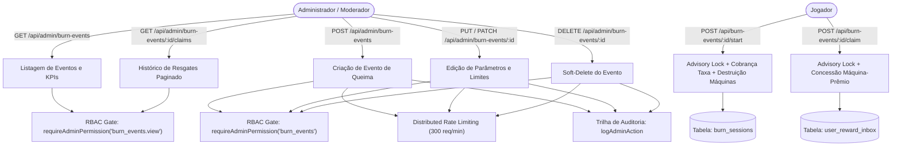

# Documentação Técnica: Gestão de Eventos de Queima (`/admin/burn-events` e `/api/admin/burn-events`)

## 1. Visão Geral e Arquitetura do Domínio

O módulo de **Eventos de Queima (Burn Events)** gerencia o mecanismo deflacionário de destruição de equipamentos e reciclagem de poder de mineração no ecossistema BlockMiner:
- **Destruição Irreversível de Máquinas**:
  - Para obter uma máquina de maior tier/potência, o jogador seleciona máquinas antigas de sua fazenda que somem pelo menos o hashrate exigido (`requiredHashRate`).
  - Ao iniciar a queima (`POST /api/burn-events/:id/start`), as máquinas selecionadas são **destruídas imediatamente no banco de dados** dentro da transação (`user_owned_machines`, `user_miners`, `user_inventory`, `user_vault`).
- **Cobrança Atômica de Taxa de Queima**:
  - O jogador escolhe pagar a taxa do evento em uma de três moedas aceitas:
    - **SHIB**: 20 SHIB
    - **POL**: 0.01 POL
    - **BLK**: 0.001 BLK
- **Prevenção de Race Conditions e Concorrência**:
  - Utilização de lock consultivo no PostgreSQL: `SELECT pg_advisory_xact_lock(${userId}::int, ${eventId}::int)`.
  - Impede que requisições paralelas do mesmo jogador iniciem duas sessões simultâneas ou reutilizem as mesmas máquinas.
- **Sessão e Timer de Conclusão (`burn_sessions`)**:
  - Criada uma sessão temporizada com duração configurável (`BURN_PROCESS_DURATION_SECONDS`, padrão: 900s / 15 min).
  - Após o término do timer, o jogador resgata o prêmio (`POST /api/burn-events/:id/claim`), que é entregue de forma garantida na caixa de entrada de recompensas (`user_reward_inbox`).
- **Gestão Administrativa (`/admin/burn-events`)**:
  - Painel com cards de KPI em tempo real (Total de Eventos, Ativos, Resgates Realizados e Máquinas Disponíveis).
  - Modal completo de criação e edição (`BurnEventFormModal`) com seleção de máquina-prêmio do catálogo, hashrate exigido, limites por jogador e estoque global.
  - Modal de auditoria e inspeção de resgates (`BurnEventClaimsModal`) para visualização de cada claim com data, jogador e hashrate queimado.
  - Exclusão suave (`deletedAt`) com confirmação inline não bloqueante.



---

## 2. Modelo de Dados Prisma

```prisma
model BurnEvent {
  id                Int       @id @default(autoincrement())
  title             String
  description       String?
  imageUrl          String?   @map("image_url")
  requiredHashRate  Float     @map("required_hash_rate")
  rewardMinerId     Int       @map("reward_miner_id")
  claimLimitPerUser Int       @default(10) @map("claim_limit_per_user")
  stockTotal        Int?      @map("stock_total")
  stockClaimed      Int       @default(0) @map("stock_claimed")
  startsAt          DateTime? @map("starts_at")
  endsAt            DateTime? @map("ends_at")
  isActive          Boolean   @default(true) @map("is_active")
  deletedAt         DateTime? @map("deleted_at")
  createdAt         DateTime  @default(now()) @map("created_at")
  updatedAt         DateTime  @updatedAt @map("updated_at")

  rewardMiner Miner       @relation(fields: [rewardMinerId], references: [id], onDelete: Restrict)
  claims      BurnClaim[]

  @@index([isActive, deletedAt])
  @@map("burn_events")
}

model BurnClaim {
  id                 Int      @id @default(autoincrement())
  eventId            Int      @map("event_id")
  userId             Int      @map("user_id")
  totalHashRate      Float    @map("total_hash_rate")
  burnedMachinesJson Json     @map("burned_machines_json")
  rewardMinerName    String   @map("reward_miner_name")
  rewardInboxId      Int?     @map("reward_inbox_id")
  claimedAt          DateTime @default(now()) @map("claimed_at")

  event BurnEvent @relation(fields: [eventId], references: [id], onDelete: Cascade)
  user  User      @relation(fields: [userId], references: [id], onDelete: Cascade)

  @@index([eventId, userId])
  @@index([userId])
  @@map("burn_claims")
}
```

---

## 3. Segurança e Governança

1. **RBAC Granular**:
   - `burn_events.view`: Permissão concedida a moderadores e administradores para visualização de eventos e histórico de claims.
   - `burn_events`: Permissão exclusiva de administradores para criar, editar, alterar status e excluir eventos.
2. **Rate Limiting Distribuído (Redis)**:
   - `burn_events_admin_read`: 120 requisições/minuto.
   - `burn_events_admin_write`: 300 requisições/minuto.
3. **Auditoria Administrativa Total (`logAdminAction`)**:
   - Todas as operações (`ADMIN_BURN_EVENT_CREATE`, `ADMIN_BURN_EVENT_UPDATE`, `ADMIN_BURN_EVENT_DELETE`) gravam autor, IDs, valores anteriores e novos em `admin_audit_logs`.
4. **Validação Estrita com Zod**:
   - Hashrate exigido estritamente positivo (`requiredHashRate > 0`).
   - Clamping numérico de IDs (`id > 0` e inteiro seguro).
   - Bloqueio de Mass Assignment via `.strict()`.

---

## 4. Especificação OpenAPI 3.0.3

```yaml
openapi: 3.0.3
info:
  title: BlockMiner Admin Burn Events API
  version: 1.0.0
  description: API administrativa para gestão de eventos de queima de equipamentos e histórico de claims.
paths:
  /api/admin/burn-events:
    get:
      summary: Listar todos os eventos de queima
      description: Retorna a lista de eventos de queima com contador de resgates e dados da máquina-prêmio.
      responses:
        '200':
          description: Lista de eventos de queima
          content:
            application/json:
              schema:
                type: object
                properties:
                  ok:
                    type: boolean
                  events:
                    type: array
                    items:
                      $ref: '#/components/schemas/BurnEvent'
        '401':
          $ref: '#/components/responses/Unauthorized'
        '403':
          $ref: '#/components/responses/Forbidden'
    post:
      summary: Criar novo evento de queima
      requestBody:
        required: true
        content:
          application/json:
            schema:
              $ref: '#/components/schemas/AdminCreateBurnEventInput'
      responses:
        '200':
          description: Evento de queima criado com sucesso
        '400':
          $ref: '#/components/responses/BadRequest'

  /api/admin/burn-events/{id}:
    put:
      summary: Atualizar evento de queima (PUT)
      parameters:
        - in: path
          name: id
          required: true
          schema:
            type: integer
      requestBody:
        required: true
        content:
          application/json:
            schema:
              $ref: '#/components/schemas/AdminUpdateBurnEventInput'
      responses:
        '200':
          description: Evento atualizado com sucesso
        '400':
          $ref: '#/components/responses/BadRequest'
        '404':
          description: Evento não encontrado
    patch:
      summary: Atualizar evento de queima (PATCH)
      parameters:
        - in: path
          name: id
          required: true
          schema:
            type: integer
      requestBody:
        required: true
        content:
          application/json:
            schema:
              $ref: '#/components/schemas/AdminUpdateBurnEventInput'
      responses:
        '200':
          description: Evento atualizado com sucesso
    delete:
      summary: Remover evento de queima (Soft-delete)
      parameters:
        - in: path
          name: id
          required: true
          schema:
            type: integer
      responses:
        '200':
          description: Evento removido com sucesso
        '404':
          description: Evento não encontrado

  /api/admin/burn-events/{id}/claims:
    get:
      summary: Listar histórico de resgates/claims de um evento
      parameters:
        - in: path
          name: id
          required: true
          schema:
            type: integer
        - in: query
          name: page
          schema:
            type: integer
            default: 1
      responses:
        '200':
          description: Lista paginada de claims
          content:
            application/json:
              schema:
                type: object
                properties:
                  ok:
                    type: boolean
                  claims:
                    type: array
                    items:
                      $ref: '#/components/schemas/BurnClaim'
                  total:
                    type: integer
                  page:
                    type: integer
                  limit:
                    type: integer

components:
  schemas:
    BurnEvent:
      type: object
      properties:
        id:
          type: integer
        title:
          type: string
        description:
          type: string
          nullable: true
        imageUrl:
          type: string
          nullable: true
        requiredHashRate:
          type: number
        rewardMinerId:
          type: integer
        claimLimitPerUser:
          type: integer
        stockTotal:
          type: integer
          nullable: true
        stockClaimed:
          type: integer
        startsAt:
          type: string
          nullable: true
        endsAt:
          type: string
          nullable: true
        isActive:
          type: boolean
        rewardMiner:
          type: object
          properties:
            id:
              type: integer
            name:
              type: string
            baseHashRate:
              type: number
            imageUrl:
              type: string
              nullable: true
        _count:
          type: object
          properties:
            claims:
              type: integer

    AdminCreateBurnEventInput:
      type: object
      required: [title, requiredHashRate, rewardMinerId]
      properties:
        title:
          type: string
        description:
          type: string
          nullable: true
        imageUrl:
          type: string
          nullable: true
        requiredHashRate:
          type: number
        rewardMinerId:
          type: integer
        claimLimitPerUser:
          type: integer
          default: 10
        stockTotal:
          type: integer
          nullable: true
        startsAt:
          type: string
          nullable: true
        endsAt:
          type: string
          nullable: true
        isActive:
          type: boolean
          default: true

    AdminUpdateBurnEventInput:
      type: object
      properties:
        title:
          type: string
        description:
          type: string
          nullable: true
        imageUrl:
          type: string
          nullable: true
        requiredHashRate:
          type: number
        rewardMinerId:
          type: integer
        claimLimitPerUser:
          type: integer
        stockTotal:
          type: integer
          nullable: true
        startsAt:
          type: string
          nullable: true
        endsAt:
          type: string
          nullable: true
        isActive:
          type: boolean

    BurnClaim:
      type: object
      properties:
        id:
          type: integer
        eventId:
          type: integer
        userId:
          type: integer
        totalHashRate:
          type: number
        rewardMinerName:
          type: string
        claimedAt:
          type: string

  responses:
    Unauthorized:
      description: Sessão administrativa inválida ou ausente
      content:
        application/json:
          schema:
            type: object
            properties:
              ok:
                type: boolean
                example: false
              message:
                type: string
    Forbidden:
      description: Permissão RBAC insuficiente
      content:
        application/json:
          schema:
            type: object
            properties:
              ok:
                type: boolean
                example: false
              code:
                type: string
                example: FORBIDDEN_PERMISSION
              message:
                type: string
    BadRequest:
      description: Payload inválido de acordo com o schema Zod
      content:
        application/json:
          schema:
            type: object
            properties:
              ok:
                type: boolean
                example: false
              message:
                type: string
