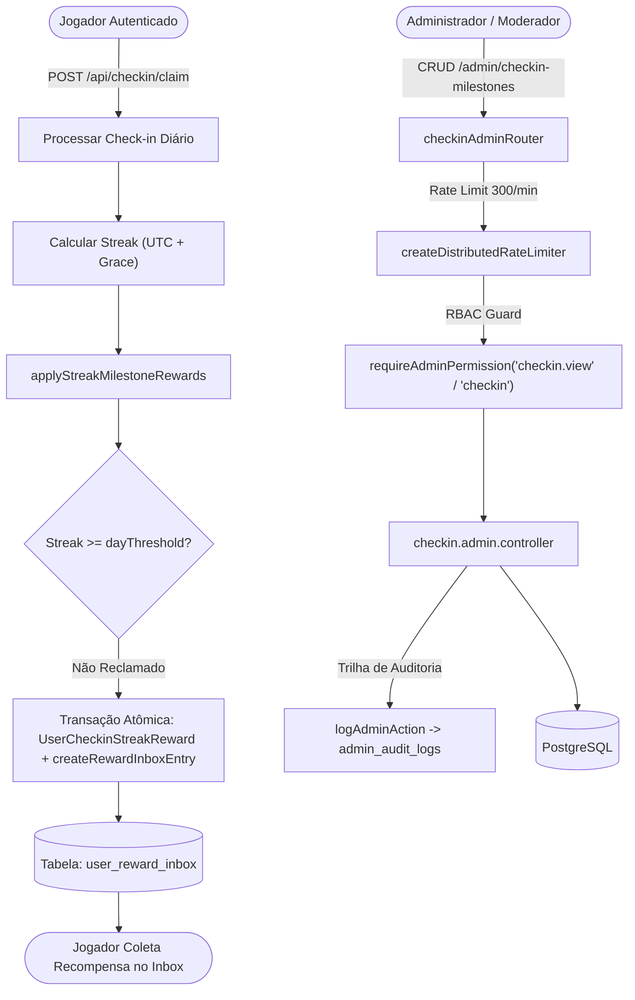

# Documentação Técnica: Marcos de Check-in & Sequência Diária (`/checkin` e `/admin/checkin-milestones`)

## 1. Visão Geral e Arquitetura do Domínio

O módulo **Check-in & Check-in Milestones** é o mecanismo central de retenção, engajamento e fidelização diária de jogadores do BlockMiner:
- **Sequência Diária (`streak`)**: Jogadores realizam check-in a cada 24 horas (balde UTC 00:00). A sequência de dias consecutivos é calculada dinamicamente (`computeCheckinStreak`) ou persistida, permitindo continuidade de streak com mecanismos de tolerância como **Grace Period** e **Streak Freeze**.
- **Marcos de Streak (`CheckinStreakMilestone`)**: Metas de dias contínuos (ex: 1, 3, 7, 14, 30, 60, 90, 100, 180 dias) que concedem recompensas especiais ao serem atingidas.
- **Tipos de Recompensa Suportados**:
  1. **POL (`pol`)**: Crédito de saldo em Polygon (POL), entregue de forma atômica no Reward Inbox do jogador.
  2. **Poder Temporário (`temporary_power`)**: Bônus de hashrate temporário (H/s) com validade em dias e duração em horas (`durationHours`), ativado após resgate no inbox.
  3. **Máquina do Catálogo (`machine`)**: Equipamento de mineração real vinculado ao catálogo (`minerId`), concedido diretamente no inventário do jogador com snapshot de poder.
- **Idempotência de Resgate**: A tabela `user_checkin_streak_rewards` possui restrição única em `[userId, milestoneId]`. Um jogador nunca recebe a mesma recompensa de marco mais de uma vez.
- **Scanner de Anomalias de Streak (`/api/admin/checkin-streak-anomalies`)**: Monitor operacional que escaneia e alerta sobre discrepâncias matemáticas de sequência, saltos incoerentes ou quebras de grace window.



---

## 2. Modelo de Dados Prisma

```prisma
model DailyCheckin {
  id            Int       @id @default(autoincrement())
  userId        Int       @map("user_id")
  checkinDate   String    @map("checkin_date") // YYYY-MM-DD (UTC)
  createdAt     DateTime  @default(now()) @map("created_at")
  confirmedAt   DateTime? @map("confirmed_at")
  txHash        String    @unique @map("tx_hash")
  status        String    @default("pending")
  amount        Float     @default(0.01)
  chainId       Int       @map("chain_id")
  paymentMethod String    @default("wallet") @map("payment_method")
  streak        Int       @default(0) @map("streak")
  usedGrace     Boolean   @default(false) @map("used_grace")
  usedFreeze    Boolean   @default(false) @map("used_freeze")

  user User @relation(fields: [userId], references: [id])

  @@unique([userId, checkinDate])
  @@map("daily_checkins")
}

model CheckinStreakMilestone {
  id           Int      @id @default(autoincrement())
  dayThreshold Int      @map("day_threshold")
  rewardType   String   @map("reward_type") // 'pol' | 'temporary_power' | 'machine'
  rewardValue  Decimal  @default(0) @map("reward_value") @db.Decimal(20, 8)
  validityDays Int      @default(7) @map("validity_days")
  displayTitle String?  @map("display_title")
  description  String?  @db.Text
  active       Boolean  @default(true)
  sortOrder    Int      @default(0) @map("sort_order")
  minerId      Int?     @map("miner_id")
  itemCode     String?  @map("item_code")
  metadataJson Json?    @map("metadata_json") // { durationHours?: number }
  createdAt    DateTime @default(now()) @map("created_at")
  updatedAt    DateTime @updatedAt @map("updated_at")

  miner  Miner?                    @relation(fields: [minerId], references: [id], onDelete: SetNull)
  claims UserCheckinStreakReward[]

  @@unique([dayThreshold])
  @@map("checkin_streak_milestones")
}

model UserCheckinStreakReward {
  id                Int      @id @default(autoincrement())
  userId            Int      @map("user_id")
  milestoneId       Int      @map("milestone_id")
  streakWhenClaimed Int      @map("streak_when_claimed")
  createdAt         DateTime @default(now()) @map("created_at")

  user      User                   @relation(fields: [userId], references: [id], onDelete: Cascade)
  milestone CheckinStreakMilestone @relation(fields: [milestoneId], references: [id], onDelete: Cascade)

  @@unique([userId, milestoneId])
  @@index([userId])
  @@map("user_checkin_streak_rewards")
}
```

---

## 3. Matriz RBAC de Controle de Acesso

O acesso ao gerenciamento de marcos de check-in é governado por papéis definidos em `server/modules/admin/admin.permissions.ts`:

| Permissão | Categoria | Descrição | Papéis com Acesso Padrão |
| :--- | :--- | :--- | :--- |
| **`checkin`** | Engajamento | Gestão completa (criação, edição, ativação/desativação e exclusão de marcos). | `super_admin`, `admin` |
| **`checkin.view`** | Engajamento | Visualização de marcos cadastrados e diagnóstico de anomalias de streak. | `super_admin`, `admin`, `moderator` |

- Operações de leitura (`GET /checkin-milestones`, `GET /checkin-streak-anomalies`) são autorizadas para `checkin.view` e `checkin`.
- Operações de escrita (`POST`, `PUT`, `PATCH`, `DELETE`) exigem estritamente a permissão `checkin`.
- Todas as mutações administrativas são registradas em `admin_audit_logs` via `logAdminAction`.

---

## 4. Especificação OpenAPI 3.0.3

```yaml
openapi: 3.0.3
info:
  title: BlockMiner Checkin Milestones API
  version: 1.0.0
  description: Endpoints administrativos para gestão de marcos de check-in, recompensas de streak e diagnóstico de anomalias.

paths:
  /api/admin/checkin-milestones:
    get:
      summary: Listar todos os marcos de check-in configurados (Admin)
      security:
        - adminAuth: []
      responses:
        "200":
          description: Lista de marcos com dados de mineradoras vinculadas
        "401":
          description: Não autenticado
        "403":
          description: Sem permissão (requer checkin.view ou checkin)

    post:
      summary: Criar novo marco de check-in (Admin)
      security:
        - adminAuth: []
      requestBody:
        required: true
        content:
          application/json:
            schema:
              type: object
              required: [dayThreshold, rewardType]
              properties:
                dayThreshold: { type: integer, minimum: 1, maximum: 10000 }
                rewardType: { type: string, enum: [pol, temporary_power, machine] }
                rewardValue: { type: number, minimum: 0 }
                validityDays: { type: integer, minimum: 1, maximum: 365, default: 1 }
                durationHours: { type: integer, minimum: 1, maximum: 8760 }
                minerId: { type: integer, nullable: true }
                active: { type: boolean, default: true }
                sortOrder: { type: integer, default: 0 }
      responses:
        "201":
          description: Marco criado com sucesso
        "400":
          description: Dados inválidos ou dayThreshold duplicado
        "403":
          description: Sem permissão (requer checkin)

  /api/admin/checkin-milestones/{id}:
    put:
      summary: Atualizar marco de check-in (Admin)
      security:
        - adminAuth: []
      parameters:
        - name: id
          in: path
          required: true
          schema: { type: integer }
      requestBody:
        required: true
        content:
          application/json:
            schema:
              type: object
              properties:
                dayThreshold: { type: integer }
                rewardType: { type: string, enum: [pol, temporary_power, machine] }
                rewardValue: { type: number }
                validityDays: { type: integer }
                durationHours: { type: integer }
                minerId: { type: integer, nullable: true }
                active: { type: boolean }
                sortOrder: { type: integer }
      responses:
        "200":
          description: Marco atualizado com sucesso
        "404":
          description: Marco não encontrado

    patch:
      summary: Atualizar parcialmente marco de check-in (Admin)
      security:
        - adminAuth: []
      parameters:
        - name: id
          in: path
          required: true
          schema: { type: integer }
      responses:
        "200":
          description: Marco atualizado com sucesso

    delete:
      summary: Excluir marco de check-in (Admin)
      security:
        - adminAuth: []
      parameters:
        - name: id
          in: path
          required: true
          schema: { type: integer }
      responses:
        "200":
          description: Marco excluído com sucesso
        "404":
          description: Marco não encontrado

  /api/admin/checkin-streak-anomalies:
    get:
      summary: Escanear anomalias operacionais de streak de check-in (Admin)
      security:
        - adminAuth: []
      responses:
        "200":
          description: Lista de anomalias detectadas com contagem
```
