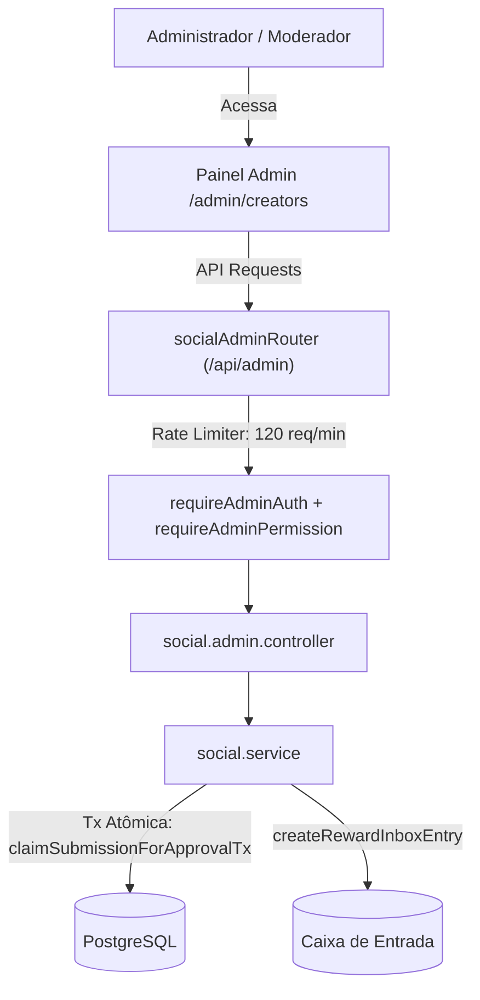

# Documentação Técnica: Gestão de Criadores & Social YouTube (`/admin/creators`)

## 1. Visão Geral e Arquitetura do Domínio

O módulo **Criadores & Social YouTube** do BlockMiner gerencia o credenciamento de influenciadores e canais do YouTube, o envio e a moderação de vídeos promocionais criados pela comunidade, e a concessão automatizada de máquinas de mineração como recompensa.

O ecossistema é dividido em dois níveis complementares:
1. **Flag `isCreator` no Usuário (`User.isCreator` e `User.youtubeUrl`)**: Identificador leve no modelo `User` que sinaliza que a conta possui credencial de criador no ecossistema geral da plataforma.
2. **Perfil Social de Criador (`YoutuberProfile`)**: Registro completo vinculado ao usuário que contém nome do canal, foto, link do canal, bio e status de credenciamento (`credentialRequestStatus`).
3. **Submissões de Vídeo (`YoutubeVideoSubmission`)**: Registros de vídeos do YouTube enviados pelos criadores para revisão da administração (`pending`, `approved`, `rejected`).
4. **Configurações de Recompensa (`YoutuberRewardSettings`)**: Tabela singleton (`id: 1`) que define qual máquina de mineração (`Miner`) é concedida na Caixa de Entrada do usuário (`createRewardInboxEntry`) no momento da aprovação de um vídeo.

---

## 2. Controle de Acesso e Matriz RBAC

O módulo utiliza o middleware central `requireAdminPermission` para garantir segregação de funções e impedir que credenciais limitadas realizem operações destrutivas ou concedam ativos:

| Permissão | Categoria | Descrição | Perfis com Acesso Padrão |
| :--- | :--- | :--- | :--- |
| `creators` | Engajamento | Gestão completa (aprovação, rejeição, mutação de perfis, alteração de máquina de recompensa, flags `isCreator`) | `super_admin`, `admin` |
| `creators.view` | Engajamento | Visualização e consulta de criadores, solicitações de credenciamento, perfis e vídeos | `super_admin`, `admin`, `moderator` |

*Compatibilidade legada:* Permissões como `promotions`, `users` e `users.view` atuam como fallbacks para compatibilidade com roles anteriores.

---

## 3. Especificação dos Endpoints de API

### 3.1. Gestão de Flags `isCreator` (`/api/admin/creators`)

- **`GET /api/admin/creators`**
  - Permissão: `creators.view`
  - Descrição: Lista todos os usuários que possuem a flag `isCreator: true`.
  - Resposta: `{ ok: true, creators: CreatorUser[] }`

- **`GET /api/admin/creators/search?q=:query`**
  - Permissão: `creators.view`
  - Descrição: Busca usuários cadastrados na plataforma pelo `username` (mínimo 2 caracteres, máximo 100).
  - Resposta: `{ ok: true, users: CreatorUser[] }`

- **`PUT /api/admin/creators/:id`**
  - Permissão: `creators`
  - Descrição: Marca o usuário como criador (`isCreator: true`) e associa opcionalmente o link do canal do YouTube (validado contra o domínio do YouTube).
  - Payload: `{ youtubeUrl?: string | null }`
  - Resposta: `{ ok: true }`

- **`DELETE /api/admin/creators/:id`**
  - Permissão: `creators`
  - Descrição: Remove a credencial de criador do usuário (`isCreator: false, youtubeUrl: null`).
  - Resposta: `{ ok: true }`

---

### 3.2. Solicitações de Credenciamento (`/api/admin/social/credential-requests`)

- **`GET /api/admin/social/credential-requests`**
  - Permissão: `creators.view`
  - Descrição: Lista todos os perfis com solicitação pendente (`credentialRequestStatus: "pending"`).
  - Resposta: `{ ok: true, profiles: Profile[] }`

- **`POST /api/admin/social/credential-requests/:id/approve`**
  - Permissão: `creators`
  - Descrição: Aprova a solicitação do canal, definindo `isCredentialed: true` e `credentialRequestStatus: "approved"`.
  - Resposta: `{ ok: true, profile: Profile }`

- **`POST /api/admin/social/credential-requests/:id/reject`**
  - Permissão: `creators`
  - Descrição: Recusa a solicitação do canal com justificativa opcional (`credentialRejectNote`).
  - Payload: `{ rejectNote?: string }`
  - Resposta: `{ ok: true, profile: Profile }`

---

### 3.3. Perfis Sociais (`/api/admin/social/profiles`)

- **`GET /api/admin/social/profiles`**
  - Permissão: `creators.view`
  - Descrição: Lista todos os perfis de criadores cadastrados, com contagem de vídeos enviados.
  - Resposta: `{ ok: true, profiles: Profile[] }`

- **`POST /api/admin/social/profiles`**
  - Permissão: `creators`
  - Descrição: Cria manualmente um perfil para um usuário. Valida a foto e URL contra allowlists de segurança.
  - Payload: `{ userId: number, channelName: string, channelUrl?: string, channelPhoto?: string, bio?: string, isCredentialed?: boolean }`
  - Resposta: `{ ok: true, profile: Profile }`

- **`PUT /api/admin/social/profiles/:id`**
  - Permissão: `creators`
  - Descrição: Atualiza os dados de um perfil existente com sanitização de campos.
  - Payload: `Partial<{ channelName, channelPhoto, channelUrl, bio, isCredentialed }>`
  - Resposta: `{ ok: true, profile: Profile }`

- **`DELETE /api/admin/social/profiles/:id`**
  - Permissão: `creators`
  - Descrição: Remove o perfil do criador (submissões vinculadas sofrem deleção em cascata).
  - Resposta: `{ ok: true }`

---

### 3.4. Moderação de Submissões de Vídeos (`/api/admin/social/submissions`)

- **`GET /api/admin/social/submissions?status=:status`**
  - Permissão: `creators.view`
  - Parâmetros: `status` (`pending`, `approved`, `rejected` ou `all`). Padrão: `pending`.
  - Resposta: `{ ok: true, submissions: Submission[] }`

- **`POST /api/admin/social/submissions/:id/approve`**
  - Permissão: `creators`
  - Descrição: Aprova o vídeo submetido. Em transação atômica (`claimSubmissionForApprovalTx`), garante que apenas uma aprovação seja processada (evitando double-grant em cliques rápidos concorrentes) e envia a máquina de recompensa ativa para a Caixa de Entrada do usuário (`createRewardInboxEntry`).
  - Resposta: `{ ok: true, rewardGranted: boolean, rewardMinerName: string | null }`

- **`POST /api/admin/social/submissions/:id/reject`**
  - Permissão: `creators`
  - Descrição: Recusa o vídeo com nota explicativa de moderação (`reviewNote`).
  - Payload: `{ reviewNote?: string }`
  - Resposta: `{ ok: true }`

- **`DELETE /api/admin/social/submissions/:id`**
  - Permissão: `creators`
  - Descrição: Exclui a submissão de vídeo do histórico administrativo. Não revoga recompensas já entregues.
  - Resposta: `{ ok: true }`

---

### 3.5. Configurações de Recompensa (`/api/admin/social/reward-settings`)

- **`GET /api/admin/social/reward-settings`**
  - Permissão: `creators.view`
  - Descrição: Obtém o ID e os detalhes da máquina de recompensa configurada para criadores.
  - Resposta: `{ ok: true, minerId: number | null, miner: RewardMiner | null }`

- **`PUT /api/admin/social/reward-settings`**
  - Permissão: `creators`
  - Descrição: Configura a máquina que será concedida automaticamente por vídeo aprovado (`minerId`), ou desativa a concessão (`minerId: null`).
  - Payload: `{ minerId: number | null }`
  - Resposta: `{ ok: true, minerId: number | null, miner: RewardMiner | null }`

---

## 4. Segurança e Hardening

1. **Prevenção de SSRF e Pixels de Rastreamento (A8 / A6):**
   - Todas as fotos de perfil passam por `validateChannelPhoto`: são permitidas apenas fotos armazenadas localmente (iniciadas por `/` e servidas pelo próprio domínio) ou hospedadas nos CDNs verificados da Google/YouTube (`yt3.ggpht.com`, `yt3.googleusercontent.com`, `lh3.googleusercontent.com`, `i.ytimg.com`, `img.youtube.com`).
   - URLs de canal passam por `validateChannelUrl`, exigindo estritamente protocolo HTTPS e hosts da família YouTube (`youtube.com`, `www.youtube.com`, `m.youtube.com`, `youtu.be`).
2. **Prevenção de Condições de Corrida (Race Conditions / Double-Grant):**
   - Na aprovação de vídeos, `claimSubmissionForApprovalTx` executa um `updateMany` condicional com `where: { id, status: "pending" }`. Caso múltiplos administradores ou múltiplos cliques enviem a aprovação simultaneamente, apenas o primeiro claim tem `count === 1`. Todas as requisições concorrentes falham de forma limpa com HTTP 409 (Conflict).
3. **Resiliência e Higienização de Erros do Prisma:**
   - Todos os controladores interceptam exceções e traduzem códigos do Prisma: `P2025` vira 404 (Entidade não encontrada), `P2002` vira 409 (Conflito de unicidade) e falhas de foreign key tornam-se 400 amigáveis, eliminando HTTP 500 desnecessários e protegendo informações internas do banco.
4. **Rate Limiting:**
   - O roteador administrativo do módulo aplica `createRateLimiter({ windowMs: 60_000, max: 120 })` por IP para blindar as buscas e operações de mutação contra flooding.
