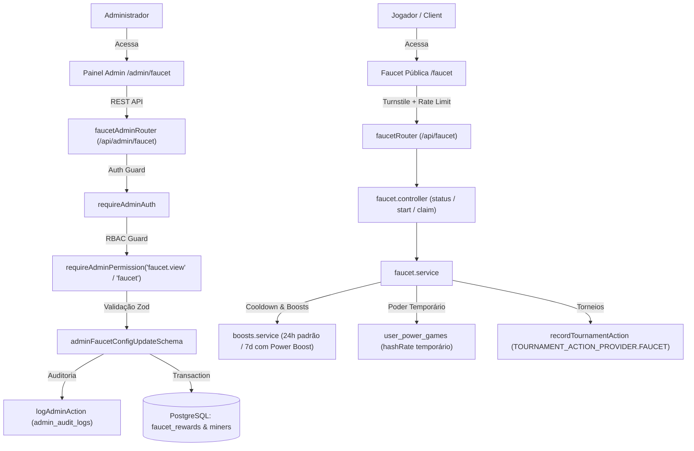

# Documentação Técnica: Gestão da Faucet & Genesis Miner (`/admin/faucet`)

## 1. Visão Geral e Arquitetura do Domínio

O módulo **Faucet / Genesis Miner** gerencia o sistema de recompensas temporárias gratuitas de mineração do BlockMiner. Os jogadores acessam a página pública (`/faucet`), realizam uma visita curta a um parceiro de engajamento (ZerAds / banner patrocinado) e realizam o *claim* para ativar poder de mineração temporário.

### Ecossistema do Faucet
1. **Superfície Pública (`/api/faucet/*`)**:
   - `GET /api/faucet/status`: Retorna se o claim está disponível, tempo restante de cooldown, dados da máquina mineradora configurada e estado da visita ao parceiro.
   - `POST /api/faucet/partner/start`: Registra o início da visualização do parceiro patrocinado (com tempo mínimo de espera `FAUCET_PARTNER_WAIT_MS = 10_000 ms`).
   - `POST /api/faucet/claim`: Valida cooldown e visita ao parceiro, gerando um registro atômico em `UserPowerGame` (`hashRate` e `expiresAt`) e incrementando `faucet_claims`.
2. **Superfície Administrativa (`/api/admin/faucet/*`)**:
   - `GET /api/admin/faucet/config`: Consulta a recompensa ativa, cooldown e dados do minerador base associado. Protegido por `requireAdminPermission("faucet.view", "faucet")`.
   - `PUT /api/admin/faucet/config`: Altera nome do minerador, hashrate base, URL da imagem, tempo de cooldown em ms e status ativo. Validado via Zod (`adminFaucetConfigUpdateSchema`), auditado via `logAdminAction`. Protegido por `requireAdminPermission("faucet")`.



---

## 2. Modelo de Dados Prisma

A configuração e operação da faucet utilizam as seguintes entidades no `prisma/schema.prisma`:

### FaucetReward (`faucet_rewards`)
```prisma
model FaucetReward {
  id         Int      @id @default(autoincrement())
  minerId    Int      @unique @map("miner_id")
  cooldownMs Int      @default(3600000) @map("cooldown_ms")
  isActive   Boolean  @default(true) @map("is_active")
  createdAt  DateTime @default(now()) @map("created_at")
  updatedAt  DateTime @updatedAt @map("updated_at")

  miner Miner @relation(fields: [minerId], references: [id])

  @@map("faucet_rewards")
}
```

### Miner (`miners`)
```prisma
model Miner {
  id              Int       @id @default(autoincrement())
  name            String
  slug            String    @unique
  baseHashRate    Float     @default(0) @map("base_hash_rate")
  imageUrl        String?   @map("image_url")
  slotSize        Int       @default(1) @map("slot_size")
  // ... campos adicionais do catálogo
  faucetReward    FaucetReward?
}
```

### FaucetClaim (`faucet_claims`)
```prisma
model FaucetClaim {
  userId      Int      @id @map("user_id")
  claimedAt   DateTime @map("claimed_at")
  totalClaims Int      @default(0) @map("total_claims")
  dayKey      String?  @map("day_key")

  user User @relation(fields: [userId], references: [id])

  @@map("faucet_claims")
}
```

### FaucetPartnerVisit (`faucet_partner_visits`)
```prisma
model FaucetPartnerVisit {
  id         Int      @id @default(autoincrement())
  userId     Int      @map("user_id")
  dayKey     String   @map("day_key")
  openedAt   DateTime @map("opened_at")
  eligibleAt DateTime @map("eligible_at")
  createdAt  DateTime @default(now()) @map("created_at")
  updatedAt  DateTime @updatedAt @map("updated_at")

  user User @relation(fields: [userId], references: [id])

  @@unique([userId, dayKey])
  @@index([eligibleAt])
  @@map("faucet_partner_visits")
}
```

---

## 3. Matriz RBAC de Controle de Acesso

| Rota | Método | Permissão Mínima | Descrição |
| :--- | :---: | :--- | :--- |
| `/api/admin/faucet/config` | `GET` | `faucet.view` ou `faucet` | Visualiza configuração ativa da recompensa de faucet e cooldown. |
| `/api/admin/faucet/config` | `PUT` | `faucet` | Altera nome, hashrate, URL da imagem, cooldown e ativação. |

### Papéis do Sistema
- `super_admin`: Acesso total irrestrito (wildcard `*`).
- `admin`: Possui a permissão `faucet` por padrão (concede leitura e escrita).
- `moderator`: Possui a permissão `faucet.view` por padrão (somente leitura; mutações são rejeitadas com HTTP 403 `FORBIDDEN_PERMISSION`).
- Outros papéis (`finance`, `support`, `readonly`): Sem permissão para o módulo (bloqueados com HTTP 403).

---

## 4. Especificação OpenAPI 3.0 (Contrato Administrativo)

```yaml
openapi: 3.0.3
info:
  title: BlockMiner Faucet Administration API
  version: 1.0.0
  description: API administrativa para parametrização do faucet miner e intervalos de cooldown.
paths:
  /api/admin/faucet/config:
    get:
      summary: Obtém a configuração ativa da Faucet
      tags:
        - Admin Faucet
      security:
        - AdminAuth: []
      responses:
        '200':
          description: Configuração carregada com sucesso
          content:
            application/json:
              schema:
                type: object
                properties:
                  ok:
                    type: boolean
                    example: true
                  configured:
                    type: boolean
                    example: true
                  reward:
                    type: object
                    nullable: true
                    properties:
                      rewardId:
                        type: integer
                        example: 1
                      cooldownMs:
                        type: integer
                        example: 3600000
                      isActive:
                        type: boolean
                        example: true
                      miner:
                        type: object
                        properties:
                          id:
                            type: integer
                            example: 38
                          slug:
                            type: string
                            example: faucet-micro-miner
                          name:
                            type: string
                            example: Pulse Mini v1
                          baseHashRate:
                            type: number
                            example: 30
                          slotSize:
                            type: integer
                            example: 1
                          imageUrl:
                            type: string
                            nullable: true
                            example: /media/miners/reward2.webp
        '401':
          description: Não autenticado
        '403':
          description: Permissão insuficiente (requer faucet.view ou faucet)

    put:
      summary: Atualiza a configuração do Faucet Miner
      tags:
        - Admin Faucet
      security:
        - AdminAuth: []
      requestBody:
        required: true
        content:
          application/json:
            schema:
              type: object
              properties:
                name:
                  type: string
                  minLength: 1
                  maxLength: 100
                  example: Pulse Mini v1
                baseHashRate:
                  type: number
                  minimum: 0.1
                  maximum: 1000000
                  example: 35
                imageUrl:
                  type: string
                  nullable: true
                  example: /media/miners/reward2.webp
                cooldownMs:
                  type: integer
                  minimum: 60000
                  maximum: 604800000
                  example: 3600000
                isActive:
                  type: boolean
                  example: true
      responses:
        '200':
          description: Configuração salva com sucesso
          content:
            application/json:
              schema:
                type: object
                properties:
                  ok:
                    type: boolean
                    example: true
                  message:
                    type: string
                    example: Configuração da faucet atualizada com sucesso.
                  reward:
                    $ref: '#/components/schemas/AdminFaucetRewardDetail'
        '400':
          description: Erro de validação Zod (código FAUCET_VALIDATION_ERROR)
        '401':
          description: Não autenticado
        '403':
          description: Permissão insuficiente (requer faucet)
        '404':
          description: Faucet não encontrada no banco de dados

components:
  schemas:
    AdminFaucetRewardDetail:
      type: object
      properties:
        rewardId:
          type: integer
        cooldownMs:
          type: integer
        isActive:
          type: boolean
        miner:
          type: object
          properties:
            id:
              type: integer
            slug:
              type: string
            name:
              type: string
            baseHashRate:
              type: number
            slotSize:
              type: integer
            imageUrl:
              type: string
              nullable: true
```

---

## 5. Como Executar e Validar Localmente

### Pré-requisitos
- Node.js $\ge$ 20
- PostgreSQL com schema Prisma migrado
- Redis (opcional para testes unitários, obrigatório para produção)

### Comandos de Teste do Módulo
```bash
# Executar todos os testes automatizados do Faucet:
npx tsx --import ./tests/_env-test-overrides.mjs --test --test-force-exit tests/faucet/*.test.mjs

# Executar testes unitários do schema Zod:
npx tsx --import ./tests/_env-test-overrides.mjs --test --test-force-exit tests/faucet/faucet.admin.schemas.unit.test.mjs

# Executar testes de integração RBAC:
npx tsx --import ./tests/_env-test-overrides.mjs --test --test-force-exit tests/faucet/faucet.admin.rbac.test.mjs

# Executar smoke tests com PostgreSQL real:
npx tsx --import ./tests/_env-test-overrides.mjs --test --test-force-exit tests/faucet/faucet.admin.smoke.test.mjs

# Executar testes de componentes client (Vitest):
npm run --prefix client test -- src/features/admin/faucet
```
