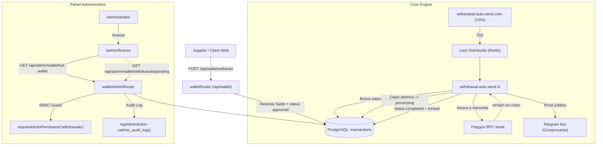

# Documentação Técnica: Sistema Financeiro de Saques & Envio Automático (`/admin/finance`)

## 1. Visão Geral e Arquitetura do Domínio

O sistema financeiro de saques do BlockMiner gerencia o ciclo de vida completo de solicitações de retirada de fundos dos jogadores em **POL (Polygon nativo)** e **SHIB (Polygon ERC20)**, integrando reserva atômica de saldo no banco, auditoria administrativa e um motor de liquidação automática on-chain (*Auto-Send Engine*).

### Ciclo de Vida do Saque
1. **Solicitação do Jogador (`POST /api/wallet/withdraw`)**:
   - Validação de formato EVM e valor mínimo (0.5 POL).
   - Reserva atômica dos fundos (`amount + fee`) via transação Prisma (`fundsReserved: true`), decrementando imediatamente o saldo do jogador (`polBalance`).
   - Criação da transação diretamente com **`status: "approved"`** (habilitando o processamento automático imediato sem necessidade de intervenção manual).
2. **Motor de Envio Automático (`withdrawal.auto-send.ts`)**:
   - Um cron executado a cada 120 segundos (`withdrawal-auto-send.cron.ts`) invoca `processPendingWithdrawals()`.
   - Adquire um lock distribuído no Redis (`AUTO_SEND_LOCK_KEY`, TTL 90s) para garantir execução exclusiva entre réplicas.
   - Seleciona saques aprovados (`status: "approved"`), realizando um claim atômico individual para `status: "processing"`.
   - Verifica o saldo da Hot Wallet on-chain contra o valor do saque + buffer de gás de 3x + reserva de segurança (`minReservePol`).
   - Assina a transação on-chain via Polygon RPC através da chave privada configurada em `WITHDRAWAL_PRIVATE_KEY`.
   - Em caso de sucesso, atualiza o status para `completed`, grava o `txHash` real e emite notificação pública via Telegram (`notifyWithdrawalCompleted`).
3. **Painel Administrativo (`/admin/finance`)**:
   - Exibe em tempo real o **Painel de Status da Hot Wallet**: endereço público, saldo on-chain, indicador de cobertura da fila, estado do auto-send (ativo, pausado ou cooldown) e modo de liquidação.
   - Fornece fallback de governança para administradores autorizados: cancelamento com estorno (`reject`) ou finalização manual com hash externo (`complete`).



---

## 2. Modelo de Dados Prisma (`Transaction`)

A entidade central no banco é a tabela `transactions` (`prisma/schema.prisma`):

```prisma
model Transaction {
  id            Int       @id @default(autoincrement())
  userId        Int       @map("user_id")
  type          String    // "withdrawal" (POL) ou "shib_withdrawal" (SHIB)
  amount        Decimal   @db.Decimal(20, 8)
  fee           Decimal?  @db.Decimal(20, 8)
  address       String?   // Endereço EVM de destino do jogador
  txHash        String?   @map("tx_hash") // Hash 0x... na blockchain Polygon
  status        String    @default("pending") // approved -> processing -> completed / rejected
  fundsReserved Boolean   @default(false) @map("funds_reserved")
  createdAt     DateTime  @default(now()) @map("created_at")
  updatedAt     DateTime  @updatedAt @map("updated_at")
  completedAt   DateTime? @map("completed_at")

  user User @relation(fields: [userId], references: [id])

  @@index([userId])
  @@index([status])
  @@index([type])
  @@index([txHash])
  @@map("transactions")
}
```

---

## 3. Matriz de Permissões RBAC & Segurança

O roteador `/api/admin/wallet/*` é protegido com autenticação administrativa (`requireAdminAuth`) e permissões granulares (`requireAdminPermission`):

| Endpoint | Método | Permissão Exigida | Descrição |
| :--- | :---: | :--- | :--- |
| `/api/admin/wallet/hot-wallet` | `GET` | `withdrawals` ou `finance` | Consulta status da Hot Wallet, saldo POL on-chain e fila de saques. |
| `/api/admin/wallet/withdrawals/pending` | `GET` | `withdrawals` ou `finance` | Lista fila de saques ativos (aprovados/processando) e histórico recente. |
| `/api/admin/wallet/withdrawals/:id/approve` | `POST` | `withdrawals` | Aprova saque pendente (legado / fallback). |
| `/api/admin/wallet/withdrawals/:id/reject` | `POST` | `withdrawals` | Rejeita saque e estorna valor + taxa para o saldo do jogador. |
| `/api/admin/wallet/withdrawals/:id/complete` | `POST` | `withdrawals` | Marca saque como concluído manualmente com hash `0x...` fornecido. |

---

## 4. Variáveis de Ambiente & Configuração

| Variável | Padrão | Descrição |
| :--- | :---: | :--- |
| `WITHDRAWAL_AUTO_SEND` | `true` | Habilita o motor de auto-send. |
| `WITHDRAWAL_AUTO_SEND_GLOBAL_PAUSE` | `false` | **Kill switch de emergência**. Se `true`, nenhum envio é disparado. |
| `WITHDRAWAL_PRIVATE_KEY` | *(obrigatório)* | Chave privada da Hot Wallet (EVM Polygon). Única fonte de assinatura. |
| `WITHDRAWAL_HOT_WALLET_MIN_BALANCE_POL` | `0.1` | Reserva mínima em POL que a carteira sempre deve manter. |
| `WITHDRAWAL_AUTO_SEND_CRON_MS` | `120000` | Intervalo do ciclo do cron (120 segundos). |
| `WITHDRAWAL_AUTO_SEND_MAX_PER_DAY_PER_USER` | `3` | Limite máximo de saques diários concluídos por jogador. |
| `WITHDRAWAL_HOT_WALLET_RETRY_COOLDOWN_SEC` | `1800` | Cooldown (30 min) ativado automaticamente se a carteira ficar sem saldo. |

---

## 5. Especificação OpenAPI 3.0 (Contrato Administrativo)

```yaml
openapi: 3.0.3
info:
  title: BlockMiner Admin Finance API
  version: 1.0.0
  description: API administrativa para monitoramento da Hot Wallet e gestão de saques.
paths:
  /api/admin/wallet/hot-wallet:
    get:
      summary: Consulta status da Hot Wallet e motor de Auto-Send
      tags:
        - Admin Finance
      security:
        - AdminAuth: []
      responses:
        '200':
          description: Status carregado com sucesso
          content:
            application/json:
              schema:
                type: object
                properties:
                  ok:
                    type: boolean
                    example: true
                  hotWallet:
                    type: object
                    properties:
                      configured:
                        type: boolean
                        example: true
                      autoSendEnabled:
                        type: boolean
                        example: true
                      globalPause:
                        type: boolean
                        example: false
                      viaCoinEx:
                        type: boolean
                        example: false
                      address:
                        type: string
                        example: "0x1234567890123456789012345678901234567890"
                      balancePol:
                        type: number
                        example: 25.4321
                      minReservePol:
                        type: number
                        example: 0.1
                      cooldownMs:
                        type: integer
                        example: 0
                      pendingApprovedCount:
                        type: integer
                        example: 2
                      pendingApprovedPol:
                        type: number
                        example: 5.5
                      canCoverPending:
                        type: boolean
                        example: true
        '401':
          description: Não autenticado
        '403':
          description: Permissão insuficiente (requer withdrawals ou finance)

  /api/admin/wallet/withdrawals/pending:
    get:
      summary: Lista fila ativa de saques e histórico recente
      tags:
        - Admin Finance
      security:
        - AdminAuth: []
      responses:
        '200':
          description: Lista de saques retornada
        '401':
          description: Não autenticado
        '403':
          description: Permissão insuficiente

  /api/admin/wallet/withdrawals/{id}/reject:
    post:
      summary: Rejeita um saque e estorna fundos ao jogador
      tags:
        - Admin Finance
      security:
        - AdminAuth: []
      parameters:
        - name: id
          in: path
          required: true
          schema:
            type: integer
      responses:
        '200':
          description: Saque rejeitado e saldo estornado
        '400':
          description: Status inválido para rejeição
        '409':
          description: Conflito de concorrência (saque já processado)

  /api/admin/wallet/withdrawals/{id}/complete:
    post:
      summary: Finaliza saque manualmente fornecendo txHash
      tags:
        - Admin Finance
      security:
        - AdminAuth: []
      parameters:
        - name: id
          in: path
          required: true
          schema:
            type: integer
      requestBody:
        required: true
        content:
          application/json:
            schema:
              type: object
              required:
                - txHash
              properties:
                txHash:
                  type: string
                  pattern: '^0x[a-fA-F0-9]{64}$'
      responses:
        '200':
          description: Saque marcado como concluído
        '400':
          description: Hash de transação inválido
        '409':
          description: Conflito de concorrência
```
