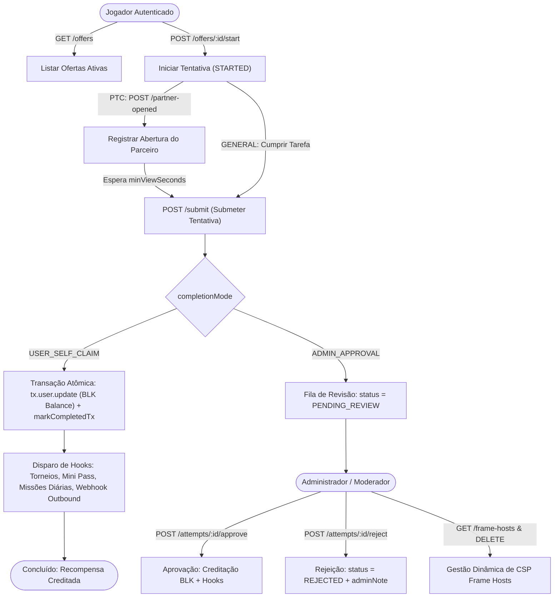

# Documentação Técnica: Offerwall Interno & Fila de Revisão (`/internal-offerwall` e `/admin/internal-offerwall`)

## 1. Visão Geral e Arquitetura do Domínio

O módulo **Internal Offerwall** é o sistema nativo do BlockMiner para distribuição e validação de ofertas pagas em BLK, englobando duas categorias operacionais:
- **PTC_IFRAME**: Visualização remunerada de websites/parceiros com validação estrita de tempo mínimo em tela (`minViewSeconds`), rastreamento de abertura da página (`partnerOpenedAt`) e restrições de cabeçalhos Content Security Policy (`frame-src`).
- **GENERAL_TASK**: Tarefas externas ou sociais (com metadados JSON flexíveis, instruções passo a passo e comprovações de conclusão).

O fluxo suporta dois modos de finalização:
1. **Auto-resgate (`USER_SELF_CLAIM`)**: Conclusão instantânea após cumprir os requisitos de visualização/tempo, com creditação atômica de saldo (`BLK`) via transação Prisma.
2. **Revisão Administrativa (`ADMIN_APPROVAL`)**: A tentativa passa para o estado `PENDING_REVIEW` com snapshot de auditoria (`auditSnapshot`), ficando disponível na fila administrativa para aprovação ou rejeição manual.



---

## 2. Modelo de Dados Prisma

```prisma
model InternalOfferwallOffer {
  id                 Int      @id @default(autoincrement())
  kind               String   @map("kind") // 'PTC_IFRAME' | 'GENERAL_TASK'
  title              String
  description        String?  @db.Text
  iframeUrl          String?  @map("iframe_url") @db.Text
  minViewSeconds     Int      @default(10) @map("min_view_seconds")
  rewardKind         String   @map("reward_kind") // 'BLK'
  rewardBlkAmount    Decimal? @map("reward_blk_amount") @db.Decimal(20, 8)
  rewardPolAmount    Decimal? @map("reward_pol_amount") @db.Decimal(20, 8)
  rewardHashRate     Float?   @map("reward_hash_rate")
  rewardHashRateDays Int?     @map("reward_hash_rate_days")
  dailyLimitPerUser  Int      @default(3) @map("daily_limit_per_user")
  sortOrder          Int      @default(0) @map("sort_order")
  isActive           Boolean  @default(true) @map("is_active")
  completionMode     String   @map("completion_mode") // 'USER_SELF_CLAIM' | 'ADMIN_APPROVAL'
  taskMetadata       Json?    @map("task_metadata")
  createdAt          DateTime @default(now()) @map("created_at")
  updatedAt          DateTime @updatedAt @map("updated_at")

  attempts             InternalOfferwallAttempt[]
  dailyTaskDefinitions DailyTaskDefinition[]

  @@map("internal_offerwall_offers")
}

model InternalOfferwallAttempt {
  id              Int       @id @default(autoincrement())
  userId          Int       @map("user_id")
  offerId         Int       @map("offer_id")
  periodKey       String    @map("period_key") // YYYY-MM-DD (UTC 00:00)
  status          String    @map("status")     // 'STARTED' | 'PENDING_REVIEW' | 'COMPLETED' | 'REJECTED'
  startedAt       DateTime  @map("started_at")
  partnerOpenedAt DateTime? @map("partner_opened_at")
  submittedAt     DateTime? @map("submitted_at")
  completedAt     DateTime? @map("completed_at")
  rewardGrantedAt DateTime? @map("reward_granted_at")
  auditSnapshot   String?   @map("audit_snapshot") @db.Text
  adminNote       String?   @map("admin_note") @db.Text

  user  User                   @relation(fields: [userId], references: [id], onDelete: Cascade)
  offer InternalOfferwallOffer @relation(fields: [offerId], references: [id], onDelete: Cascade)

  @@index([userId, offerId, periodKey])
  @@index([offerId, status])
  @@map("internal_offerwall_attempts")
}

model InternalOfferwallFrameHost {
  id        Int      @id @default(autoincrement())
  hostname  String   @unique @map("hostname") @db.VarChar(253)
  isActive  Boolean  @default(true) @map("is_active")
  createdAt DateTime @default(now()) @map("created_at")

  @@map("internal_offerwall_frame_hosts")
}
```

---

## 3. Segurança e Mecanismo de CSP (`frame-src`)

O módulo atua diretamente sobre o middleware de segurança do servidor (`server/core/http/middleware/csp.ts`):
- **Allowlist Dinâmica de Hosts**: Todos os domínios configurados nas ofertas ativas e na tabela `internal_offerwall_frame_hosts` são auto-registrados e consolidados no cache de memória sincronizado (`getIframeHostAllowlistCachedSync()`).
- **Expansão de CSP**: A função `expandCspFrameSrcHostSources` converte os hostnames autorizados em diretivas CSP estritas (`https://host` e `https://*.host`).
- **Prevenção contra SSRF e Injeções**:
  - Rejeita esquemas inseguros (`http://`, exceto se explicitamente ativado em ambiente de teste via `INTERNAL_OFFERWALL_ALLOW_HTTP_IFRAME`).
  - Proíbe endereços IP literais (`x.x.x.x`) e `localhost`.
  - Rejeita caracteres inválidos como `:`, `[`, `]` e path traversals em hostnames.

---

## 4. Matriz RBAC de Controle de Acesso

O acesso ao módulo administrativo é controlado granularmente por papéis e permissões (`server/modules/admin/admin.permissions.ts`):

| Permissão | Categoria | Descrição | Papéis com Acesso Padrão |
| :--- | :--- | :--- | :--- |
| **`internal_offerwall`** | Monetização | Gestão completa (criação, edição, aprovação/rejeição e hosts CSP). | `super_admin`, `admin` |
| **`internal_offerwall.view`** | Monetização | Visualização das ofertas, fila de revisão e hosts de iframe. | `super_admin`, `admin`, `moderator` |

- **Fallback Automático**: Os guards aceitam também as permissões legadas `offerwall` e `offerwall.view`.
- **Auditoria de Operações**: Todas as mutações administrativas disparam eventos estruturados via `logAdminAction`:
  - `ADMIN_INTERNAL_OFFERWALL_CREATE_OFFER`
  - `ADMIN_INTERNAL_OFFERWALL_UPDATE_OFFER`
  - `ADMIN_INTERNAL_OFFERWALL_APPROVE_ATTEMPT`
  - `ADMIN_INTERNAL_OFFERWALL_REJECT_ATTEMPT`
  - `ADMIN_INTERNAL_OFFERWALL_DEACTIVATE_FRAME_HOST`

---

## 5. Especificação OpenAPI 3.0.3

```yaml
openapi: 3.0.3
info:
  title: BlockMiner Internal Offerwall API
  version: 1.0.0
  description: Endpoints para o módulo de Offerwall Interno (PTC/Tarefas) do usuário e painel administrativo.

paths:
  /api/internal-offerwall/status:
    get:
      summary: Status do recurso
      responses:
        "200":
          description: Flag de ativação da funcionalidade
          content:
            application/json:
              schema:
                type: object
                properties:
                  ok: { type: boolean }
                  enabled: { type: boolean }

  /api/internal-offerwall/offers:
    get:
      summary: Listar ofertas ativas e tentativas em andamento do usuário logado
      security:
        - cookieAuth: []
      responses:
        "200":
          description: Ofertas com snapshot de uso e tentativas abertas
        "401":
          description: Não autenticado

  /api/internal-offerwall/offers/{offerId}/start:
    post:
      summary: Iniciar execução de uma oferta
      security:
        - cookieAuth: []
      parameters:
        - name: offerId
          in: path
          required: true
          schema: { type: integer }
      responses:
        "200":
          description: Tentativa iniciada com sucesso
        "429":
          description: Limite de execuções atingido no período

  /api/internal-offerwall/attempts/{attemptId}/partner-opened:
    post:
      summary: Registrar abertura da página do parceiro (PTC)
      security:
        - cookieAuth: []
      parameters:
        - name: attemptId
          in: path
          required: true
          schema: { type: integer }
      responses:
        "200":
          description: Horário de abertura registrado

  /api/internal-offerwall/attempts/{attemptId}/submit:
    post:
      summary: Submeter tentativa após cumprimento dos requisitos
      security:
        - cookieAuth: []
      parameters:
        - name: attemptId
          in: path
          required: true
          schema: { type: integer }
      responses:
        "200":
          description: Recompensa creditada (COMPLETED) ou enviada para revisão (PENDING_REVIEW)
        "400":
          description: Tempo mínimo não cumprido ou parceiro não aberto

  /api/internal-offerwall/attempts/{attemptId}/abandon:
    post:
      summary: Cancelar tentativa iniciada
      security:
        - cookieAuth: []
      parameters:
        - name: attemptId
          in: path
          required: true
          schema: { type: integer }
      responses:
        "200":
          description: Tentativa cancelada

  /api/admin/internal-offerwall/offers:
    get:
      summary: Listar todas as ofertas cadastradas (Admin)
      security:
        - adminAuth: []
      responses:
        "200":
          description: Lista de ofertas
    post:
      summary: Criar nova oferta (Admin)
      security:
        - adminAuth: []
      requestBody:
        required: true
        content:
          application/json:
            schema:
              type: object
              required: [kind, title, minViewSeconds]
              properties:
                kind: { type: string, enum: [PTC_IFRAME, GENERAL_TASK] }
                title: { type: string }
                description: { type: string, nullable: true }
                iframeUrl: { type: string, nullable: true }
                minViewSeconds: { type: integer }
                rewardKind: { type: string, enum: [BLK] }
                rewardBlkAmount: { type: number }
                dailyLimitPerUser: { type: integer }
                completionMode: { type: string, enum: [USER_SELF_CLAIM, ADMIN_APPROVAL] }
      responses:
        "201":
          description: Oferta criada com sucesso

  /api/admin/internal-offerwall/offers/{id}:
    put:
      summary: Atualizar oferta existente (Admin)
      security:
        - adminAuth: []
      parameters:
        - name: id
          in: path
          required: true
          schema: { type: integer }
      responses:
        "200":
          description: Oferta atualizada com sucesso
    patch:
      summary: Atualizar parcialmente oferta existente (Admin)
      security:
        - adminAuth: []
      parameters:
        - name: id
          in: path
          required: true
          schema: { type: integer }
      responses:
        "200":
          description: Oferta atualizada com sucesso

  /api/admin/internal-offerwall/attempts:
    get:
      summary: Listar tentativas filtradas por status (Admin)
      security:
        - adminAuth: []
      parameters:
        - name: status
          in: query
          schema: { type: string }
        - name: limit
          in: query
          schema: { type: integer }
      responses:
        "200":
          description: Fila de tentativas

  /api/admin/internal-offerwall/attempts/{id}/approve:
    post:
      summary: Aprovar tentativa em revisão (Admin)
      security:
        - adminAuth: []
      parameters:
        - name: id
          in: path
          required: true
          schema: { type: integer }
      responses:
        "200":
          description: Tentativa aprovada e recompensa creditada

  /api/admin/internal-offerwall/attempts/{id}/reject:
    post:
      summary: Rejeitar tentativa em revisão (Admin)
      security:
        - adminAuth: []
      parameters:
        - name: id
          in: path
          required: true
          schema: { type: integer }
      requestBody:
        content:
          application/json:
            schema:
              type: object
              properties:
                note: { type: string, nullable: true }
      responses:
        "200":
          description: Tentativa rejeitada

  /api/admin/internal-offerwall/frame-hosts:
    get:
      summary: Listar hosts de iframe permitidos (Admin)
      security:
        - adminAuth: []
      responses:
        "200":
          description: Lista de hostnames permitidos na política CSP

  /api/admin/internal-offerwall/frame-hosts/{id}:
    delete:
      summary: Desativar hostname de iframe (Admin)
      security:
        - adminAuth: []
      parameters:
        - name: id
          in: path
          required: true
          schema: { type: integer }
      responses:
        "200":
          description: Host desativado
```
