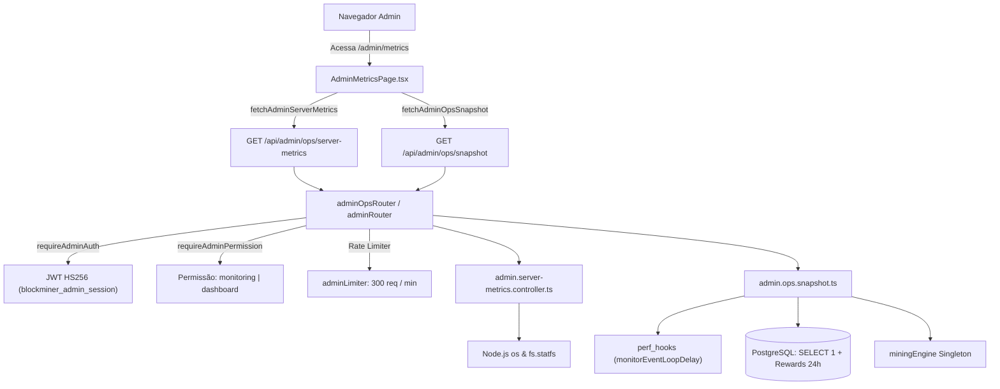

# Documentação Técnica: Métricas do Servidor & Operações (`/admin/metrics`)

## 1. Visão Geral e Arquitetura do Domínio

O módulo de Métricas do Servidor (`/admin/metrics`) fornece observabilidade em tempo real sobre a saúde do processo Node.js, recursos de hardware da máquina anfitriã (host) e prontidão dos subsistemas do BlockMiner 2.1.

### Componentes Principais

- **Coletor de Recursos do Host (`admin.server-metrics.controller.ts`):**
  - **CPU:** Percentual de uso derivado de `os.loadavg()[0]` normalizado pelo número de cores lógicos (`os.cpus().length`). Possui cache de 5 segundos (`CPU_SAMPLE_CACHE_MS = 5000`) para evitar amostragem redundante sob chamadas concorrentes.
  - **Memória RAM:** Bytes totais, livres e utilizados obtidos via `os.totalmem()` e `os.freemem()`.
  - **Armazenamento em Disco:** Medição best-effort utilizando `fs.statfs('/')` com fallback seguro para `execFile('df', ['-kP', '/'])`. Se inacessível, relata honestamente `diskUnavailable: true` com valores nulos, sem quebrar o painel.
  - **Uptime & Processo:** Tempo de atividade do host (`os.uptime()`), do processo Node.js (`process.uptime()`), PID, versão da runtime e plataforma.

- **Snapshot Operacional (`admin.ops.snapshot.ts`):**
  - **Atraso do Event Loop (libuv Lag):** Amostragem de 200ms via `perf_hooks.monitorEventLoopDelay({ resolution: 10 })` calculando latência máxima, média e p99 em milissegundos.
  - **Prontidão do Banco (Readiness):** Executa query de pulso (`SELECT 1`) contra o PostgreSQL via Prisma com timeout estrito de 2000ms.
  - **Economia & Mineração:** Extrai o número do bloco atual e mineradores ativos diretamente do singleton `miningEngine`, além de agregação em tempo real de recompensas liquidadas nas últimas 24h (`prisma.blockMinerReward.count`).
  - **Status de Filas e Conexões:** Contratos de telemetria para HTTP (req/min), websockets, BullMQ e Redis.

### Fluxo Arquitetural



---

## 2. Modelos de Dados e Contrato da API

### `AdminServerMetricsSnapshot`

```typescript
export interface AdminServerMetricsSnapshot {
  cpuUsagePercent: number;
  cpuCores: number;
  memoryTotalBytes: number;
  memoryFreeBytes: number;
  memoryUsedBytes: number;
  memoryUsagePercent: number;
  diskTotalBytes: number | null;
  diskUsedBytes: number | null;
  diskUsagePercent: number | null;
  diskUnavailable: boolean;
  uptimeSeconds: number;
  processUptimeSeconds?: number;
  platform: string;
  nodeVersion: string;
  processId: number;
}
```

### `AdminOpsSnapshot`

```typescript
export interface AdminOpsSnapshot {
  timestamp: string;
  readiness: {
    ok: boolean;
    checks: Record<string, HealthCheckDetail>;
  };
  eventLoopLag: EventLoopLagSnapshot;
  runtime: RuntimeRegistrySnapshot;
  http: AdminOpsHttpStats;
  socket: {
    connectionsActive: number;
    connectsTotal: number;
    disconnectsTotal: number;
  };
  mining: AdminOpsMiningStats;
  queues: AdminOpsQueueStats;
  redis: AdminOpsRedisStats;
  economy: AdminOpsEconomyRow[];
  alerts: AdminOpsAlert[];
}
```

---

## 3. Especificação OpenAPI 3.0.0

```yaml
openapi: 3.0.0
info:
  title: BlockMiner 2.1 - Admin Metrics & Ops API
  version: 1.0.0
  description: Endpoints de telemetria de infraestrutura e prontidão de serviços do painel administrativo.

paths:
  /api/admin/ops/server-metrics:
    get:
      summary: Coleta métricas de CPU, RAM, disco e uptime do host
      description: Requer permissão RBAC 'monitoring' ou 'dashboard'.
      security:
        - AdminSessionCookie: []
        - BearerAuth: []
      responses:
        '200':
          description: Métricas do servidor coletadas com sucesso
          content:
            application/json:
              schema:
                type: object
                properties:
                  ok:
                    type: boolean
                    example: true
                  metrics:
                    $ref: '#/components/schemas/AdminServerMetricsSnapshot'
        '401':
          description: Não autenticado ou sessão administrativa expirada
        '403':
          description: Acesso negado por falta de permissão RBAC
        '500':
          description: Falha interna ao ler métricas do sistema operacional

  /api/admin/server-metrics:
    get:
      summary: Alias de compatibilidade direta para /api/admin/ops/server-metrics
      responses:
        '200':
          description: Idêntico a /api/admin/ops/server-metrics

  /api/admin/ops/snapshot:
    get:
      summary: Coleta snapshot de prontidão (health checks, event loop, mineração, economia)
      description: Requer permissão RBAC 'monitoring' ou 'dashboard'.
      security:
        - AdminSessionCookie: []
        - BearerAuth: []
      responses:
        '200':
          description: Snapshot operacional gerado com sucesso
          content:
            application/json:
              schema:
                type: object
                properties:
                  ok:
                    type: boolean
                    example: true
                  snapshot:
                    $ref: '#/components/schemas/AdminOpsSnapshot'
        '401':
          description: Não autenticado
        '403':
          description: Permissão insuficiente
        '500':
          description: Falha ao compilar snapshot de saúde

components:
  schemas:
    AdminServerMetricsSnapshot:
      type: object
      required:
        - cpuUsagePercent
        - cpuCores
        - memoryTotalBytes
        - memoryFreeBytes
        - memoryUsedBytes
        - memoryUsagePercent
        - diskUnavailable
        - uptimeSeconds
        - platform
        - nodeVersion
        - processId
      properties:
        cpuUsagePercent:
          type: number
          example: 18.5
        cpuCores:
          type: integer
          example: 6
        memoryTotalBytes:
          type: integer
          example: 12554379264
        memoryFreeBytes:
          type: integer
          example: 3418529792
        memoryUsedBytes:
          type: integer
          example: 9135849472
        memoryUsagePercent:
          type: number
          example: 72.8
        diskTotalBytes:
          type: integer
          nullable: true
          example: 105553616896
        diskUsedBytes:
          type: integer
          nullable: true
          example: 41258934272
        diskUsagePercent:
          type: number
          nullable: true
          example: 39.1
        diskUnavailable:
          type: boolean
          example: false
        uptimeSeconds:
          type: number
          example: 864200
        processUptimeSeconds:
          type: number
          example: 14200
        platform:
          type: string
          example: linux
        nodeVersion:
          type: string
          example: v22.15.3
        processId:
          type: integer
          example: 1

    AdminOpsSnapshot:
      type: object
      required:
        - timestamp
        - readiness
        - eventLoopLag
        - runtime
        - http
        - socket
        - mining
        - queues
        - redis
        - economy
        - alerts
      properties:
        timestamp:
          type: string
          format: date-time
        readiness:
          type: object
          properties:
            ok:
              type: boolean
            checks:
              type: object
        eventLoopLag:
          type: object
          properties:
            maxMs:
              type: number
            meanMs:
              type: number
            p99Ms:
              type: number
            sampleWindowMs:
              type: number
        runtime:
          type: object
          properties:
            nodeVersion:
              type: string
            platform:
              type: string
            pid:
              type: integer
            uptimeSeconds:
              type: number
            memoryRssBytes:
              type: integer
            memoryHeapUsedBytes:
              type: integer
        economy:
          type: array
          items:
            type: object
            properties:
              module:
                type: string
              action:
                type: string
              total:
                type: number
```

---

## 4. Segurança & Controles Operacionais

1. **Autenticação:** Exige cookie HttpOnly/SameSite=Strict `blockminer_admin_session` ou header `Authorization: Bearer <ADMIN_JWT>`.
2. **Autorização (RBAC):** Protegido por `requireAdminPermission("monitoring", "dashboard")`. Administradores sem esses privilégios recebem `403 FORBIDDEN_PERMISSION`.
3. **Prevenção de Denial of Service / Event Loop Starvation:**
   - A amostragem de CPU utiliza cache em memória de 5 segundos para que múltiplas abas ou múltiplos admins não provoquem picos de I/O.
   - Amostragem de libuv event loop é limitada a janela síncrona de 200ms.
   - A checagem de banco possui `withTimeout` rígido de 2000ms: se o PostgreSQL travar, a requisição não fica pendurada e retorna status degradado honesto.
4. **Execução Segura:** A chamada a `df -kP /` usa `execFile` com argumentos estáticos (`['-kP', '/']`), sem passar por shell intermediário, eliminando risco de Command Injection (CWE-78).
