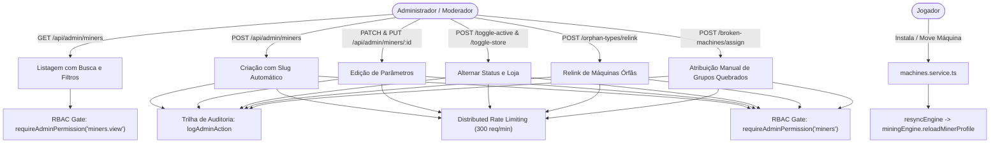

# Documentação Técnica: Gestão de Mineradoras e Catálogo de Máquinas (`/admin/miners` e `/api/admin/miners`)

## 1. Visão Geral e Arquitetura do Domínio

O módulo de **Mineradoras (Catálogo e Máquinas)** é o núcleo da infraestrutura de mineração e economia de equipamentos do BlockMiner:
- **Catálogo Global (`Miner`)**:
  - Máquinas permanentes comercializadas na Loja (`/shop`), distribuídas em eventos ou configuradas pelo administrador.
  - Atributos principais: `name`, `slug`, `baseHashRate` (poder base em H/s), `price` (preço em POL/BLK), `slotSize` (tamanho de 1 ou 2 slots de rack), `tier` (common, rare, epic, legendary), `sourceType`, `isActive` e `showInShop`.
- **Instâncias dos Jogadores (`UserOwnedMachine`, `UserMiner`, `UserInventory`)**:
  - `UserOwnedMachine`: Registro canônico de propriedade da máquina (identidade única, nível, hashrate atualizado e localização: `RACK`, `INVENTORY`, `WAREHOUSE`).
  - `UserMiner`: Representação da máquina instalada fisicamente em um slot de rack na sala de mineração (`slotIndex`, `isActive`).
  - `UserInventory`: Representação da máquina na mochila do usuário aguardando instalação.
- **Sincronização em Tempo Real com o Motor de Mineração**:
  - Qualquer mutação em rack (`toggleMachineForUser`, `removeMachineToInventory`, `moveMachineForUser`, `placeIntoRackSlotTx`) aciona `resyncEngine(userId)` chamando `miningEngine.reloadMinerProfile(userId)` para manter os ganhos matemáticos de blocos 100% atualizados.
- **Sistema de Diagnóstico e Reparo de Máquinas Órfãs (`miners.admin.repair.ts`)**:
  - Detecta máquinas sem vínculo com o catálogo (`minerId` nulo e `eventMinerId` nulo) geradas por legados.
  - Permite aos administradores relincar em lote ou individualmente com mineradoras do catálogo ou de eventos.



---

## 2. Modelo de Dados Prisma

```prisma
model Miner {
  id                Int       @id @default(autoincrement())
  name              String
  slug              String    @unique
  description       String?
  baseHashRate      Float     @default(0) @map("base_hash_rate")
  price             Decimal   @default(0.5) @db.Decimal(18, 8)
  slotSize          Int       @default(1) @map("slot_size")
  imageUrl          String?   @map("image_url")
  tier              String    @default("common")
  sourceType        String    @default("store") @map("source_type")
  isActive          Boolean   @default(true) @map("is_active")
  showInShop        Boolean   @default(true) @map("show_in_shop")
  isArchived        Boolean   @default(false) @map("is_archived")
  sortOrder         Int       @default(0) @map("sort_order")
  createdAt         DateTime  @default(now()) @map("created_at")
  updatedAt         DateTime  @updatedAt @map("updated_at")

  userMiners        UserMiner[]
  userInventory     UserInventory[]
  userOwnedMachines UserOwnedMachine[]
  shopPurchases     ShopPurchase[]

  @@map("miners")
}

model UserOwnedMachine {
  id           Int       @id @default(autoincrement())
  userId       Int       @map("user_id")
  minerId      Int?      @map("miner_id")
  eventMinerId Int?      @map("event_miner_id")
  location     String    @default("INVENTORY") // RACK, INVENTORY, WAREHOUSE
  minerName    String    @map("miner_name")
  level        Int       @default(1)
  hashRate     Float     @default(0) @map("hash_rate")
  slotSize     Int       @default(1) @map("slot_size")
  imageUrl     String?   @map("image_url")
  createdAt    DateTime  @default(now()) @map("created_at")
  updatedAt    DateTime  @updatedAt @map("updated_at")

  miner        Miner?       @relation(fields: [minerId], references: [id])
  eventMiner   EventMiner?  @relation(fields: [eventMinerId], references: [id])
  user         User         @relation(fields: [userId], references: [id], onDelete: Cascade)

  @@map("user_owned_machines")
}
```

---

## 3. Segurança e Governança

1. **RBAC Granular**:
   - `miners.view`: Acesso somente leitura (`GET /miners`, `GET /miners/orphan-types`, `GET /miners/broken-machines`, `GET /miners/:id`).
   - `miners`: Acesso completo com mutação (`POST`, `PATCH`, `PUT`, toggles e reparos de órfãs).
   - Super Admin (`*`): Acesso irrestrito a todos os endpoints.
2. **Proteção contra Abuso (Rate Limiting)**:
   - Rate limiting distribuído em Redis via `createDistributedRateLimiter` com janela de 60 segundos e teto de 300 requisições por minuto (`name: admin_miners_mutation`).
3. **Trilha de Auditoria Administrativa**:
   - Ações persistidas em `admin_audit_logs` registrando `adminId`, `action` (`ADMIN_MINER_CREATE`, `ADMIN_MINER_UPDATE`, `ADMIN_MINER_TOGGLE_ACTIVE`, `ADMIN_MINER_TOGGLE_STORE`, `ADMIN_MINER_ORPHAN_RELINK`, `ADMIN_BROKEN_MACHINES_ASSIGN`), `resource`, `resourceId`, valores anteriores (`oldValue`) e novos valores (`newValue`).
4. **Sanitização Estrita (Zod)**:
   - Rejeição de valores negativos em `baseHashRate` e `price`.
   - Limite estrito de 32-bit em IDs para prevenção de Integer Overflow.
   - Slugs padronizados e validados com expressão regular `^[a-z0-9-]+$`.

---

## 4. Especificação OpenAPI 3.0.3

```yaml
openapi: 3.0.3
info:
  title: BlockMiner Admin Miners API
  version: 1.0.0
  description: API administrativa para gestão do catálogo de mineradoras e reparo de instâncias órfãs.
paths:
  /api/admin/miners:
    get:
      summary: Listar mineradoras do catálogo
      description: Retorna a lista de mineradoras ordenadas por sortOrder com suporte a busca textual e filtro de arquivadas.
      parameters:
        - in: query
          name: q
          schema:
            type: string
          description: Termo de busca por nome ou slug
        - in: query
          name: includeArchived
          schema:
            type: string
            enum: ["0", "1", "true", "false"]
          description: Incluir mineradoras arquivadas
      responses:
        '200':
          description: Lista de mineradoras
          content:
            application/json:
              schema:
                type: object
                properties:
                  ok:
                    type: boolean
                  total:
                    type: integer
                  miners:
                    type: array
                    items:
                      $ref: '#/components/schemas/Miner'
        '401':
          $ref: '#/components/responses/Unauthorized'
        '403':
          $ref: '#/components/responses/Forbidden'
    post:
      summary: Cadastrar nova mineradora
      description: Cria um novo modelo de mineradora no catálogo.
      requestBody:
        required: true
        content:
          application/json:
            schema:
              $ref: '#/components/schemas/CreateMinerInput'
      responses:
        '200':
          description: Mineradora criada com sucesso
          content:
            application/json:
              schema:
                type: object
                properties:
                  ok:
                    type: boolean
                  miner:
                    $ref: '#/components/schemas/Miner'
        '400':
          $ref: '#/components/responses/BadRequest'
        '409':
          description: Slug já em uso

  /api/admin/miners/{id}:
    get:
      summary: Obter detalhes de uma mineradora
      parameters:
        - in: path
          name: id
          required: true
          schema:
            type: integer
      responses:
        '200':
          description: Detalhes da mineradora
        '404':
          description: Mineradora não encontrada
    patch:
      summary: Atualizar parâmetros da mineradora
      parameters:
        - in: path
          name: id
          required: true
          schema:
            type: integer
      requestBody:
        required: true
        content:
          application/json:
            schema:
              $ref: '#/components/schemas/UpdateMinerInput'
      responses:
        '200':
          description: Mineradora atualizada com sucesso
        '400':
          $ref: '#/components/responses/BadRequest'
        '404':
          description: Mineradora não encontrada
    put:
      summary: Atualizar parâmetros da mineradora (idêntico ao PATCH)
      parameters:
        - in: path
          name: id
          required: true
          schema:
            type: integer
      requestBody:
        required: true
        content:
          application/json:
            schema:
              $ref: '#/components/schemas/UpdateMinerInput'
      responses:
        '200':
          description: Mineradora atualizada com sucesso

  /api/admin/miners/{id}/toggle-active:
    post:
      summary: Alternar status ativo/inativo da mineradora
      parameters:
        - in: path
          name: id
          required: true
          schema:
            type: integer
      responses:
        '200':
          description: Status alternado com sucesso
        '404':
          description: Mineradora não encontrada

  /api/admin/miners/{id}/toggle-store:
    post:
      summary: Alternar visibilidade da mineradora na loja
      parameters:
        - in: path
          name: id
          required: true
          schema:
            type: integer
      responses:
        '200':
          description: Visibilidade na loja alternada com sucesso
        '404':
          description: Mineradora não encontrada

  /api/admin/miners/orphan-types:
    get:
      summary: Listar tipos de máquinas órfãs
      responses:
        '200':
          description: Lista de agrupamentos órfãos sem vínculo de catálogo

  /api/admin/miners/orphan-types/relink:
    post:
      summary: Relincar instâncias órfãs ao catálogo
      requestBody:
        required: true
        content:
          application/json:
            schema:
              type: object
              required: [minerName]
              properties:
                minerName:
                  type: string
      responses:
        '200':
          description: Instâncias vinculadas com sucesso
        '400':
          $ref: '#/components/responses/BadRequest'

  /api/admin/miners/broken-machines:
    get:
      summary: Listar grupos de máquinas com inconsistência
      responses:
        '200':
          description: Grupos quebrados agrupados por nome, hashrate e localização

  /api/admin/miners/broken-machines/assign:
    post:
      summary: Atribuir mineradora do catálogo ou evento a grupo quebrado
      requestBody:
        required: true
        content:
          application/json:
            schema:
              type: object
              required: [minerName, hashRate, location]
              properties:
                minerName:
                  type: string
                hashRate:
                  type: number
                location:
                  type: string
                  enum: [RACK, INVENTORY, WAREHOUSE]
                catalogMinerId:
                  type: integer
                eventMinerId:
                  type: integer
      responses:
        '200':
          description: Atribuição realizada com sucesso
        '400':
          $ref: '#/components/responses/BadRequest'

components:
  schemas:
    Miner:
      type: object
      properties:
        id:
          type: integer
        name:
          type: string
        slug:
          type: string
        description:
          type: string
          nullable: true
        baseHashRate:
          type: number
        price:
          type: number
        slotSize:
          type: integer
        imageUrl:
          type: string
          nullable: true
        tier:
          type: string
        sourceType:
          type: string
        isActive:
          type: boolean
        showInShop:
          type: boolean
        isArchived:
          type: boolean
        sortOrder:
          type: integer
    CreateMinerInput:
      type: object
      required: [name, baseHashRate, price]
      properties:
        name:
          type: string
        slug:
          type: string
        description:
          type: string
        baseHashRate:
          type: number
        price:
          type: number
        slotSize:
          type: integer
        imageUrl:
          type: string
        tier:
          type: string
        sourceType:
          type: string
        isActive:
          type: boolean
        showInShop:
          type: boolean
        sortOrder:
          type: integer
    UpdateMinerInput:
      type: object
      properties:
        name:
          type: string
        slug:
          type: string
        description:
          type: string
        baseHashRate:
          type: number
        price:
          type: number
        slotSize:
          type: integer
        imageUrl:
          type: string
        tier:
          type: string
        sourceType:
          type: string
        isActive:
          type: boolean
        showInShop:
          type: boolean
        isArchived:
          type: boolean
        sortOrder:
          type: integer

  responses:
    Unauthorized:
      description: Token de autenticação ausente ou inválido
      content:
        application/json:
          schema:
            type: object
            properties:
              ok:
                type: boolean
                example: false
              message:
                type: string
    Forbidden:
      description: Permissão RBAC insuficiente
      content:
        application/json:
          schema:
            type: object
            properties:
              ok:
                type: boolean
                example: false
              code:
                type: string
                example: FORBIDDEN_PERMISSION
              message:
                type: string
    BadRequest:
      description: Payload inválido de acordo com o schema Zod
      content:
        application/json:
          schema:
            type: object
            properties:
              ok:
                type: boolean
                example: false
              message:
                type: string
