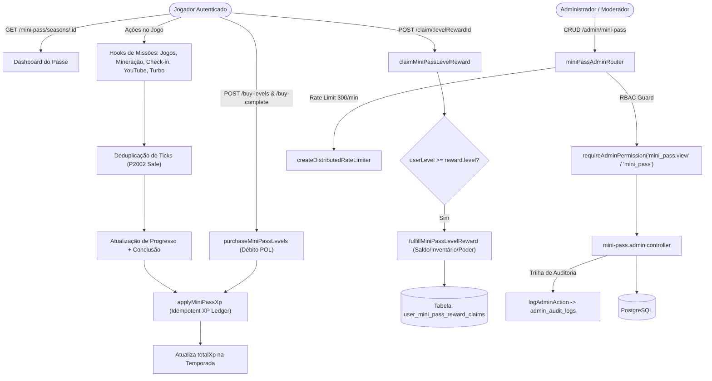

# Documentação Técnica: Gestão de Temporadas do Mini Pass (`/mini-pass` e `/admin/mini-pass`)

## 1. Visão Geral e Arquitetura do Domínio

O **Mini Pass** é o sistema de passe de batalha (*Battle Pass*) e progressão por níveis do BlockMiner:
- **Temporadas Temporais (`MiniPassSeason`)**: Temporadas com datas de início (`startsAt`) e fim (`endsAt`), que determinam o ciclo de vida (`upcoming`, `live`, `ended`, `hidden`).
- **Níveis e Progressão (`level-math`)**:
  - `maxLevel`: Número máximo de níveis na temporada (ex: 10, 20, 50).
  - `xpPerLevel`: Quantidade de XP necessária para avançar 1 nível (ex: 100 XP).
  - `xpCap`: Teto total de XP da temporada (`maxLevel * xpPerLevel`).
  - `computePassLevel(totalXp, xpPerLevel, maxLevel)`: Nível do jogador derivado matematicamente (`Math.min(maxLevel, Math.floor(totalXp / xpPerLevel) + 1)`).
- **Missões e Cadências (`MiniPassMission`)**:
  - `cadence`: Ciclo de renovação (`DAILY`, `WEEKLY`, `EVENT`).
  - `missionType`: Tipos de evento monitorados (`PLAY_GAMES`, `MINE_BLK`, `LOGIN_DAY`, `WATCH_YOUTUBE`, `AUTO_MINING_TURBO`, `INTERNAL_OFFERWALL`).
  - Hooks assíncronos registram progresso em `UserMiniPassMissionProgress` com deduplicação atômica (`UserMiniPassMissionDedupeTick`).
- **Recompensas por Nível (`MiniPassLevelReward`)**:
  - `NONE`: Nível sem recompensa.
  - `SHOP_MINER`: Máquina do catálogo da loja (`minerId`).
  - `EVENT_MINER`: Máquina de evento (`eventMinerId`).
  - `HASHRATE_TEMP`: Poder de mineração temporário (`user_power_games`).
  - `BLK` / `POL`: Crédito direto no saldo do usuário.
- **Compra de Níveis e Passe Completo**:
  - `POST /mini-pass/seasons/:id/buy-levels`: Compra de níveis adicionais debitando saldo POL (`buyLevelPricePol`).
  - `POST /mini-pass/seasons/:id/buy-complete`: Compra do passe completo debitando saldo POL (`completePassPricePol`).



---

## 2. Modelo de Dados Prisma

```prisma
model MiniPassSeason {
  id                   Int       @id @default(autoincrement())
  slug                 String    @unique
  titleI18n            Json      @map("title_i18n")
  subtitleI18n         Json?     @map("subtitle_i18n")
  startsAt             DateTime  @map("starts_at")
  endsAt               DateTime  @map("ends_at")
  maxLevel             Int       @map("max_level")
  xpPerLevel           Int       @map("xp_per_level")
  buyLevelPricePol     Decimal   @default(0) @map("buy_level_price_pol") @db.Decimal(20, 8)
  completePassPricePol Decimal   @default(0) @map("complete_pass_price_pol") @db.Decimal(20, 8)
  bannerImageUrl       String?   @map("banner_image_url")
  isActive             Boolean   @default(true) @map("is_active")
  deletedAt            DateTime? @map("deleted_at")
  createdAt            DateTime  @default(now()) @map("created_at")
  updatedAt            DateTime  @updatedAt @map("updated_at")

  levelRewards MiniPassLevelReward[]
  missions     MiniPassMission[]
  enrollments  UserMiniPassEnrollment[]
  xpLedger     UserMiniPassXpLedger[]
  purchases    UserMiniPassPurchase[]

  @@index([startsAt, endsAt])
  @@index([isActive, deletedAt])
  @@map("mini_pass_seasons")
}

model MiniPassLevelReward {
  id           Int      @id @default(autoincrement())
  seasonId     Int      @map("season_id")
  level        Int
  rewardKind   String   @map("reward_kind")
  minerId      Int?     @map("miner_id")
  eventMinerId Int?     @map("event_miner_id")
  hashRate     Float?   @map("hash_rate")
  hashRateDays Int?     @map("hash_rate_days")
  blkAmount    Decimal? @map("blk_amount") @db.Decimal(20, 8)
  polAmount    Decimal? @map("pol_amount") @db.Decimal(20, 8)
  titleI18n    Json?    @map("title_i18n")
  sortOrder    Int      @default(0) @map("sort_order")
  createdAt    DateTime @default(now()) @map("created_at")
  updatedAt    DateTime @updatedAt @map("updated_at")

  season     MiniPassSeason            @relation(fields: [seasonId], references: [id], onDelete: Cascade)
  miner      Miner?                    @relation(fields: [minerId], references: [id], onDelete: SetNull)
  eventMiner EventMiner?               @relation(fields: [eventMinerId], references: [id], onDelete: SetNull)
  claims     UserMiniPassRewardClaim[]

  @@unique([seasonId, level])
  @@index([seasonId])
  @@map("mini_pass_level_rewards")
}

model MiniPassMission {
  id              Int      @id @default(autoincrement())
  seasonId        Int      @map("season_id")
  cadence         String
  missionType     String   @map("mission_type")
  targetValue     Decimal  @map("target_value") @db.Decimal(24, 8)
  xpReward        Int      @map("xp_reward")
  titleI18n       Json     @map("title_i18n")
  descriptionI18n Json?    @map("description_i18n")
  gameSlug        String?  @map("game_slug")
  isActive        Boolean  @default(true) @map("is_active")
  sortOrder       Int      @default(0) @map("sort_order")
  createdAt       DateTime @default(now()) @map("created_at")
  updatedAt       DateTime @updatedAt @map("updated_at")

  season      MiniPassSeason                  @relation(fields: [seasonId], references: [id], onDelete: Cascade)
  progress    UserMiniPassMissionProgress[]
  xpGrants    UserMiniPassXpLedger[]
  dedupeTicks UserMiniPassMissionDedupeTick[]

  @@index([seasonId])
  @@map("mini_pass_missions")
}

model UserMiniPassEnrollment {
  id         Int      @id @default(autoincrement())
  userId     Int      @map("user_id")
  seasonId   Int      @map("season_id")
  totalXp    Int      @default(0) @map("total_xp")
  enrolledAt DateTime @default(now()) @map("enrolled_at")

  user   User           @relation(fields: [userId], references: [id], onDelete: Cascade)
  season MiniPassSeason @relation(fields: [seasonId], references: [id], onDelete: Cascade)

  @@unique([userId, seasonId])
  @@index([seasonId])
  @@map("user_mini_pass_enrollments")
}
```

---

## 3. Matriz RBAC de Controle de Acesso

O acesso administrativo ao gerenciamento de temporadas do Mini Pass é governado por papéis definidos em `server/modules/admin/admin.permissions.ts`:

| Permissão | Categoria | Descrição | Papéis com Acesso Padrão |
| :--- | :--- | :--- | :--- |
| **`mini_pass`** | Engajamento | Gestão completa (criação, edição, exclusão de temporadas, recompensas e missões). | `super_admin`, `admin` |
| **`mini_pass.view`** | Engajamento | Visualização de temporadas cadastradas, níveis e missões (leitura). | `super_admin`, `admin`, `moderator` |

- Operações de leitura (`GET /mini-pass/seasons`, `GET /mini-pass/seasons/:id`) são autorizadas para `mini_pass.view` e `mini_pass`.
- Operações de escrita (`POST`, `PUT`, `PATCH`, `DELETE`) exigem estritamente a permissão `mini_pass`.
- Todas as mutações administrativas são registradas em `admin_audit_logs` via `logAdminAction`.

---

## 4. Especificação OpenAPI 3.0.3

```yaml
openapi: 3.0.3
info:
  title: BlockMiner Mini Pass API
  version: 1.0.0
  description: Endpoints públicos e administrativos para progressão, temporadas, recompensas e missões do Mini Pass.

paths:
  /api/mini-pass/seasons:
    get:
      summary: Listar temporadas ao vivo e futuras disponíveis para o jogador
      security:
        - cookieAuth: []
      responses:
        "200":
          description: Lista de temporadas públicas
        "401":
          description: Não autenticado

  /api/mini-pass/seasons/{seasonId}:
    get:
      summary: Obter dashboard completo da temporada para o jogador logado
      security:
        - cookieAuth: []
      parameters:
        - name: seasonId
          in: path
          required: true
          schema: { type: integer }
      responses:
        "200":
          description: Detalhes da temporada, progresso de nível, missões e recompensas
        "404":
          description: Temporada não encontrada ou não ativa

  /api/mini-pass/seasons/{seasonId}/claim/{levelRewardId}:
    post:
      summary: Resgatar recompensa de nível desbloqueado
      security:
        - cookieAuth: []
      parameters:
        - name: seasonId
          in: path
          required: true
          schema: { type: integer }
        - name: levelRewardId
          in: path
          required: true
          schema: { type: integer }
      responses:
        "200":
          description: Recompensa resgatada com sucesso
        "400":
          description: Nível não atingido ou temporada encerrada

  /api/mini-pass/seasons/{seasonId}/buy-levels:
    post:
      summary: Comprar níveis do passe com saldo POL
      security:
        - cookieAuth: []
      parameters:
        - name: seasonId
          in: path
          required: true
          schema: { type: integer }
      requestBody:
        content:
          application/json:
            schema:
              type: object
              properties:
                quantity: { type: integer, minimum: 1, maximum: 50, default: 1 }
      responses:
        "200":
          description: Níveis comprados com sucesso
        "400":
          description: Saldo insuficiente ou nível máximo atingido

  /api/mini-pass/seasons/{seasonId}/buy-complete:
    post:
      summary: Comprar o passe completo com saldo POL
      security:
        - cookieAuth: []
      parameters:
        - name: seasonId
          in: path
          required: true
          schema: { type: integer }
      responses:
        "200":
          description: Passe completo adquirido com sucesso
        "400":
          description: Saldo insuficiente ou nível máximo atingido

  /api/admin/mini-pass/seasons:
    get:
      summary: Listar todas as temporadas cadastradas (Admin)
      security:
        - adminAuth: []
      responses:
        "200":
          description: Lista de temporadas com contadores de recompensas e missões
    post:
      summary: Criar nova temporada (Admin)
      security:
        - adminAuth: []
      requestBody:
        required: true
        content:
          application/json:
            schema:
              type: object
              required: [slug, titleI18n, startsAt, endsAt]
              properties:
                slug: { type: string }
                titleI18n: { type: object }
                subtitleI18n: { type: object, nullable: true }
                startsAt: { type: string, format: date-time }
                endsAt: { type: string, format: date-time }
                maxLevel: { type: integer, default: 10 }
                xpPerLevel: { type: integer, default: 100 }
                buyLevelPricePol: { type: number, default: 1 }
                completePassPricePol: { type: number, default: 10 }
                bannerImageUrl: { type: string, nullable: true }
                isActive: { type: boolean, default: true }
      responses:
        "201":
          description: Temporada criada com sucesso

  /api/admin/mini-pass/seasons/{id}:
    get:
      summary: Obter dados detalhados da temporada (Admin)
      security:
        - adminAuth: []
      parameters:
        - name: id
          in: path
          required: true
          schema: { type: integer }
      responses:
        "200":
          description: Temporada com todas as recompensas de nível e missões
    put:
      summary: Atualizar temporada (Admin)
      security:
        - adminAuth: []
      parameters:
        - name: id
          in: path
          required: true
          schema: { type: integer }
      responses:
        "200":
          description: Temporada atualizada com sucesso
    patch:
      summary: Atualizar parcialmente temporada (Admin)
      security:
        - adminAuth: []
      parameters:
        - name: id
          in: path
          required: true
          schema: { type: integer }
      responses:
        "200":
          description: Temporada atualizada com sucesso
    delete:
      summary: Soft-delete de temporada (Admin)
      security:
        - adminAuth: []
      parameters:
        - name: id
          in: path
          required: true
          schema: { type: integer }
      responses:
        "200":
          description: Temporada desativada com sucesso

  /api/admin/mini-pass/seasons/{seasonId}/level-rewards:
    post:
      summary: Criar recompensa de nível na temporada (Admin)
      security:
        - adminAuth: []
      parameters:
        - name: seasonId
          in: path
          required: true
          schema: { type: integer }
      responses:
        "200":
          description: Recompensa criada com sucesso

  /api/admin/mini-pass/seasons/{seasonId}/level-rewards/{rewardId}:
    put:
      summary: Atualizar recompensa de nível (Admin)
      security:
        - adminAuth: []
      parameters:
        - name: seasonId
          in: path
          required: true
          schema: { type: integer }
        - name: rewardId
          in: path
          required: true
          schema: { type: integer }
      responses:
        "200":
          description: Recompensa atualizada com sucesso
    patch:
      summary: Atualizar parcialmente recompensa de nível (Admin)
      security:
        - adminAuth: []
      parameters:
        - name: seasonId
          in: path
          required: true
          schema: { type: integer }
        - name: rewardId
          in: path
          required: true
          schema: { type: integer }
      responses:
        "200":
          description: Recompensa atualizada com sucesso
    delete:
      summary: Excluir recompensa de nível (Admin)
      security:
        - adminAuth: []
      parameters:
        - name: seasonId
          in: path
          required: true
          schema: { type: integer }
        - name: rewardId
          in: path
          required: true
          schema: { type: integer }
      responses:
        "200":
          description: Recompensa excluída com sucesso

  /api/admin/mini-pass/seasons/{seasonId}/missions:
    post:
      summary: Criar missão na temporada (Admin)
      security:
        - adminAuth: []
      parameters:
        - name: seasonId
          in: path
          required: true
          schema: { type: integer }
      responses:
        "200":
          description: Missão criada com sucesso

  /api/admin/mini-pass/seasons/{seasonId}/missions/{missionId}:
    put:
      summary: Atualizar missão na temporada (Admin)
      security:
        - adminAuth: []
      parameters:
        - name: seasonId
          in: path
          required: true
          schema: { type: integer }
        - name: missionId
          in: path
          required: true
          schema: { type: integer }
      responses:
        "200":
          description: Missão atualizada com sucesso
    patch:
      summary: Atualizar parcialmente missão na temporada (Admin)
      security:
        - adminAuth: []
      parameters:
        - name: seasonId
          in: path
          required: true
          schema: { type: integer }
        - name: missionId
          in: path
          required: true
          schema: { type: integer }
      responses:
        "200":
          description: Missão atualizada com sucesso
    delete:
      summary: Excluir missão na temporada (Admin)
      security:
        - adminAuth: []
      parameters:
        - name: seasonId
          in: path
          required: true
          schema: { type: integer }
        - name: missionId
          in: path
          required: true
          schema: { type: integer }
      responses:
        "200":
          description: Missão excluída com sucesso
```
