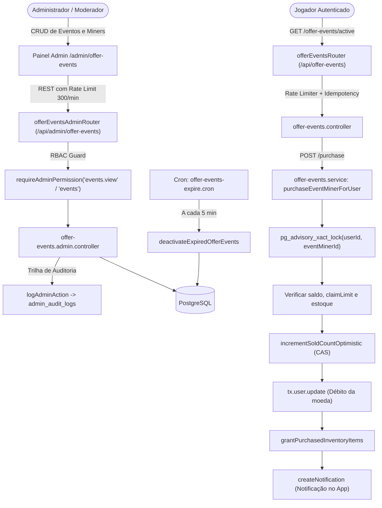

# Documentação Técnica: Gestão de Eventos de Oferta (`/offers` e `/admin/offer-events`)

## 1. Visão Geral e Arquitetura do Domínio

O módulo **Offer Events** gerencia as campanhas promocionais e eventos de compras de máquinas exclusivas e equipamentos do BlockMiner:
- **Eventos com Janela Temporal (`OfferEvent`)**: Ofertas com data de início (`startsAt`) e fim (`endsAt`), que ativam automaticamente no catálogo público (`/offers`) e são desativadas de forma programada pelo cron de expiração (`offer-events-expire.cron.ts`).
- **Máquinas de Evento (`EventMiner`)**: Mineradoras customizadas vinculadas ao evento, com precificação flexível em múltiplas moedas (`POL`, `BLK`, `BTC`, `ETH`, `USDT`, `USDC`, `ZER`), controle de estoque global (`stockCount` / `stockUnlimited`) e limites de coleta por jogador (`claimLimitPerUser`).
- **Ofertas de Acessórios (Fans & Racks)**: As rotas públicas `/offer-events/purchase-fan` e `/offer-events/purchase-rack` são roteadas por este módulo para permitir checkout unificado com limites configurados por variáveis de ambiente (`FAN_MAX_BULK_QUANTITY` e `RACK_MAX_BULK_QUANTITY`).



---

## 2. Modelo de Dados Prisma

```prisma
model OfferEvent {
  id          Int       @id @default(autoincrement())
  title       String
  description String    @db.Text
  imageUrl    String?   @map("image_url")
  startsAt    DateTime  @map("starts_at")
  endsAt      DateTime  @map("ends_at")
  isActive    Boolean   @default(true) @map("is_active")
  deletedAt   DateTime? @map("deleted_at")
  createdAt   DateTime  @default(now()) @map("created_at")
  updatedAt   DateTime  @updatedAt @map("updated_at")

  miners    EventMiner[]
  purchases EventPurchase[]

  @@index([startsAt, endsAt])
  @@index([isActive, deletedAt])
  @@map("offer_events")
}

model EventMiner {
  id                Int      @id @default(autoincrement())
  eventId           Int      @map("event_id")
  name              String
  description       String   @db.Text
  imageUrl          String?  @map("image_url")
  price             Decimal  @db.Decimal(20, 8)
  hashRate          Float    @map("hash_rate")
  currency          String   @default("BLK")
  stockUnlimited    Boolean  @default(false) @map("stock_unlimited")
  stockCount        Int?     @map("stock_count")
  soldCount         Int      @default(0) @map("sold_count")
  slotSize          Int      @default(1) @map("slot_size")
  isActive          Boolean  @default(true) @map("is_active")
  isFree            Boolean  @default(false) @map("is_free")
  claimLimitPerUser Int      @default(1) @map("claim_limit_per_user")
  createdAt         DateTime @default(now()) @map("created_at")
  updatedAt         DateTime @updatedAt @map("updated_at")

  event                OfferEvent            @relation(fields: [eventId], references: [id], onDelete: Cascade)
  purchases            EventPurchase[]
  miniPassLevelRewards MiniPassLevelReward[]
  dailyTaskRewardDefs  DailyTaskDefinition[]
  userOwnedMachines    UserOwnedMachine[]

  @@index([eventId])
  @@map("event_miners")
}

model EventPurchase {
  id           Int      @id @default(autoincrement())
  userId       Int      @map("user_id")
  eventId      Int      @map("event_id")
  eventMinerId Int      @map("event_miner_id")
  pricePaid    Decimal  @map("price_paid") @db.Decimal(20, 8)
  currency     String
  createdAt    DateTime @default(now()) @map("created_at")

  user       User       @relation(fields: [userId], references: [id], onDelete: Cascade)
  event      OfferEvent @relation(fields: [eventId], references: [id], onDelete: Cascade)
  eventMiner EventMiner @relation(fields: [eventMinerId], references: [id], onDelete: Restrict)

  @@index([userId])
  @@index([eventId])
  @@index([eventMinerId])
  @@index([userId, eventMinerId])
  @@map("event_purchases")
}
```

---

## 3. Mecanismos de Concorrência & Segurança Financeira

1. **Advisory Lock por Usuário e Mineradora**:
   - Para impedir que um usuário colete mais máquinas gratuitas do que o limite permitido (`claimLimitPerUser`) através de cliques simultâneos em abas paralelas, a transação executa:
     ```sql
     SELECT pg_advisory_xact_lock(userId::int, eventMinerId::int)
     ```
   - Isso serializa qualquer requisição concorrente do mesmo jogador para a mesma mineradora, liberando automaticamente no `commit` ou `rollback`.
2. **Controle Otimista de Estoque (CAS)**:
   - Para o estoque global (`stockCount`), a função `incrementSoldCountOptimistic` executa um loop de atualização atômica com verificação de versão (`where: { id, soldCount: m.soldCount }`), garantindo que não haja over-selling mesmo sob alta concorrência.
3. **Idempotência Estrita**:
   - As mutações de compra utilizam `requireCriticalIdempotency` via cabeçalho `Idempotency-Key` com lease distribuído.
4. **Proteção Anti-SSRF / URL Maliciosa**:
   - Validação Zod estrita de URLs de imagem (`imageUrl`).

---

## 4. Matriz RBAC de Controle de Acesso

O acesso administrativo ao gerenciamento de eventos é governado por papéis definidos em `server/modules/admin/admin.permissions.ts`:

| Permissão | Categoria | Descrição | Papéis com Acesso Padrão |
| :--- | :--- | :--- | :--- |
| **`events`** | Monetização | Gestão completa (criação, edição, exclusão de eventos e mineradoras). | `super_admin`, `admin` |
| **`events.view`** | Monetização | Visualização de eventos, mineradoras cadastradas e vendas. | `super_admin`, `admin`, `moderator` |

- Operações de leitura (`GET`) são liberadas para `events.view` e `events`.
- Mutações (`POST`, `PUT`, `PATCH`, `DELETE`) exigem estritamente a permissão `events`.
- Todas as mutações administrativas são registradas em `admin_audit_logs` via `logAdminAction`.

---

## 5. Especificação OpenAPI 3.0.3

```yaml
openapi: 3.0.3
info:
  title: BlockMiner Offer Events API
  version: 1.0.0
  description: Endpoints públicos e administrativos para gerenciamento e compra de eventos de oferta e mineradoras promocionais.

paths:
  /api/offer-events/active:
    get:
      summary: Listar eventos e ofertas ativas para o jogador logado
      security:
        - cookieAuth: []
      responses:
        "200":
          description: Eventos ativos, catálogo de miners e ofertas de acessórios
        "401":
          description: Não autenticado

  /api/offer-events/purchase:
    post:
      summary: Comprar ou resgatar mineradora de evento
      security:
        - cookieAuth: []
      requestBody:
        required: true
        content:
          application/json:
            schema:
              type: object
              required: [eventMinerId]
              properties:
                eventMinerId: { type: integer }
                quantity: { type: integer, minimum: 1, maximum: 25, default: 1 }
      responses:
        "200":
          description: Compra realizada com sucesso
        "400":
          description: Saldo insuficiente ou limite de coletas atingido
        "409":
          description: Conflito de concorrência (retry)

  /api/offer-events/purchase-fan:
    post:
      summary: Comprar fans na página de ofertas
      security:
        - cookieAuth: []
      requestBody:
        required: true
        content:
          application/json:
            schema:
              type: object
              required: [sku]
              properties:
                sku: { type: string }
                quantity: { type: integer, minimum: 1 }
      responses:
        "200":
          description: Fan comprado com sucesso

  /api/offer-events/purchase-rack:
    post:
      summary: Comprar racks na página de ofertas
      security:
        - cookieAuth: []
      requestBody:
        required: true
        content:
          application/json:
            schema:
              type: object
              required: [sku]
              properties:
                sku: { type: string }
                quantity: { type: integer, minimum: 1 }
      responses:
        "200":
          description: Rack comprado com sucesso

  /api/admin/offer-events:
    get:
      summary: Listar eventos de oferta com métricas de vendas (Admin)
      security:
        - adminAuth: []
      parameters:
        - name: page
          in: query
          schema: { type: integer, default: 1 }
        - name: pageSize
          in: query
          schema: { type: integer, default: 20, maximum: 100 }
        - name: includeDeleted
          in: query
          schema: { type: string, enum: ["0", "1"] }
      responses:
        "200":
          description: Lista paginada de eventos
    post:
      summary: Criar novo evento de oferta (Admin)
      security:
        - adminAuth: []
      requestBody:
        required: true
        content:
          application/json:
            schema:
              type: object
              required: [title, description, startsAt, endsAt]
              properties:
                title: { type: string }
                description: { type: string }
                imageUrl: { type: string, nullable: true }
                startsAt: { type: string, format: date-time }
                endsAt: { type: string, format: date-time }
                isActive: { type: boolean, default: true }
      responses:
        "200":
          description: Evento criado

  /api/admin/offer-events/{id}:
    get:
      summary: Obter detalhes do evento de oferta (Admin)
      security:
        - adminAuth: []
      parameters:
        - name: id
          in: path
          required: true
          schema: { type: integer }
      responses:
        "200":
          description: Detalhes do evento
    put:
      summary: Atualizar evento de oferta (Admin)
      security:
        - adminAuth: []
      parameters:
        - name: id
          in: path
          required: true
          schema: { type: integer }
      responses:
        "200":
          description: Evento atualizado
    patch:
      summary: Atualizar parcialmente evento de oferta (Admin)
      security:
        - adminAuth: []
      parameters:
        - name: id
          in: path
          required: true
          schema: { type: integer }
      responses:
        "200":
          description: Evento atualizado
    delete:
      summary: Soft-delete de evento de oferta (Admin)
      security:
        - adminAuth: []
      parameters:
        - name: id
          in: path
          required: true
          schema: { type: integer }
      responses:
        "200":
          description: Evento desativado

  /api/admin/offer-events/{eventId}/miners:
    get:
      summary: Listar mineradoras do evento (Admin)
      security:
        - adminAuth: []
      parameters:
        - name: eventId
          in: path
          required: true
          schema: { type: integer }
      responses:
        "200":
          description: Lista de miners
    post:
      summary: Cadastrar mineradora no evento (Admin)
      security:
        - adminAuth: []
      parameters:
        - name: eventId
          in: path
          required: true
          schema: { type: integer }
      requestBody:
        required: true
        content:
          application/json:
            schema:
              type: object
              required: [name, price, hashRate, stockUnlimited]
              properties:
                name: { type: string }
                description: { type: string }
                imageUrl: { type: string, nullable: true }
                price: { type: number }
                hashRate: { type: number }
                currency: { type: string, enum: [POL, BLK, BTC, ETH, USDT, USDC, ZER] }
                stockUnlimited: { type: boolean }
                stockCount: { type: integer, nullable: true }
                slotSize: { type: integer, enum: [1, 2], default: 1 }
                isFree: { type: boolean, default: false }
                claimLimitPerUser: { type: integer, default: 1 }
                isActive: { type: boolean, default: true }
      responses:
        "200":
          description: Mineradora cadastrada

  /api/admin/offer-events/{eventId}/miners/{minerId}:
    put:
      summary: Atualizar mineradora do evento (Admin)
      security:
        - adminAuth: []
      parameters:
        - name: eventId
          in: path
          required: true
          schema: { type: integer }
        - name: minerId
          in: path
          required: true
          schema: { type: integer }
      responses:
        "200":
          description: Mineradora atualizada
    patch:
      summary: Atualizar parcialmente mineradora do evento (Admin)
      security:
        - adminAuth: []
      parameters:
        - name: eventId
          in: path
          required: true
          schema: { type: integer }
      responses:
        "200":
          description: Mineradora atualizada
    delete:
      summary: Remover ou desativar mineradora do evento (Admin)
      security:
        - adminAuth: []
      parameters:
        - name: eventId
          in: path
          required: true
          schema: { type: integer }
        - name: minerId
          in: path
          required: true
          schema: { type: integer }
      responses:
        "200":
          description: Mineradora removida ou desativada

  /api/admin/offer-events/{id}/purchases:
    get:
      summary: Listar histórico de compras consolidadas do evento (Admin)
      security:
        - adminAuth: []
      parameters:
        - name: id
          in: path
          required: true
          schema: { type: integer }
        - name: page
          in: query
          schema: { type: integer, default: 1 }
        - name: pageSize
          in: query
          schema: { type: integer, default: 100, maximum: 200 }
        - name: userId
          in: query
          schema: { type: integer }
      responses:
        "200":
          description: Lotes de compras agregados com estatísticas
```
