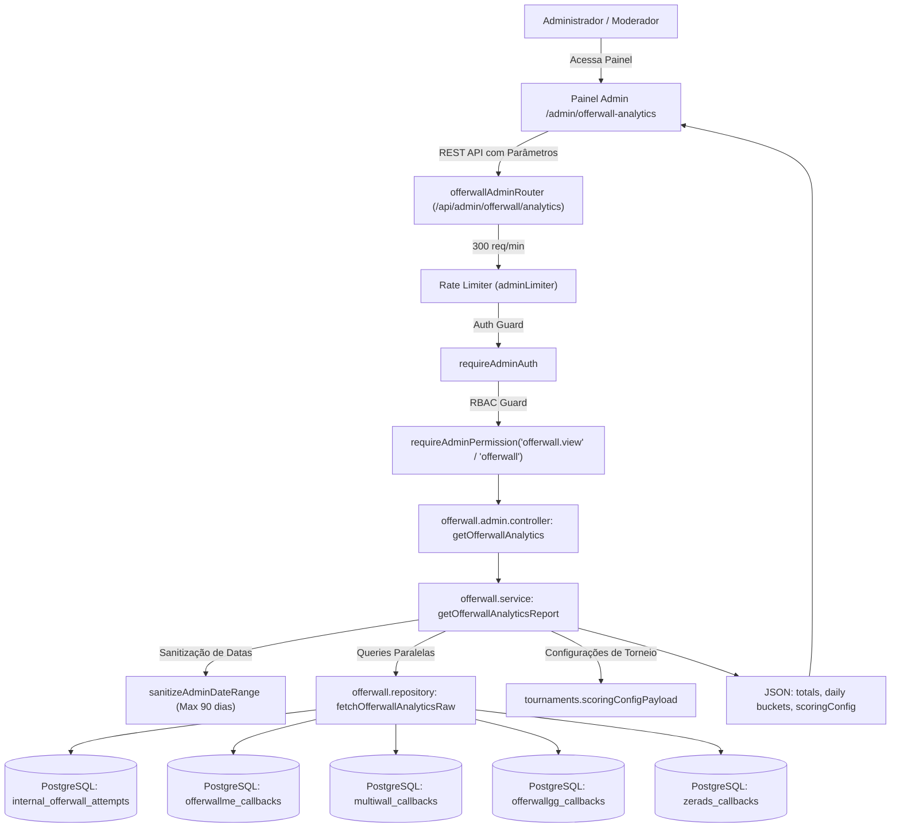

# Documentação Técnica: Gestão de Offerwall Analytics (`/admin/offerwall-analytics`)

## 1. Visão Geral e Arquitetura do Domínio

O módulo **Offerwall Analytics** (`/admin/offerwall-analytics`) é a central administrativa de inteligência de monetização externa e conversões do BlockMiner.

Ao contrário dos módulos de provedores individuais (`internal-offerwall`, `offerwallme`, `multiwall`, `offerwallgg`, `zerads`), que processam sessões de usuários ou recebem webhooks/postbacks S2S com creditação de saldo, o módulo `offerwall/` atua como uma **fronteira de consolidação analítica e auditoria**:
- **Agregação Multi-Provedor**: Executa queries paralelas no PostgreSQL para consolidar métricas de 5 fontes de dados distintas.
- **Relatório Temporal UTC/BRT**: Agrupa as conversões em baldes diários UTC (com carimbo e apresentação em horário de Brasília), calculando subtotais de eventos e payouts em POL.
- **Integração com Torneios**: Expõe a configuração ativa do motor de pontuação (`scoringConfig`), incluindo o limite diário de cliques de tráfego/PTC para ligas e rankings.



---

## 2. Fontes de Dados Consolidadas

| Provedor / Tipo | Tabela PostgreSQL | Critério de Conclusão / Filtro | Campos de Métrica |
| :--- | :--- | :--- | :--- |
| **Internas** | `internal_offerwall_attempts` | `status = 'COMPLETED'` | `completedAt`, `offer.rewardPolAmount`, `offer.rewardBlkAmount` |
| **OfferwallMe** | `offerwallme_callbacks` | `status = 1` | `createdAt`, `polCredited`, `payoutUsd` |
| **Multiwall (Offerwall PRO)** | `multiwall_callbacks` | `status = 1` | `createdAt`, `polCredited`, `payoutUsd` |
| **Offerwall.GG** | `offerwallgg_callbacks` | `status = 1` | `createdAt`, `polCredited`, `payoutUsd` |
| **Zerads PTC** | `zerads_callbacks` | Todos os registros validados | `callbackAt`, `clicks`, `payoutAmount` |

---

## 3. Matriz RBAC de Controle de Acesso

O módulo adota o controle estrito baseado em papéis centralizado em `server/modules/admin/admin.permissions.ts`:

| Permissão | Categoria | Descrição | Papéis com Acesso Padrão |
| :--- | :--- | :--- | :--- |
| **`offerwall`** | Monetização | Gestão completa e operacional de offerwalls e provedores externos. | `super_admin`, `admin` |
| **`offerwall.view`** | Monetização | Visualização e consulta analítica do painel de offerwalls (`/admin/offerwall-analytics`). | `super_admin`, `admin`, `moderator` |

Usuários não autenticados recebem `HTTP 401 Unauthorized`. Administradores sem a permissão `offerwall` ou `offerwall.view` (ex: `finance`, `support`, `readonly`) recebem `HTTP 403 Forbidden` com código `FORBIDDEN_PERMISSION`.

---

## 4. Especificação OpenAPI 3.0.3

```yaml
openapi: 3.0.3
info:
  title: BlockMiner Offerwall Analytics API
  version: 1.0.0
  description: Endpoints administrativos para consulta consolidada de conversões, postbacks e métricas de offerwalls.

paths:
  /api/admin/offerwall/analytics:
    get:
      summary: Consulta métricas consolidadas de conversões de offerwalls por período
      tags:
        - Admin Offerwall
      security:
        - AdminAuth: []
      parameters:
        - name: from
          in: query
          required: false
          description: Data/hora inicial no formato ISO 8601 (padrão 7 dias atrás UTC)
          schema:
            type: string
            format: date-time
            example: "2026-09-21T00:00:00.000Z"
        - name: to
          in: query
          required: false
          description: Data/hora final no formato ISO 8601 (padrão agora)
          schema:
            type: string
            format: date-time
            example: "2026-09-28T23:59:59.999Z"
        - name: userId
          in: query
          required: false
          description: Filtrar métricas por um jogador específico
          schema:
            type: integer
            example: 1042
      responses:
        '200':
          description: Relatório analítico consolidado retornado com sucesso
          content:
            application/json:
              schema:
                type: object
                properties:
                  ok:
                    type: boolean
                    example: true
                  from:
                    type: string
                    example: "2026-09-21T00:00:00.000Z"
                  to:
                    type: string
                    example: "2026-09-28T03:00:00.000Z"
                  serverNow:
                    type: string
                    example: "2026-09-28T03:00:00.000Z"
                  serverNowBrt:
                    type: string
                    example: "28/09/2026 00:00:00"
                  userId:
                    type: integer
                    nullable: true
                    example: null
                  scoringConfig:
                    type: object
                  totals:
                    type: object
                    properties:
                      internal:
                        type: object
                        properties:
                          count: { type: integer, example: 4300 }
                          pol: { type: number, example: 0.0000 }
                      offerwallMe:
                        type: object
                        properties:
                          count: { type: integer, example: 603 }
                          pol: { type: number, example: 0.3015 }
                      multiwall:
                        type: object
                        properties:
                          count: { type: integer, example: 740 }
                          pol: { type: number, example: 0.3700 }
                      offerwallGg:
                        type: object
                        properties:
                          count: { type: integer, example: 0 }
                          pol: { type: number, example: 0.0000 }
                      zerads:
                        type: object
                        properties:
                          callbacks: { type: integer, example: 35989 }
                          clicks: { type: integer, example: 35989 }
                          pol: { type: number, example: 17.9945 }
                  daily:
                    type: array
                    items:
                      type: object
                      properties:
                        day: { type: string, example: "2026-09-28" }
                        dayBrt: { type: string, example: "28/09/2026" }
                        internal: { type: integer, example: 121 }
                        internalPol: { type: number, example: 0.0000 }
                        offerwallMe: { type: integer, example: 14 }
                        offerwallMePol: { type: number, example: 0.0070 }
                        multiwall: { type: integer, example: 5 }
                        multiwallPol: { type: number, example: 0.0025 }
                        offerwallGg: { type: integer, example: 0 }
                        offerwallGgPol: { type: number, example: 0.0000 }
                        zeradsCallbacks: { type: integer, example: 0 }
                        zeradsClicks: { type: integer, example: 0 }
                        zeradsPol: { type: number, example: 0.0000 }
        '400':
          description: Parâmetros de data inválidos, intervalo superior a 90 dias ou userId malformado
        '401':
          description: Sessão administrativa não informada ou inválida
        '403':
          description: Acesso negado por falta da permissão offerwall ou offerwall.view
```

---

## 5. Procedimentos de Teste Local

```bash
# Testes do módulo Offerwall Analytics
npx tsx tests/offerwall/offerwall.admin.analytics.test.mjs
npx tsx tests/offerwall/offerwall.rbac.test.mjs
npx tsx tests/offerwall/offerwall.smoke.test.mjs

# Validação estática
npm run typecheck
npm --prefix client run typecheck
```
