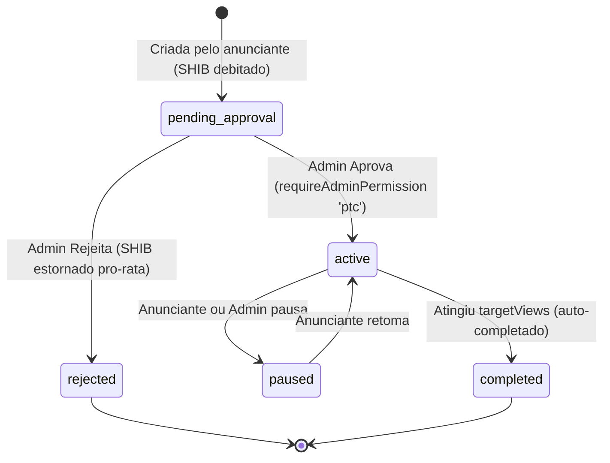

# Documentação Técnica: Gestão de PTC Multi-Moeda (`/admin/ptc` & `/ptc`)

## 1. Visão Geral e Arquitetura Multi-Moeda (POL, BLK, SHIB)

O módulo **PTC (Paid-to-Click)** do BlockMiner opera como um marketplace descentralizado e flexível de anúncios com liquidação multi-ativo:
- **Anunciantes**: Criam campanhas publicitárias pagando em **POL**, **BLK** ou **SHIB**, debitado instantaneamente da carteira correspondente (`user.polBalance`, `user.blkBalance` ou `user.shibBalance`).
- **Administradores**: Revisam, aprovam ou rejeitam campanhas (com estorno pro-rata automático na moeda original para visualizações não entregues), gerenciam *tiers* parametrizados por tempo (5s, 10s, 15s, 30s, 60s) e moeda (SHIB, POL, BLK).
- **Jogadores**: Visualizam os anúncios em sessões cronometradas com anti-cheat (`PtpSession` com heartbeat a cada 15s) e recebem recompensas creditadas diretamente na moeda configurada pelo anunciante.

### Matriz de Mapeamento de Saldos por Moeda

| Moeda / Ativo | Coluna de Saldo no Usuário | Precisão Decimal | Tipo de Débito / Crédito |
| :--- | :--- | :--- | :--- |
| **SHIB** | `user.shibBalance` | `Decimal(30, 8)` | Transação atômica Prisma |
| **POL** | `user.polBalance` | `Decimal(20, 8)` | Transação atômica Prisma |
| **BLK** | `user.blkBalance` | `Decimal(20, 8)` | Transação atômica Prisma |

### Catálogo de Tiers Padronizados (Duração & Moeda)

| Moeda | Label | Duração | Custo Anunciante | Recompensa Viewer | Tipo | Ordem |
| :--- | :--- | :--- | :--- | :--- | :--- | :--- |
| **SHIB** | SHIB Rápido 5s | 5s | 15.000000 SHIB | 12.000000 SHIB | window | 1 |
| **SHIB** | SHIB Básico 10s | 10s | 25.000000 SHIB | 20.000000 SHIB | window | 2 |
| **SHIB** | SHIB Padrão 15s | 15s | 35.000000 SHIB | 30.000000 SHIB | window | 3 |
| **SHIB** | SHIB Destaque 30s | 30s | 60.000000 SHIB | 50.000000 SHIB | window | 4 |
| **SHIB** | SHIB Premium 60s | 60s | 100.000000 SHIB | 85.000000 SHIB | window | 5 |
| **POL** | POL Rápido 5s | 5s | 0.000200 POL | 0.000160 POL | window | 10 |
| **POL** | POL Básico 10s | 10s | 0.000350 POL | 0.000280 POL | window | 11 |
| **POL** | POL Padrão 15s | 15s | 0.000500 POL | 0.000400 POL | window | 12 |
| **POL** | POL Destaque 30s | 30s | 0.000900 POL | 0.000750 POL | window | 13 |
| **POL** | POL Premium 60s | 60s | 0.001600 POL | 0.000130 POL | window | 14 |
| **BLK** | BLK Rápido 5s | 5s | 0.000060 BLK | 0.000050 BLK | window | 20 |
| **BLK** | BLK Básico 10s | 10s | 0.000100 BLK | 0.000080 BLK | window | 21 |
| **BLK** | BLK Padrão 15s | 15s | 0.000150 BLK | 0.000120 BLK | window | 22 |
| **BLK** | BLK Destaque 30s | 30s | 0.000280 BLK | 0.000220 BLK | window | 23 |
| **BLK** | BLK Premium 60s | 60s | 0.000500 BLK | 0.000400 BLK | window | 24 |

### Notificação Obrigatória no Telegram (Adendo Operacional)
Toda vez que uma nova campanha é submetida por um anunciante via `POST /api/ptc/campaigns`:
1. Um evento `TELEGRAM_EVENT_TYPES.PTC_CAMPAIGN_SUBMITTED` é gerado na tabela `telegram_outbox_events`.
2. O worker de notificações processa o evento e despacha imediatamente uma mensagem HTML formatada para o chat privado do administrador (`TELEGRAM_PRIVATE_WITHDRAWAL_ALERT_CHAT_ID`).

```mermaid
flowchart TD
    Advertiser[Anunciante / Jogador] -->|Cria Campanha| CreateRoute["POST /api/ptc/campaigns"]
    CreateRoute -->|Valida Zod (URL segura)| Schema["createCampaignSchema"]
    Schema -->|Transação Atômica| Tx["$transaction (Prisma PostgreSQL)"]
    Tx -->|Debita Saldo| DebitShib["User.shibBalance -= costShib"]
    Tx -->|Persiste Anúncio| AdRecord["PtpAd (status: pending_approval)"]
    Tx -->|Outbox Telegram| Outbox["TelegramOutboxEvent (ptc_campaign_submitted)"]
    Outbox --> TelegramWorker["runTelegramOutboxTick (Telegram Bot API)"]
    TelegramWorker --> AdminChat["📱 Telegram Privado do Administrador"]

    Admin[Administrador] -->|Acessa| AdminUI["Painel Admin /admin/ptc"]
    AdminUI -->|REST API| AdminRouter["ptcAdminRouter (/api/admin/ptc)"]
    AdminRouter -->|Auth Guard| AdminAuth["requireAdminAuth"]
    AdminRouter -->|RBAC Guard| RBAC["requireAdminPermission('ptc.view' / 'ptc')"]
    RBAC --> AdminCtrl["ptc.admin.controller"]
    AdminCtrl -->|Aprovar| Approve["PtpAd.status = 'active'"]
    AdminCtrl -->|Rejeitar| Reject["PtpAd.status = 'rejected' + Estorno SHIB pro-rata"]
    AdminCtrl -->|Auditoria| Audit["logAdminAction (admin_audit_logs)"]

    Viewer[Jogador / Visualizador] -->|Inicia Visualização| StartSession["POST /api/ptc/session/start"]
    StartSession --> Heartbeat["POST /api/ptc/session/:id/heartbeat (max 15s gap)"]
    Heartbeat --> ClaimSession["POST /api/ptc/session/:id/claim"]
    ClaimSession --> CreditViewer["User.shibBalance += rewardPerViewShib"]
```

---

## 2. Máquina de Estados da Campanha PTC (`PtpAd.status`)



---

## 3. Modelo de Dados Prisma

As entidades de PTC estão estruturadas em `prisma/schema.prisma`:

### PtcSettings (`ptc_settings`)
```prisma
model PtcSettings {
  id                 Int     @id @default(1)
  pricePerViewShib   Decimal @default(0) @map("price_per_view_shib") @db.Decimal(30, 8)
  rewardPerViewShib  Decimal @default(0) @map("reward_per_view_shib") @db.Decimal(30, 8)
  minDurationSeconds Int     @default(10) @map("min_duration_seconds")
  maxDurationSeconds Int     @default(60) @map("max_duration_seconds")
  minViews           Int     @default(100) @map("min_views")
  maxViews           Int     @default(1000000) @map("max_views")
  isEnabled          Boolean @default(true) @map("is_enabled")

  @@map("ptc_settings")
}
```

### PtcAdTier (`ptc_ad_tiers`)
```prisma
model PtcAdTier {
  id                Int     @id @default(autoincrement())
  label             String
  adType            String  @default("window") @map("ad_type")
  durationSeconds   Int     @map("duration_seconds")
  pricePerViewShib  Decimal @default(0) @map("price_per_view_shib") @db.Decimal(30, 8)
  rewardPerViewShib Decimal @default(0) @map("reward_per_view_shib") @db.Decimal(30, 8)
  isActive          Boolean @default(true) @map("is_active")
  sortOrder         Int     @default(0) @map("sort_order")

  campaigns PtpAd[]

  @@map("ptc_ad_tiers")
}
```

### PtpAd (`ptp_ads`)
```prisma
model PtpAd {
  id                Int      @id @default(autoincrement())
  userId            Int      @map("user_id")
  tierId            Int?     @map("tier_id")
  title             String
  description       String   @default("")
  url               String
  hash              String   @unique
  adType            String   @default("window") @map("ad_type")
  durationSeconds   Int      @default(10) @map("duration_seconds")
  createdAt         DateTime @default(now()) @map("created_at")
  status            String   @default("pending_approval")
  rejectionReason   String?  @map("rejection_reason")
  views             Int      @default(0)
  targetViews       Int      @default(0) @map("target_views")
  costShib          Decimal  @default(0) @map("cost_shib") @db.Decimal(30, 8)
  rewardPerViewShib Decimal  @default(0) @map("reward_per_view_shib") @db.Decimal(30, 8)

  user        User         @relation(fields: [userId], references: [id])
  tier        PtcAdTier?   @relation(fields: [tierId], references: [id])
  ptpViews    PtpView[]
  ptpSessions PtpSession[]

  @@index([userId])
  @@index([status])
  @@map("ptp_ads")
}
```

---

## 4. Matriz RBAC de Controle de Acesso

| Endpoint | Método | Permissão Mínima | Descrição |
| :--- | :---: | :--- | :--- |
| `/api/admin/ptc/settings` | `GET` | `ptc.view` ou `ptc` | Visualiza parâmetros globais do sistema PTC |
| `/api/admin/ptc/settings` | `PUT` | `ptc` | Altera limites de views, durações e ativação global |
| `/api/admin/ptc/campaigns/pending` | `GET` | `ptc.view` ou `ptc` | Lista campanhas pendentes de aprovação |
| `/api/admin/ptc/campaigns` | `GET` | `ptc.view` ou `ptc` | Lista todas as campanhas com paginação |
| `/api/admin/ptc/campaigns/:id/approve` | `POST` | `ptc` | Aprova campanha e move para status `active` |
| `/api/admin/ptc/campaigns/:id/reject` | `POST` | `ptc` | Rejeita campanha e reembolsa SHIB não utilizado |
| `/api/admin/ptc/tiers` | `GET` | `ptc.view` ou `ptc` | Lista tiers de duração e precificação cadastrados |
| `/api/admin/ptc/tiers` | `POST` | `ptc` | Cria novo tier de duração e preço por visualização |
| `/api/admin/ptc/tiers/:id` | `PUT` | `ptc` | Atualiza parâmetros de um tier existente |
| `/api/admin/ptc/tiers/:id` | `DELETE` | `ptc` | Exclui tier (campanhas já criadas mantêm histórico) |

### Papéis do Sistema
- `super_admin`: Acesso irrestrito total (`*`).
- `admin`: Possui `ptc` e `ptc.view` por padrão (concede leitura e escrita).
- `moderator`: Possui `ptc.view` por padrão (leitura de campanhas e tiers; mutações bloqueadas com HTTP 403 `FORBIDDEN_PERMISSION`).
- Demais papéis (`finance`, `support`, `readonly`): Sem permissão para o módulo (bloqueados com HTTP 403).

---

## 5. Especificação OpenAPI 3.0

```yaml
openapi: 3.0.3
info:
  title: BlockMiner PTC API
  version: 1.0.0
  description: API para anúncios Paid-To-Click (PTC) e administração de campanhas.
paths:
  /api/ptc/campaigns:
    post:
      summary: Cria nova campanha de anúncio pelo anunciante
      tags:
        - PTC Advertiser
      security:
        - UserSessionAuth: []
      requestBody:
        required: true
        content:
          application/json:
            schema:
              type: object
              required:
                - title
                - url
                - tierId
                - targetViews
              properties:
                title:
                  type: string
                  example: Meu Site Cripto
                description:
                  type: string
                  example: Conheça nosso projeto de mineração
                url:
                  type: string
                  format: uri
                  example: https://example.com/promo
                tierId:
                  type: integer
                  example: 1
                targetViews:
                  type: integer
                  example: 500
      responses:
        '200':
          description: Campanha submetida com sucesso (status pending_approval)
        '400':
          description: Saldo insuficiente em SHIB ou dados inválidos

  /api/admin/ptc/campaigns/pending:
    get:
      summary: Lista campanhas aguardando aprovação
      tags:
        - Admin PTC
      security:
        - AdminAuth: []
      responses:
        '200':
          description: Lista de campanhas pendentes
        '403':
          description: Requer permissão ptc.view ou ptc

  /api/admin/ptc/campaigns/{id}/approve:
    post:
      summary: Aprova uma campanha PTC pendente
      tags:
        - Admin PTC
      security:
        - AdminAuth: []
      parameters:
        - name: id
          in: path
          required: true
          schema:
            type: integer
      responses:
        '200':
          description: Campanha aprovada e ativada
        '400':
          description: Campanha não encontrada ou não pendente
        '403':
          description: Requer permissão ptc

  /api/admin/ptc/campaigns/{id}/reject:
    post:
      summary: Rejeita uma campanha PTC e estorna SHIB não entregue
      tags:
        - Admin PTC
      security:
        - AdminAuth: []
      parameters:
        - name: id
          in: path
          required: true
          schema:
            type: integer
      requestBody:
        content:
          application/json:
            schema:
              type: object
              properties:
                reason:
                  type: string
                  example: Violação dos termos de publicidade
      responses:
        '200':
          description: Campanha rejeitada e saldo estornado
        '400':
          description: ID inválido ou erro no estorno
        '403':
          description: Requer permissão ptc

  /api/admin/ptc/tiers:
    get:
      summary: Lista tiers de duração e preços
      tags:
        - Admin PTC
      security:
        - AdminAuth: []
      responses:
        '200':
          description: Lista de tiers
    post:
      summary: Cria novo tier de duração
      tags:
        - Admin PTC
      security:
        - AdminAuth: []
      requestBody:
        required: true
        content:
          application/json:
            schema:
              type: object
              required:
                - label
                - durationSeconds
                - pricePerViewShib
                - rewardPerViewShib
              properties:
                label:
                  type: string
                  example: Básico 10s
                adType:
                  type: string
                  enum: [window, iframe]
                durationSeconds:
                  type: integer
                  example: 10
                pricePerViewShib:
                  type: number
                  example: 0.002
                rewardPerViewShib:
                  type: number
                  example: 0.0016
                currency:
                  type: string
                  enum: [SHIB, POL, BLK]
                  default: SHIB
                  example: POL
      responses:
        '200':
          description: Tier criado com sucesso
```

---

## 6. Procedimento de Teste Local

```bash
# 1. Executar testes do módulo PTC
npx tsx tests/ptc/ptc.schemas.test.mjs
npx tsx tests/ptc/ptc.repository.test.mjs
npx tsx tests/ptc/ptc.service.test.mjs

# 2. Executar validação estática de tipos
npx tsc --noEmit -p tsconfig.json
cd client && npx tsc --noEmit -p tsconfig.json
```
