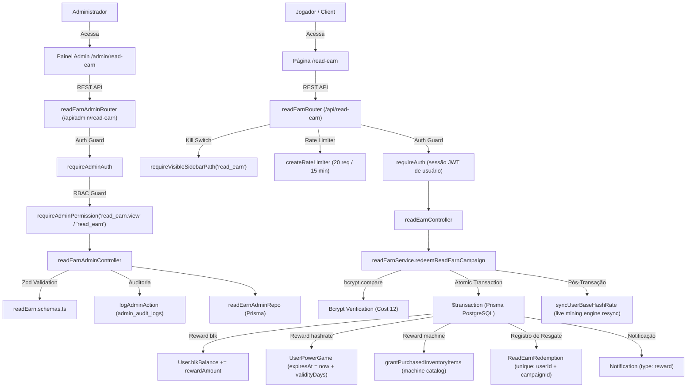

# Documentação Técnica: Read & Earn (`/admin/read-earn` & `/read-earn`)

## 1. Visão Geral e Arquitetura do Domínio

O módulo **Read & Earn** gerencia campanhas patrocinadas de leitura e engajamento externo no BlockMiner. Os jogadores visitam artigos ou sites de parceiros para localizar um código promocional secreto e resgatá-lo uma única vez por campanha para receber recompensas (BLK, poder de mineração temporário ou mineradoras de inventário).

### Ecossistema do Read & Earn

1. **Superfície Pública (`/api/read-earn/*`)**:
   - `GET /api/read-earn/campaigns`: Lista campanhas ativas dentro da janela temporal (`startsAt <= now <= expiresAt`), filtrando segredos (`codeHash` omitido). Gated pelo kill switch `requireVisibleSidebarPath("read_earn")`.
   - `POST /api/read-earn/redeem`: Autenticado via `requireAuth`. Aplica rate limiting (`REDEEM_RATE_MAX = 20` requisições a cada `REDEEM_RATE_WINDOW_MS = 15min`). Valida código secreto contra o hash bcrypt (`BCRYPT_COST = 12`) em transação atômica isolada.

2. **Superfície Administrativa (`/api/admin/read-earn/*`)**:
   - `GET /api/admin/read-earn/campaigns`: Lista todas as campanhas (ativas e inativas) com contador agregado de resgates. Protegido por `requireAdminPermission("read_earn.view", "read_earn")`.
   - `POST /api/admin/read-earn/campaigns`: Cria nova campanha com hashing obrigatório de código promocional (`BCRYPT_COST = 12`). Validação Zod estrita (`readEarnAdminCreateSchema`) e auditoria via `logAdminAction`. Protegido por `requireAdminPermission("read_earn")`.
   - `PUT /api/admin/read-earn/campaigns/:id`: Atualização parcial de metadados, janela de tempo ou código secreto. Auditoria comparativa `oldValue`/`newValue` via `logAdminAction`. Protegido por `requireAdminPermission("read_earn")`.
   - `DELETE /api/admin/read-earn/campaigns/:id`: Exclui campanha se não possuir resgates registrados (`count === 0`); caso contrário retorna HTTP 409 Conflict. Protegido por `requireAdminPermission("read_earn")`.
   - `GET /api/admin/read-earn/campaigns/:id/redemptions`: Listagem paginada de usuários que resgataram a campanha (`take` max 100, default 50). Protegido por `requireAdminPermission("read_earn.view", "read_earn")`.



---

## 2. Modelo de Dados Prisma

As entidades estão localizadas em `prisma/schema.prisma`:

### ReadEarnCampaign (`read_earn_campaigns`)
```prisma
model ReadEarnCampaign {
  id                   Int      @id @default(autoincrement())
  title                String
  partnerUrl           String   @map("partner_url")
  codeHash             String   @map("code_hash")
  rewardType           String   @map("reward_type")
  rewardAmount         Decimal  @default(0) @map("reward_amount") @db.Decimal(20, 8)
  rewardMinerId        Int?     @map("reward_miner_id")
  hashrateValidityDays Int      @default(7) @map("hashrate_validity_days")
  startsAt             DateTime @map("starts_at")
  expiresAt            DateTime @map("expires_at")
  isActive             Boolean  @default(true) @map("is_active")
  maxRedemptions       Int?     @map("max_redemptions")
  sortOrder            Int      @default(0) @map("sort_order")
  createdAt            DateTime @default(now()) @map("created_at")
  updatedAt            DateTime @updatedAt @map("updated_at")

  rewardMiner Miner?               @relation(fields: [rewardMinerId], references: [id], onDelete: SetNull)
  redemptions ReadEarnRedemption[]

  @@index([isActive, startsAt, expiresAt])
  @@map("read_earn_campaigns")
}
```

### ReadEarnRedemption (`read_earn_redemptions`)
```prisma
model ReadEarnRedemption {
  id             Int      @id @default(autoincrement())
  campaignId     Int      @map("campaign_id")
  userId         Int      @map("user_id")
  rewardSnapshot Json?    @map("reward_snapshot")
  ip             String?  @map("ip")
  userAgent      String?  @map("user_agent")
  redeemedAt     DateTime @default(now()) @map("redeemed_at")

  campaign ReadEarnCampaign @relation(fields: [campaignId], references: [id], onDelete: Cascade)
  user     User             @relation(fields: [userId], references: [id], onDelete: Cascade)

  @@unique([userId, campaignId])
  @@index([campaignId])
  @@index([userId])
  @@map("read_earn_redemptions")
}
```

---

## 3. Matriz RBAC de Controle de Acesso

| Endpoint | Método | Permissão Mínima | Descrição |
| :--- | :---: | :--- | :--- |
| `/api/admin/read-earn/campaigns` | `GET` | `read_earn.view` ou `read_earn` | Lista todas as campanhas administrativas com total de resgates |
| `/api/admin/read-earn/campaigns` | `POST` | `read_earn` | Cria uma nova campanha com código secreto criptografado |
| `/api/admin/read-earn/campaigns/:id` | `PUT` | `read_earn` | Atualiza metadados, datas, parâmetros ou altera código secreto |
| `/api/admin/read-earn/campaigns/:id` | `DELETE` | `read_earn` | Exclui campanha (bloqueado se houver resgates existentes) |
| `/api/admin/read-earn/campaigns/:id/redemptions` | `GET` | `read_earn.view` ou `read_earn` | Consulta histórico de resgates paginados da campanha |

### Papéis do Sistema
- `super_admin`: Acesso irrestrito total (`*`).
- `admin`: Possui `read_earn` e `read_earn.view` por padrão.
- `moderator`: Possui `read_earn.view` por padrão (leitura de campanhas e histórico de resgates; mutações bloqueadas com HTTP 403).
- Demais papéis (`finance`, `support`, `readonly`): Sem permissão para o módulo (bloqueados com HTTP 403 `FORBIDDEN_PERMISSION`).

---

## 4. Especificação OpenAPI 3.0

```yaml
openapi: 3.0.3
info:
  title: BlockMiner Read & Earn API
  version: 1.0.0
  description: Endpoints públicos e administrativos do módulo Read & Earn.
paths:
  /api/read-earn/campaigns:
    get:
      summary: Lista campanhas ativas para os jogadores
      tags:
        - Read & Earn Public
      responses:
        '200':
          description: Lista de campanhas ativas
          content:
            application/json:
              schema:
                type: object
                properties:
                  ok:
                    type: boolean
                    example: true
                  campaigns:
                    type: array
                    items:
                      type: object
                      properties:
                        id:
                          type: integer
                          example: 1
                        title:
                          type: string
                          example: Artigo Parceiro ZerAds
                        partnerUrl:
                          type: string
                          example: https://partner.example.com/article
                        startsAt:
                          type: string
                          format: date-time
                        expiresAt:
                          type: string
                          format: date-time

  /api/read-earn/redeem:
    post:
      summary: Resgata recompensa de campanha fornecendo código secreto
      tags:
        - Read & Earn Public
      security:
        - UserSessionAuth: []
      requestBody:
        required: true
        content:
          application/json:
            schema:
              type: object
              required:
                - campaignId
                - code
              properties:
                campaignId:
                  type: integer
                  example: 1
                code:
                  type: string
                  example: SECRET2026
      responses:
        '200':
          description: Resgate aprovado com sucesso
          content:
            application/json:
              schema:
                type: object
                properties:
                  ok:
                    type: boolean
                    example: true
                  code:
                    type: string
                    example: OK
                  reward:
                    type: object
                    properties:
                      rewardType:
                        type: string
                        example: blk
                      rewardAmount:
                        type: number
                        example: 5
        '400':
          description: Código incorreto, campanha fora do período ou esgotada
        '401':
          description: Sessão de usuário não fornecida ou expirada
        '409':
          description: Campanha já resgatada anteriormente pelo usuário
        '429':
          description: Rate limit excedido (máximo 20 tentativas por 15 min)

  /api/admin/read-earn/campaigns:
    get:
      summary: Lista todas as campanhas administrativas
      tags:
        - Admin Read & Earn
      security:
        - AdminAuth: []
      responses:
        '200':
          description: Lista de campanhas
        '403':
          description: Requer permissão read_earn.view ou read_earn
    post:
      summary: Cria nova campanha com código secreto
      tags:
        - Admin Read & Earn
      security:
        - AdminAuth: []
      requestBody:
        required: true
        content:
          application/json:
            schema:
              type: object
              required:
                - title
                - partnerUrl
                - rewardCode
                - rewardType
                - rewardAmount
                - startsAt
                - expiresAt
              properties:
                title:
                  type: string
                  example: Campanha BlockMiner News #1
                partnerUrl:
                  type: string
                  example: https://blog.blockminer.space/news-1
                rewardCode:
                  type: string
                  minLength: 6
                  maxLength: 128
                  example: BMNEWS2026
                rewardType:
                  type: string
                  enum: [hashrate, blk, machine]
                rewardAmount:
                  type: number
                  example: 10
                rewardMinerId:
                  type: integer
                  nullable: true
                hashrateValidityDays:
                  type: integer
                  default: 7
                startsAt:
                  type: string
                  format: date-time
                expiresAt:
                  type: string
                  format: date-time
                maxRedemptions:
                  type: integer
                  nullable: true
                sortOrder:
                  type: integer
                  default: 0
                isActive:
                  type: boolean
                  default: true
      responses:
        '200':
          description: Campanha criada com sucesso
        '400':
          description: Dados de entrada inválidos
        '403':
          description: Requer permissão read_earn

  /api/admin/read-earn/campaigns/{id}:
    put:
      summary: Atualiza campanha existente
      tags:
        - Admin Read & Earn
      security:
        - AdminAuth: []
      parameters:
        - name: id
          in: path
          required: true
          schema:
            type: integer
      responses:
        '200':
          description: Campanha atualizada
        '404':
          description: Campanha não encontrada
    delete:
      summary: Exclui campanha que não possua resgates
      tags:
        - Admin Read & Earn
      security:
        - AdminAuth: []
      parameters:
        - name: id
          in: path
          required: true
          schema:
            type: integer
      responses:
        '200':
          description: Campanha excluída
        '404':
          description: Campanha não encontrada
        '409':
          description: Campanha já possui resgates registrados

  /api/admin/read-earn/campaigns/{id}/redemptions:
    get:
      summary: Lista resgates de uma campanha com paginação
      tags:
        - Admin Read & Earn
      security:
        - AdminAuth: []
      parameters:
        - name: id
          in: path
          required: true
          schema:
            type: integer
        - name: skip
          in: query
          schema:
            type: integer
            default: 0
        - name: take
          in: query
          schema:
            type: integer
            default: 50
      responses:
        '200':
          description: Histórico de resgates
```

---

## 5. Parâmetros e Variáveis de Ambiente

Nenhuma variável de ambiente proprietária isolada é necessária além das variáveis globais da aplicação:

| Variável | Obrigatória | Padrão | Descrição |
| :--- | :---: | :--- | :--- |
| `DATABASE_URL` | Sim | — | Conexão PostgreSQL |
| `JWT_SECRET` | Sim | — | Assinatura e verificação de sessões |
| `ADMIN_JWT_SECRET` | Sim | — | Assinatura de sessões administrativas |
| `REDIS_URL` | Sim | — | Cache e rate limiter operacional |

---

## 6. Procedimento de Teste Local

```bash
# 1. Executar testes unitários do módulo Read & Earn
npx tsx tests/read-earn/read-earn.errors.test.mjs

# 2. Executar verificação estática de tipos
npx tsc --noEmit -p tsconfig.json
cd client && npx tsc --noEmit -p tsconfig.json
```
