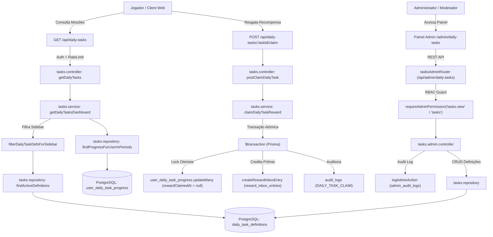

# Documentação Técnica: Gestão de Tarefas & Missões (`/admin/daily-tasks` & `/tasks`)

## 1. Visão Geral e Arquitetura do Domínio

O módulo **Tarefas Diárias & Missões (Genesis Miner)** gerencia objetivos diários, semanais e mensais para os jogadores do BlockMiner, estimulando engajamento e retenção contínua através de recompensas gamificadas.

O ecossistema é composto por duas superfícies principais:
1. **Superfície do Jogador (`/tasks` & `/api/daily-tasks`)**:
   - `GET /api/daily-tasks`: Dashboard consolidado com todas as missões ativas na janela de tempo atual, agrupadas por cadência UTC (Diária, Semanal, Mensal), exibindo o progresso atual do usuário, meta, status da missão (`available`, `in_progress`, `completed`, `claimed`) e prêmios.
   - `POST /api/daily-tasks/:taskId/claim`: Resgate atômico da recompensa de uma missão concluída. O resgate gera uma entrada na caixa de recompensas do usuário (`reward-inbox`) ou crédito seguro, gravando log de auditoria e impedindo resgates duplos através de lock otimista.
2. **Superfície Administrativa (`/admin/daily-tasks` & `/api/admin/daily-tasks`)**:
   - Gestão de definições de missões (`DailyTaskDefinition`): criação, edição completa, ativação/desativação, reordenação de exibição e exclusão.
   - Protegida por autenticação administrativa (`requireAdminAuth`), rate limiting dedicado (300 req/min), controle de acesso RBAC (`requireAdminPermission("tasks.view", "tasks")`) e trilha de auditoria imutável (`logAdminAction`).



---

## 2. Tipos de Missões e Ganchos Externos (Hooks)

O progresso das tarefas é atualizado de forma assíncrona e desacoplada através de 5 ganchos disparados pelos módulos emissores:

| Tipo de Tarefa (`taskType`) | Módulo Emissor | Arquivo do Gancho | Chave de Deduplicação (`dedupeKey`) | Regra de Incremento |
| :--- | :--- | :--- | :--- | :--- |
| **`LOGIN_DAY`** | Check-in Diário | `checkin.notifications.ts` | `login-{utcDateKey}` | Incrementa 1 vez por dia UTC após o check-in confirmado. |
| **`MINE_BLK`** | Mineração | `mining.blk-cycle.ts` | `blklog-{blkRewardLogId}` | Incrementa o valor em BLK minerado no ciclo de bloco. |
| **`PLAY_GAMES`** | Minijogos | `games.socket.ts`, `game2048.service.ts` | `game-{userPowerGameId}` | Incrementa +1 partida. Pode ser restrita a um jogo específico via `gameSlug`. |
| **`WATCH_YOUTUBE`** | YouTube Social | `youtube.service.ts` | `ytclaim-{claimId}` | Incrementa +1 vídeo assistido e confirmado. |
| **`INTERNAL_OFFERWALL`**| Offerwall Interno | `internal-offerwall.service.ts` | `owattempt-{attemptId}` | Incrementa +1 oferta concluída. Pode ser restrita a uma oferta via `internalOfferwallOfferId`. |

---

## 3. Tipos de Recompensas Suportadas (`rewardKind`)

| Tipo (`rewardKind`) | Campos Obrigatórios | Destino da Recompensa |
| :--- | :--- | :--- |
| **`BLK`** | `rewardBlkAmount` (> 0) | Caixa de entrada de recompensas (`reward_inbox_entries` tipo `blk`). |
| **`POL`** | `rewardPolAmount` (> 0) | Caixa de entrada de recompensas (`reward_inbox_entries` tipo `pol`). |
| **`HASHRATE_TEMP`** | `rewardHashRate` (> 0), `rewardHashRateDays` ($\ge 1$) | Poder temporário de mineração creditado via `reward_inbox_entries` (`temporary_power`). |
| **`SHOP_MINER`** | `rewardMinerId` (ID válido em `miners`) | Máquina de mineração permanente adicionada ao inventário do jogador. |
| **`EVENT_MINER`** | `rewardEventMinerId` (ID válido em `event_miners`) | Máquina de evento adicionada ao inventário do jogador. |

---

## 4. Modelo de Dados Prisma

### `DailyTaskDefinition` (`daily_task_definitions`)
```prisma
model DailyTaskDefinition {
  id                         Int       @id @default(autoincrement())
  slug                       String    @unique
  taskType                   String    @map("task_type")
  resetCadence               String    @default("DAILY") @map("reset_cadence") // DAILY, WEEKLY, MONTHLY
  targetValue                Decimal   @map("target_value") @db.Decimal(24, 8)
  translationKey             String    @map("translation_key")
  rewardKind                 String    @map("reward_kind") // BLK, POL, HASHRATE_TEMP, SHOP_MINER, EVENT_MINER
  rewardMinerId              Int?      @map("reward_miner_id")
  rewardEventMinerId         Int?      @map("reward_event_miner_id")
  rewardHashRate             Float?    @map("reward_hash_rate")
  rewardHashRateDays         Int?      @map("reward_hash_rate_days")
  rewardBlkAmount            Decimal?  @map("reward_blk_amount") @db.Decimal(20, 8)
  rewardPolAmount            Decimal?  @map("reward_pol_amount") @db.Decimal(20, 8)
  gameSlug                   String?   @map("game_slug")
  internalOfferwallOfferId   Int?      @map("internal_offerwall_offer_id")
  sortOrder                  Int       @default(0) @map("sort_order")
  isActive                   Boolean   @default(true) @map("is_active")
  validFrom                  DateTime? @map("valid_from")
  validUntil                 DateTime? @map("valid_until")
  createdAt                  DateTime  @default(now()) @map("created_at")
  updatedAt                  DateTime  @updatedAt @map("updated_at")

  progress                   UserDailyTaskProgress[]
  dedupeTicks                UserDailyTaskDedupeTick[]

  @@map("daily_task_definitions")
}
```

### `UserDailyTaskProgress` (`user_daily_task_progress`)
```prisma
model UserDailyTaskProgress {
  id               Int       @id @default(autoincrement())
  userId           Int       @map("user_id")
  taskDefinitionId Int       @map("task_definition_id")
  periodKey        String    @map("period_key") // YYYY-MM-DD (diário), YYYY-Www (semanal), YYYY-MM (mensal)
  currentValue     Decimal   @default(0) @map("current_value") @db.Decimal(24, 8)
  completedAt      DateTime? @map("completed_at")
  rewardClaimedAt  DateTime? @map("reward_claimed_at")
  updatedAt        DateTime  @updatedAt @map("updated_at")

  user             User      @relation(fields: [userId], references: [id], onDelete: Cascade)
  taskDefinition   DailyTaskDefinition @relation(fields: [taskDefinitionId], references: [id], onDelete: Cascade)

  @@unique([userId, taskDefinitionId, periodKey])
  @@index([userId, periodKey])
  @@index([completedAt])
  @@map("user_daily_task_progress")
}
```

### `UserDailyTaskDedupeTick` (`user_daily_task_dedupe_ticks`)
```prisma
model UserDailyTaskDedupeTick {
  id               Int      @id @default(autoincrement())
  taskDefinitionId Int      @map("task_definition_id")
  dedupeKey        String   @map("dedupe_key")
  createdAt        DateTime @default(now()) @map("created_at")

  task             DailyTaskDefinition @relation(fields: [taskDefinitionId], references: [id], onDelete: Cascade)

  @@unique([taskDefinitionId, dedupeKey])
  @@map("user_daily_task_dedupe_ticks")
}
```

---

## 5. Matriz RBAC de Controle de Acesso

| Permissão | Categoria | Descrição | Papéis com Acesso Padrão |
| :--- | :--- | :--- | :--- |
| **`tasks`** | Engajamento | Gestão completa (criar missões, alterar metas/prêmios, ativar/desativar e excluir definições). | `super_admin`, `admin` |
| **`tasks.view`** | Engajamento | Consulta e leitura da lista de definições de tarefas no painel administrativo. | `super_admin`, `admin`, `moderator` |

---

## 6. Especificação OpenAPI / Swagger

```yaml
openapi: 3.0.3
info:
  title: BlockMiner Daily Tasks API
  version: 1.0.0
  description: Endpoints para consulta de missões diárias, resgate de recompensas e gestão de definições administrativas.

paths:
  /api/daily-tasks:
    get:
      summary: Consulta o dashboard de missões do jogador autenticado
      tags:
        - Player Tasks
      security:
        - UserSessionCookie: []
      responses:
        '200':
          description: Dashboard consolidado com progresso e reset UTC
          content:
            application/json:
              schema:
                type: object
                properties:
                  ok:
                    type: boolean
                    example: true
                  periodKey:
                    type: string
                    example: "2026-09-28"
                  serverTime:
                    type: string
                    example: "2026-09-28T02:00:00.000Z"
                  nextResetAt:
                    type: string
                    example: "2026-09-29T00:00:00.000Z"
                  tasks:
                    type: array
                    items:
                      type: object
                      properties:
                        id:
                          type: integer
                        slug:
                          type: string
                        taskType:
                          type: string
                        resetCadence:
                          type: string
                          enum: [DAILY, WEEKLY, MONTHLY]
                        targetValue:
                          type: number
                        currentValue:
                          type: number
                        status:
                          type: string
                          enum: [available, in_progress, completed, claimed]
                        reward:
                          type: object

  /api/daily-tasks/{taskId}/claim:
    post:
      summary: Resgata a recompensa de uma missão concluída
      tags:
        - Player Tasks
      security:
        - UserSessionCookie: []
      parameters:
        - name: taskId
          in: path
          required: true
          schema:
            type: integer
      responses:
        '200':
          description: Recompensa resgatada com sucesso
        '400':
          description: Tarefa ainda não concluída
        '404':
          description: Tarefa não encontrada
        '409':
          description: Recompensa já foi resgatada anteriormente

  /api/admin/daily-tasks/definitions:
    get:
      summary: Lista todas as definições de tarefas cadastradas
      tags:
        - Admin Tasks
      security:
        - AdminAuth: []
      responses:
        '200':
          description: Lista de tarefas ordenadas por sortOrder
        '401':
          description: Sessão administrativa inválida
        '403':
          description: Requer permissão tasks.view ou tasks

    post:
      summary: Cria uma nova definição de tarefa
      tags:
        - Admin Tasks
      security:
        - AdminAuth: []
      requestBody:
        required: true
        content:
          application/json:
            schema:
              type: object
              required:
                - slug
                - taskType
                - targetValue
                - translationKey
                - rewardKind
              properties:
                slug:
                  type: string
                  example: "mine-5-blk"
                taskType:
                  type: string
                  enum: [LOGIN_DAY, MINE_BLK, PLAY_GAMES, WATCH_YOUTUBE, INTERNAL_OFFERWALL]
                resetCadence:
                  type: string
                  enum: [DAILY, WEEKLY, MONTHLY]
                  default: DAILY
                targetValue:
                  type: number
                  example: 5
                translationKey:
                  type: string
                  example: "dailyTasks.mine_blk_5"
                rewardKind:
                  type: string
                  enum: [BLK, POL, HASHRATE_TEMP, SHOP_MINER, EVENT_MINER]
                rewardBlkAmount:
                  type: number
                  example: 1.5
      responses:
        '201':
          description: Tarefa criada com sucesso
        '400':
          description: Parâmetros inválidos ou chave estrangeira inexistente
        '409':
          description: Slug já cadastrado

  /api/admin/daily-tasks/definitions/{id}:
    patch:
      summary: Atualiza parcialmente uma definição de tarefa
      tags:
        - Admin Tasks
      security:
        - AdminAuth: []
      parameters:
        - name: id
          in: path
          required: true
          schema:
            type: integer
      responses:
        '200':
          description: Tarefa atualizada com sucesso
        '404':
          description: Definição não encontrada

    delete:
      summary: Exclui uma definição de tarefa
      tags:
        - Admin Tasks
      security:
        - AdminAuth: []
      parameters:
        - name: id
          in: path
          required: true
          schema:
            type: integer
      responses:
        '200':
          description: Tarefa excluída com sucesso
        '404':
          description: Definição não encontrada
```
