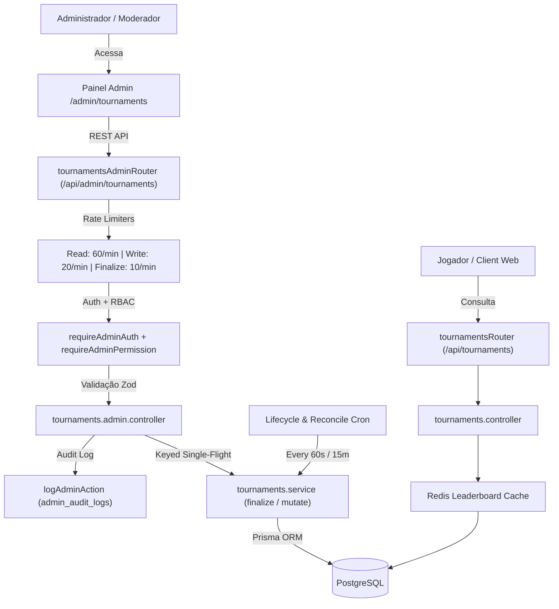

# Documentação Técnica: Gestão de Torneios e Competições (`/admin/tournaments`)

## 1. Visão Geral e Arquitetura do Domínio

O módulo **Torneios & Ligas** (`/admin/tournaments`) gerencia competições com tabelas de classificação ao vivo (leaderboards) e premiação automática ou manual no ecossistema do BlockMiner. Os torneios incentivam a retenção dos jogadores por meio de métricas competitivas diárias, semanais e mensais.

O ecossistema é composto por quatro camadas sincronizadas:
1. **Superfície Pública (`/api/tournaments` e `/api/ranking`)**: Consumida pelo hub de torneios do jogador (`TournamentsPage`), fornecendo tabelas de classificação em tempo real via polling e Socket.IO, pódio visual dos top 3 colocados e histórico de prêmios.
2. **Superfície Administrativa (`/api/admin/tournaments`)**: Interface protegida por autenticação administrativa (`requireAdminAuth`), controle de acesso por papéis (`requireAdminPermission`), rate limiters dedicados e registro de auditoria (`logAdminAction`).
3. **Motor de Pontuação & Reconciliação (Engine V2)**: Suporta pontuação incremental em tempo real (via outbox transacional para blocos minerados e eventos de depósito) e recálculo em lote (para tarefas, check-ins e cliques em offerwalls).
4. **Ciclo de Vida & Finalização Segura (`finalizeTournament`)**: Processa o encerramento do torneio, cálculo determinístico de ranks com critério de desempate por tempo da primeira contribuição (`firstContributionAt`), concessão atômica de prêmios (POL, BLK, MINING_BOOST e MACHINE) e spawn automático do próximo ciclo recorrente.



---

## 2. Modelo de Dados Prisma (`Tournament`)

A persistência é gerenciada pelas seguintes tabelas no PostgreSQL (`prisma/schema.prisma`):

### Tabela Principal: `tournaments` (`Tournament`)
```prisma
model Tournament {
  id                 Int              @id @default(autoincrement())
  name               String
  description        String?
  type               TournamentType   // DAILY | WEEKLY | MONTHLY | CUSTOM
  metric             TournamentMetric // 13 métricas suportadas
  metricConfig       Json?            @map("metric_config")
  startsAt           DateTime         @map("starts_at")
  endsAt             DateTime         @map("ends_at")
  status             TournamentStatus @default(SCHEDULED) // SCHEDULED | ACTIVE | ENDED | CANCELLED
  recurring          Boolean          @default(false)
  scoresReconciledAt DateTime?        @map("scores_reconciled_at")
  version            Int              @default(0)
  prizes             TournamentPrize[]
  entries            TournamentEntry[]
  scoreContributions TournamentScoreContribution[]
  scoreDrifts        TournamentScoreDrift[]
  createdAt          DateTime         @default(now()) @map("created_at")
  updatedAt          DateTime         @updatedAt @map("updated_at")

  @@index([status, startsAt])
  @@index([status, endsAt])
  @@index([status, metric])
  @@map("tournaments")
}
```

### Faixas de Premiação: `tournament_prizes` (`TournamentPrize`)
```prisma
model TournamentPrize {
  id            Int                 @id @default(autoincrement())
  tournamentId  Int                 @map("tournament_id")
  rankFrom      Int                 @map("rank_from")
  rankTo        Int                 @map("rank_to")
  prizeType     TournamentPrizeType // POL | BLK | MINING_BOOST | MACHINE
  polAmount     Decimal?            @map("pol_amount") @db.Decimal(20, 8)
  blkAmount     Decimal?            @map("blk_amount") @db.Decimal(20, 8)
  boostHashRate Float?              @map("boost_hash_rate")
  boostHours    Int?                @map("boost_hours")
  minerId       Int?                @map("miner_id")
  minerCount    Int                 @default(1) @map("miner_count")

  tournament    Tournament          @relation(fields: [tournamentId], references: [id], onDelete: Cascade)
  miner         Miner?              @relation(fields: [minerId], references: [id], onDelete: SetNull)

  @@index([tournamentId])
  @@map("tournament_prizes")
}
```

### Entradas no Leaderboard: `tournament_entries` (`TournamentEntry`)
```prisma
model TournamentEntry {
  id                  Int       @id @default(autoincrement())
  tournamentId        Int       @map("tournament_id")
  userId              Int       @map("user_id")
  score               Float     @default(0)
  rank                Int?
  firstContributionAt DateTime? @map("first_contribution_at")
  rewardGranted       Boolean   @default(false) @map("reward_granted")
  rewardGrantedAt     DateTime? @map("reward_granted_at")

  tournament          Tournament @relation(fields: [tournamentId], references: [id], onDelete: Cascade)
  user                User       @relation(fields: [userId], references: [id], onDelete: Cascade)

  @@unique([tournamentId, userId])
  @@index([tournamentId, score(sort: Desc)])
  @@map("tournament_entries")
}
```

---

## 3. Controle de Acesso e Matriz RBAC

O acesso administrativo é protegido pelo middleware `requireAdminPermission`:

| Permissão | Categoria | Descrição | Papéis com Acesso Padrão |
| :--- | :--- | :--- | :--- |
| `tournaments` | Engajamento | Gestão completa (criar, atualizar, cancelar, finalizar e alterar ordem de exibição). | `super_admin`, `admin` |
| `tournaments.view` | Engajamento | Consulta e visualização dos torneios, leaderboard e estatísticas de motor. | `super_admin`, `admin`, `moderator` |

*Segregação de Funções:* Papéis restritos (`moderator`, `finance`, `support`, `readonly`) recebem HTTP 403 `FORBIDDEN_PERMISSION` em qualquer tentativa de mutação, cancelamento ou finalização.

---

## 4. Especificação dos Endpoints Administrativos (`/api/admin/tournaments`)

### `GET /api/admin/tournaments`
- **Permissão Exigida**: `tournaments.view`
- **Descrição**: Lista todos os torneios cadastrados com contadores de participantes e faixas de prêmios.
- **Resposta Sucesso (200 OK)**:
```json
{
  "ok": true,
  "tournaments": [
    {
      "id": 1,
      "name": "Daily Offerwall Tournament",
      "type": "DAILY",
      "metric": "OFFERS_ALL",
      "status": "ACTIVE",
      "recurring": true,
      "startsAt": "2026-09-25T00:00:00.000Z",
      "endsAt": "2026-09-26T00:00:00.000Z",
      "_count": { "entries": 42 },
      "prizes": []
    }
  ]
}
```

### `POST /api/admin/tournaments`
- **Permissão Exigida**: `tournaments`
- **Descrição**: Cria um novo torneio validado via schema Zod com auditoria em `admin_audit_logs`.
- **Corpo da Requisição (JSON)**:
```json
{
  "name": "Torneio Diário de Mineração",
  "description": "Compita minerando blocos na plataforma",
  "type": "DAILY",
  "metric": "BLOCKS_MINED",
  "startsAt": "2026-09-26T00:00:00.000Z",
  "endsAt": "2026-09-27T00:00:00.000Z",
  "recurring": true,
  "prizes": [
    { "rankFrom": 1, "rankTo": 1, "prizeType": "POL", "polAmount": 50 },
    { "rankFrom": 2, "rankTo": 5, "prizeType": "BLK", "blkAmount": 200 }
  ]
}
```
- **Resposta Sucesso (200 OK)**:
```json
{
  "ok": true,
  "tournament": { "id": 2, "name": "Torneio Diário de Mineração", "status": "SCHEDULED" }
}
```

### `PATCH /api/admin/tournaments/:id`
- **Permissão Exigida**: `tournaments`
- **Descrição**: Atualiza dados de um torneio `SCHEDULED` ou dados permitidos de um `ACTIVE`.
- **Salvaguarda de Integridade**: Torneios em andamento (`ACTIVE`) rejeitam alterações em campos imutáveis (`metric`, datas ou prêmios) com `TOURNAMENT_ACTIVE_IMMUTABLE_FIELDS`. Torneios `ENDED` ou `CANCELLED` não aceitam edições.

### `POST /api/admin/tournaments/:id/finalize`
- **Permissão Exigida**: `tournaments`
- **Rate Limit**: 10 req/min (operação computacionalmente intensiva).
- **Proteção de Concorrência**: Protegido por `keyedSingleFlight` em memória para impedir execuções paralelas simultâneas sobre o mesmo ID.
- **Resposta Sucesso (200 OK)**:
```json
{
  "ok": true,
  "ranked": 42,
  "rewarded": 10,
  "nextId": 3
}
```

### `POST /api/admin/tournaments/:id/cancel`
- **Permissão Exigida**: `tournaments`
- **Descrição**: Cancela um torneio `ACTIVE` ou `SCHEDULED`, invalidando o cache do leaderboard e registrando auditoria.

### `GET /api/admin/tournaments/:id/entries`
- **Permissão Exigida**: `tournaments.view`
- **Query Params**: `page` (default 1, clamp de 1 a 200).
- **Descrição**: Retorna o leaderboard paginado com rank, pontuação e usuário.

### `GET /api/admin/tournaments/display-order` e `PATCH /api/admin/tournaments/display-order`
- **Permissão Exigida**: `tournaments.view` (GET) / `tournaments` (PATCH)
- **Descrição**: Lê ou atualiza a ordem de prioridade dos tipos de torneio (`MONTHLY`, `WEEKLY`, `DAILY`, `CUSTOM`) exibida no hub dos jogadores.

---

## 5. Fluxo de Finalização e Distribuição de Prêmios (4 Fases)

A função central `finalizeTournament` opera em 4 fases sequenciais para garantir que falhas parciais não causem inconsistência financeira:

1. **Fase A (Reconciliação e Pontuação)**:
   - Fora de transação de banco. Executa o scorer final da métrica para garantir que todos os pontos foram agregados.
2. **Fase B (Rankeamento em Lote)**:
   - Ordena os scores em memória: maior pontuação primeiro; empates resolvidos por `firstContributionAt` mais antigo.
   - Atualiza `tournament_entries.rank` em lotes de 200 registros.
3. **Fase C (Distribuição Atômica de Prêmios)**:
   - **Uma transação curta por ganhador** dentro da faixa de premiação.
   - Aplica claim atômico: `updateMany({ where: { id: entryId, rewardGranted: false }, data: { rewardGranted: true } })`.
   - Se o claim retornar `count === 0`, ignora (prevenção absoluta contra pagamento duplicado).
   - Credita o ativo (saldo POL/BLK, horas de Boost ou entrega da máquina na Caixa de Entrada).
   - Se um prêmio falhar (ex.: máquina deletada do catálogo), o erro é registrado no `ErrorReporter`, a contagem de falhas incrementa e o loop avança para o próximo ganhador sem reverter os prêmios já entregues.
4. **Fase D (Encerramento e Próximo Ciclo)**:
   - Atualiza status para `ENDED`.
   - Se `recurring: true`, cria o próximo torneio da série alinhado à próxima janela UTC calendar-day.
   - Invalida o cache Redis do leaderboard e emite evento WebSocket de encerramento.

---

## 6. Segurança e Checklist OWASP

1. **Controle de Acesso em Nível de Função Quebrado (BFLA - OWASP A1 / CWE-285):**
   - Todas as rotas admin utilizam `requireAdminPermission`. Papéis restritos recebem 403 `FORBIDDEN_PERMISSION`.
2. **Prevenção de Race Conditions & Double-Spending (OWASP A4 / CWE-362):**
   - `keyedSingleFlight` bloqueia finalizações simultâneas.
   - Claim atômico via `rewardGranted: false` garante pagamento único por vencedor.
3. **Prevenção de Injeção e Overflow Numérico (OWASP A3 / CWE-778):**
   - Valores de premiação validados com `MAX_PRIZE_NUMERIC = 1_000_000_000`.
   - Parâmetro `:id` sanitizado como inteiro positivo.
4. **Auditabilidade Total (OWASP A9 / CWE-778):**
   - `create`, `update`, `cancel` e `finalize` gravam registros estruturados na tabela `admin_audit_logs`.
