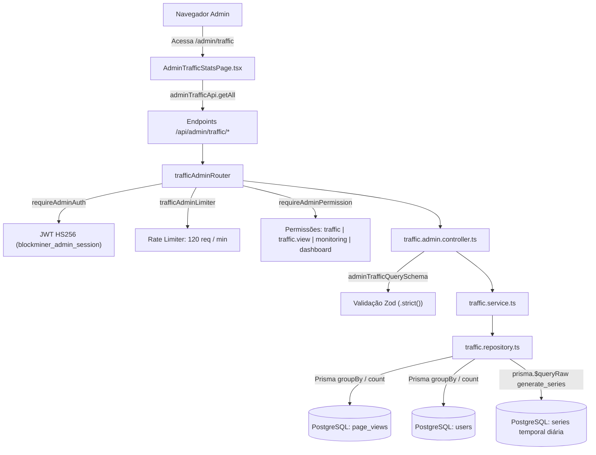

# Documentação Técnica: Tráfego e Origem de Usuários (`/admin/traffic`)

## 1. Visão Geral e Arquitetura do Domínio

O módulo de Tráfego e Origem de Usuários (`/admin/traffic`) fornece monitoramento analítico contínuo sobre visitantes da landing page (`page_views`), conversão de novos usuários registrados (`users`) e eficácia de canais de aquisição (domínios de referência e campanhas de marketing com parâmetros UTM).

### Componentes Principais

- **Serviço de Registro de Page Views (`traffic.service.ts` / `traffic.repository.ts`):**
  - Registra acessos com sanitização de campos (`path`, `referrerDomain`, `utmSource`, `utmMedium`, `utmCampaign`).
  - Execução não-bloqueante best-effort para não comprometer a experiência do usuário visitante.
- **Roteador Administrativo de Tráfego (`traffic.admin.routes.ts`):**
  - Protegido por autenticação de administrador (`requireAdminAuth`), rate limiter distribuído (120 req/min) e matriz granular de permissões RBAC (`traffic`, `traffic.view`, `monitoring` ou `dashboard`).
- **Controlador Administrativo (`traffic.admin.controller.ts`):**
  - Validação estrita via Zod (`adminTrafficQuerySchema`) para parâmetros de consulta `days` (inteiro entre 1 e 365 dias, default 30).
  - Tratamento defensivo de erros com supressão de mensagens internas e códigos de erro estáveis (`TRAFFIC_QUERY_ERROR`, `VALIDATION_ERROR`).
- **Repositório de Dados (`traffic.repository.ts`):**
  - Agregações de alto desempenho via Prisma ORM (`count`, `groupBy`).
  - Série temporal diária compilada via `generate_series` do PostgreSQL totalmente parametrizada com `prisma.$queryRaw` e `Date` bindings, eliminando vulnerabilidades de SQL Injection.
- **Interface Administrativa (`AdminTrafficStatsPage.tsx`):**
  - Dashboard intuitivo e responsivo com 6 cards de KPI e tendências diárias.
  - Gráfico de barras vertical interativo com tooltips flutuantes de detalhes.
  - 4 abas organizadas: Visão Geral, Domínios Referenciadores, Campanhas UTM e Série Diária Completa.
  - Filtros instantâneos por pesquisa de texto, ordenação clicável e barras visuais de proporção relativa de tráfego.

### Fluxo Arquitetural



---

## 2. Modelos de Dados e Contrato da API

### `AdminTrafficSummary`

```typescript
export interface AdminTrafficSummary {
  totalHits: number;
  periodHits: number;
  totalRegs: number;
  periodRegs: number;
  conversionRate: number | null;
  days: number;
  avgDailyHits?: number;
  avgDailyRegs?: number;
}
```

### `AdminTrafficDomainRow`

```typescript
export interface AdminTrafficDomainRow {
  domain: string;
  hits: number;
  registrations: number;
  conversionRate: number | null;
}
```

### `AdminTrafficUtmRow`

```typescript
export interface AdminTrafficUtmRow {
  source: string;
  hits: number;
  registrations: number;
  conversionRate: number | null;
}
```

### `AdminTrafficDailyRow`

```typescript
export interface AdminTrafficDailyRow {
  date: string;
  hits: number;
  registrations: number;
}
```

---

## 3. Especificação OpenAPI 3.0.0

```yaml
openapi: 3.0.0
info:
  title: BlockMiner 2.1 — Admin Traffic Analytics API
  version: 1.0.0
  description: Endpoints analíticos administrativos para métricas de tráfego, conversão de usuários e origens de campanhas.

paths:
  /api/admin/traffic/summary:
    get:
      summary: Consulta o resumo agregado de tráfego e conversão
      tags:
        - Admin Traffic
      security:
        - AdminSessionCookie: []
        - BearerAuth: []
      parameters:
        - name: days
          in: query
          required: false
          schema:
            type: integer
            minimum: 1
            maximum: 365
            default: 30
          description: Janela de dias para análise retrospectiva (1 a 365).
      responses:
        '200':
          description: Resumo de tráfego retornado com sucesso.
          content:
            application/json:
              schema:
                type: object
                required: [ok, totalHits, periodHits, totalRegs, periodRegs, days]
                properties:
                  ok:
                    type: boolean
                    example: true
                  totalHits:
                    type: integer
                    example: 15420
                  periodHits:
                    type: integer
                    example: 3410
                  totalRegs:
                    type: integer
                    example: 2190
                  periodRegs:
                    type: integer
                    example: 412
                  conversionRate:
                    type: number
                    nullable: true
                    example: 12.08
                  days:
                    type: integer
                    example: 30
        '400':
          description: Parâmetros inválidos.
          content:
            application/json:
              schema:
                $ref: '#/components/schemas/ErrorResponse'
        '401':
          description: Não autenticado ou sessão expirada.
        '403':
          description: Acesso proibido por falta de permissão RBAC.
        '429':
          description: Limite de taxa de requisições excedido.
        '500':
          description: Erro interno de processamento.

  /api/admin/traffic/by-domain:
    get:
      summary: Consulta as origens de tráfego agregadas por domínio referenciador
      tags:
        - Admin Traffic
      security:
        - AdminSessionCookie: []
        - BearerAuth: []
      parameters:
        - name: days
          in: query
          required: false
          schema:
            type: integer
            minimum: 1
            maximum: 365
            default: 30
      responses:
        '200':
          description: Lista dos 50 principais domínios por volume de tráfego.
          content:
            application/json:
              schema:
                type: object
                required: [ok, rows]
                properties:
                  ok:
                    type: boolean
                    example: true
                  rows:
                    type: array
                    items:
                      type: object
                      required: [domain, hits, registrations, conversionRate]
                      properties:
                        domain:
                          type: string
                          example: "google.com"
                        hits:
                          type: integer
                          example: 1240
                        registrations:
                          type: integer
                          example: 154
                        conversionRate:
                          type: number
                          nullable: true
                          example: 12.42
        '400':
          $ref: '#/components/responses/400BadRequest'
        '401':
          $ref: '#/components/responses/401Unauthorized'
        '403':
          $ref: '#/components/responses/403Forbidden'
        '429':
          $ref: '#/components/responses/429RateLimit'
        '500':
          $ref: '#/components/responses/500ServerError'

  /api/admin/traffic/by-utm:
    get:
      summary: Consulta o desempenho agregado por parâmetro utm_source
      tags:
        - Admin Traffic
      security:
        - AdminSessionCookie: []
        - BearerAuth: []
      parameters:
        - name: days
          in: query
          required: false
          schema:
            type: integer
            minimum: 1
            maximum: 365
            default: 30
      responses:
        '200':
          description: Lista das 50 principais fontes UTM registradas.
          content:
            application/json:
              schema:
                type: object
                required: [ok, rows]
                properties:
                  ok:
                    type: boolean
                    example: true
                  rows:
                    type: array
                    items:
                      type: object
                      required: [source, hits, registrations, conversionRate]
                      properties:
                        source:
                          type: string
                          example: "telegram_ad"
                        hits:
                          type: integer
                          example: 520
                        registrations:
                          type: integer
                          example: 85
                        conversionRate:
                          type: number
                          nullable: true
                          example: 16.35

  /api/admin/traffic/daily:
    get:
      summary: Consulta a série temporal diária completa no período
      tags:
        - Admin Traffic
      security:
        - AdminSessionCookie: []
        - BearerAuth: []
      parameters:
        - name: days
          in: query
          required: false
          schema:
            type: integer
            minimum: 1
            maximum: 365
            default: 30
      responses:
        '200':
          description: Lista contínua de dias com totais de hits e registros.
          content:
            application/json:
              schema:
                type: object
                required: [ok, rows]
                properties:
                  ok:
                    type: boolean
                    example: true
                  rows:
                    type: array
                    items:
                      type: object
                      required: [date, hits, registrations]
                      properties:
                        date:
                          type: string
                          format: date
                          example: "2026-09-30"
                        hits:
                          type: integer
                          example: 124
                        registrations:
                          type: integer
                          example: 18

components:
  securitySchemes:
    AdminSessionCookie:
      type: apiKey
      in: cookie
      name: blockminer_admin_session
    BearerAuth:
      type: http
      scheme: bearer
      bearerFormat: JWT

  schemas:
    ErrorResponse:
      type: object
      required: [ok, code, message]
      properties:
        ok:
          type: boolean
          example: false
        code:
          type: string
          example: "VALIDATION_ERROR"
        message:
          type: string
          example: "Parâmetros inválidos."

  responses:
    400BadRequest:
      description: Requisição inválida ou parâmetros incorretos.
      content:
        application/json:
          schema:
            $ref: '#/components/schemas/ErrorResponse'
    401Unauthorized:
      description: Sessão de administrador ausente ou inválida.
    403Forbidden:
      description: Permissão insuficiente para consultar este recurso.
    429RateLimit:
      description: Limite de taxa de requisições excedido.
    500ServerError:
      description: Falha interna no servidor.
```
