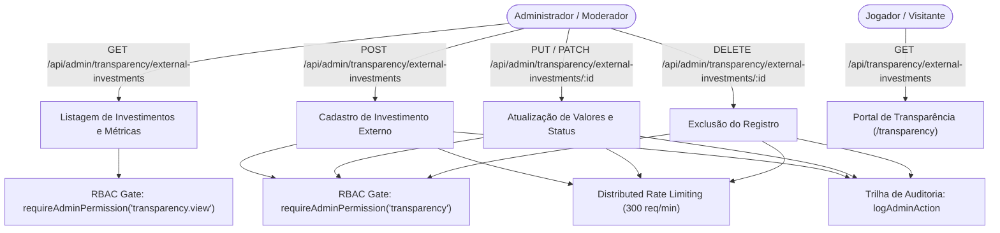

# Documentação Técnica: Gestão de Investimentos Externos (`/admin/transparency/investments` e `/api/admin/transparency/external-investments`)

## 1. Visão Geral e Arquitetura do Domínio

O módulo de **Investimentos Externos (Outros Investimentos)** é o pilar de divulgação da tesouraria do BlockMiner voltado para plataformas e protocolos de terceiros:
- **Finalidade e Modelo de Negócio**:
  - Divulgação transparente das alocações de capital feitas pela tesouraria em plataformas externas (ex: staking, protocolos DeFi, pools de liquidez parceiros, mineração externa) com o objetivo de gerar rendimentos e recomprar/recompensar jogadores.
  - Dados gerenciados: Nome da plataforma, descrição do investimento, URL da logo/ícone (`imageUrl`), link oficial externo (`linkUrl`), valor total investido (`amountInvestedUsd`), valor total já resgatado/sacado (`amountWithdrawnUsd`), previsão de retorno/taxa (`roiForecast`), status ativo (`isActive`) e ordem de prioridade (`sortOrder`).
- **Exibição Pública no Portal de Transparência (`/transparency`)**:
  - Consumido publicamente através de `GET /api/transparency/external-investments` (e também mapeado na visualização consolidada de tesouraria em `GET /api/transparency/wallets-live`).
  - O portal calcula métricas consolidadas: Total Investido em plataformas externas, Total Resgatado, Saldo Líquido e Percentual de Retorno.
- **Governança & Rastreabilidade Administrativa**:
  - `POST /api/admin/transparency/external-investments`: Cadastro de nova alocação.
  - `PUT /api/admin/transparency/external-investments/:id` e `PATCH /api/admin/transparency/external-investments/:id`: Edição total ou parcial de métricas, links ou status ativo.
  - `DELETE /api/admin/transparency/external-investments/:id`: Exclusão da alocação.
  - Todas as mutações são auditadas automaticamente em `admin_audit_logs` registrando valores prévios e posteriores via `logAdminAction`.



---

## 2. Modelo de Dados Prisma

```prisma
model TransparencyExternalInvestment {
  id                 Int      @id @default(autoincrement())
  name               String
  description        String?  @db.Text
  imageUrl           String?  @map("image_url")
  linkUrl            String?  @map("link_url")
  amountInvestedUsd  Decimal  @default(0) @map("amount_invested_usd") @db.Decimal(20, 2)
  amountWithdrawnUsd Decimal  @default(0) @map("amount_withdrawn_usd") @db.Decimal(20, 2)
  roiForecast        String?  @map("roi_forecast")
  isActive           Boolean  @default(true) @map("is_active")
  sortOrder          Int      @default(0) @map("sort_order")
  createdAt          DateTime @default(now()) @map("created_at")
  updatedAt          DateTime @updatedAt @map("updated_at")

  @@index([isActive, sortOrder])
  @@map("transparency_external_investments")
}
```

---

## 3. Segurança e Governança

1. **RBAC Granular**:
   - `transparency.view`: Acesso somente leitura para listagem e acompanhamento de métricas financeiras (atribuído a moderadores e administradores).
   - `transparency`: Acesso de modificação com poderes de criação, alteração de status/valores e exclusão (exclusivo para administradores).
2. **Defesa em Profundidade contra SSRF / XSS em URLs**:
   - `isSafeHttpUrl` valida que `linkUrl` e `imageUrl` sejam estritamente URLs `http://` ou `https://` (ou caminho relativo de assets), bloqueando protocolos maliciosos como `javascript:`, `data:`, `vbscript:`, `file:` e endereços de metadados de nuvem (`169.254.169.254`).
3. **Prevenção de Mass Assignment & Fuzzing Numérico**:
   - Schemas Zod com `.strict()` impedem a injeção de campos não autorizados no body.
   - Valores negativos em `amountInvestedUsd` e `amountWithdrawnUsd` são bloqueados com HTTP 400 Bad Request.
   - IDs de rota (`:id`) são sanitizados e validados com teto numérico de 32-bit (`id <= 2_147_483_647`) via `parsePositiveIntParam`.
4. **Rate Limiting Distribuído**:
   - Protegido por limitadores Redis: 120 req/min para leitura e 300 req/min para mutação.
5. **Trilha de Auditoria Forense**:
   - Mutações registradas com `TRANSPARENCY_INVESTMENT_CREATE`, `TRANSPARENCY_INVESTMENT_UPDATE` e `TRANSPARENCY_INVESTMENT_DELETE` em `admin_audit_logs`.

---

## 4. Especificação OpenAPI 3.0.3

```yaml
openapi: 3.0.3
info:
  title: BlockMiner Admin Transparency External Investments API
  version: 1.0.0
  description: API administrativa para gestão de alocações e investimentos externos da tesouraria.
paths:
  /api/admin/transparency/external-investments:
    get:
      summary: Listar todos os investimentos externos cadastrados
      description: Retorna todos os investimentos registrados ordenados por sortOrder e data de criação.
      responses:
        '200':
          description: Lista de investimentos externos
          content:
            application/json:
              schema:
                type: object
                properties:
                  ok:
                    type: boolean
                  investments:
                    type: array
                    items:
                      $ref: '#/components/schemas/ExternalInvestment'
        '401':
          $ref: '#/components/responses/Unauthorized'
        '403':
          $ref: '#/components/responses/Forbidden'
    post:
      summary: Cadastrar novo investimento externo
      requestBody:
        required: true
        content:
          application/json:
            schema:
              $ref: '#/components/schemas/CreateExternalInvestmentInput'
      responses:
        '201':
          description: Investimento cadastrado com sucesso
          content:
            application/json:
              schema:
                type: object
                properties:
                  ok:
                    type: boolean
                  investment:
                    $ref: '#/components/schemas/ExternalInvestment'
        '400':
          $ref: '#/components/responses/BadRequest'

  /api/admin/transparency/external-investments/{id}:
    put:
      summary: Atualizar investimento externo (PUT)
      parameters:
        - in: path
          name: id
          required: true
          schema:
            type: integer
      requestBody:
        required: true
        content:
          application/json:
            schema:
              $ref: '#/components/schemas/UpdateExternalInvestmentInput'
      responses:
        '200':
          description: Investimento atualizado com sucesso
        '400':
          $ref: '#/components/responses/BadRequest'
        '404':
          description: Investimento não encontrado
    patch:
      summary: Atualizar investimento externo parcialmente (PATCH)
      parameters:
        - in: path
          name: id
          required: true
          schema:
            type: integer
      requestBody:
        required: true
        content:
          application/json:
            schema:
              $ref: '#/components/schemas/UpdateExternalInvestmentInput'
      responses:
        '200':
          description: Investimento atualizado com sucesso
        '400':
          $ref: '#/components/responses/BadRequest'
        '404':
          description: Investimento não encontrado
    delete:
      summary: Excluir investimento externo
      parameters:
        - in: path
          name: id
          required: true
          schema:
            type: integer
      responses:
        '200':
          description: Investimento removido com sucesso
        '400':
          $ref: '#/components/responses/BadRequest'
        '404':
          description: Investimento não encontrado

components:
  schemas:
    ExternalInvestment:
      type: object
      properties:
        id:
          type: integer
        name:
          type: string
        description:
          type: string
          nullable: true
        imageUrl:
          type: string
          nullable: true
        linkUrl:
          type: string
          nullable: true
        amountInvestedUsd:
          type: number
        amountWithdrawnUsd:
          type: number
        roiForecast:
          type: string
          nullable: true
        isActive:
          type: boolean
        sortOrder:
          type: integer
        createdAt:
          type: string
        updatedAt:
          type: string

    CreateExternalInvestmentInput:
      type: object
      required: [name]
      properties:
        name:
          type: string
          minLength: 2
          maxLength: 100
        description:
          type: string
          maxLength: 2000
          nullable: true
        imageUrl:
          type: string
          nullable: true
        linkUrl:
          type: string
          nullable: true
        amountInvestedUsd:
          type: number
          minimum: 0
          default: 0
        amountWithdrawnUsd:
          type: number
          minimum: 0
          default: 0
        roiForecast:
          type: string
          maxLength: 100
          nullable: true
        isActive:
          type: boolean
          default: true
        sortOrder:
          type: integer
          default: 0

    UpdateExternalInvestmentInput:
      type: object
      properties:
        name:
          type: string
          minLength: 2
          maxLength: 100
        description:
          type: string
          maxLength: 2000
          nullable: true
        imageUrl:
          type: string
          nullable: true
        linkUrl:
          type: string
          nullable: true
        amountInvestedUsd:
          type: number
          minimum: 0
        amountWithdrawnUsd:
          type: number
          minimum: 0
        roiForecast:
          type: string
          maxLength: 100
          nullable: true
        isActive:
          type: boolean
        sortOrder:
          type: integer

  responses:
    Unauthorized:
      description: Sessão administrativa inválida ou ausente
      content:
        application/json:
          schema:
            type: object
            properties:
              ok:
                type: boolean
                example: false
              message:
                type: string
    Forbidden:
      description: Permissão RBAC insuficiente
      content:
        application/json:
          schema:
            type: object
            properties:
              ok:
                type: boolean
                example: false
              code:
                type: string
                example: FORBIDDEN_PERMISSION
              message:
                type: string
    BadRequest:
      description: Parâmetro ou payload inválido
      content:
        application/json:
          schema:
            type: object
            properties:
              ok:
                type: boolean
                example: false
              message:
                type: string
