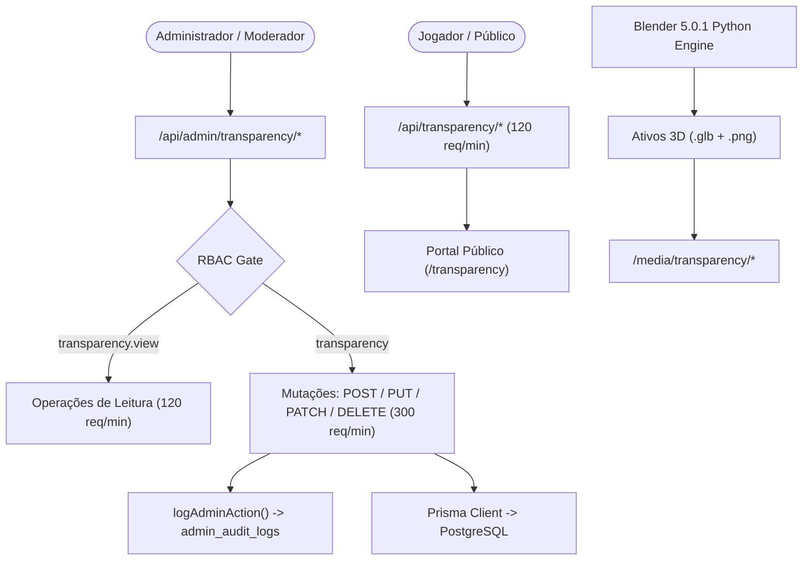

# Documentação Técnica: Sistema Completo de Transparência (`/admin/transparency` e `/transparency`)

## 1. Visão Geral da Arquitetura

O ecossistema de transparência do BlockMiner garante rastreabilidade financeira e comprovação on-chain das operações da plataforma, segregado em 4 áreas principais:



### 1.1 Módulos Administrativos
1. **Balanço (Receitas & Despesas - `TransparencyEntry`)**:
   - Gestão de custos de infraestrutura (servidores Contabo), ferramentas (Anthropic Claude Code, Google Gemini Pro), marketing, folha e receitas operacionais.
   - Emblemas e modelos 3D gerados no Blender armazenados em `/media/transparency/*.glb` e renderizados como badges de alta fidelidade `.png`.
2. **Carteiras da Tesouraria (`TransparencyTrackedWallet` & `TransparencyWalletSettings`)**:
   - Endereço central da tesouraria Polygon e carteiras operacionais monitoradas com pooling on-chain.
   - Valores manuais auditáveis para fundos off-chain ou cold storage.
3. **Parque de Mineração Física ASIC (`TransparencyHardwareAsset`)**:
   - Registro de hardware físico (Antminer S19j Pro, etc.) com visualizador 3D interativo `@google/model-viewer`.
   - Lançamento contábil diário de proventos em Satoshis via rede Lightning com conversão automática via snapshot da taxa BTC/USD.
4. **Investimentos Externos (`TransparencyExternalInvestment`)**:
   - Carteira de aportes em projetos e protocolos parceiros.

---

## 2. Modelo de Dados Prisma

```prisma
model TransparencyEntry {
  id             Int       @id @default(autoincrement())
  type           String    @default("expense")
  category       String    @default("misc")
  incomeCategory String?   @map("income_category")
  name           String
  description    String?   @db.Text
  provider       String?
  providerUrl    String?   @map("provider_url")
  imageUrl       String?   @map("image_url")
  amountUsd      Decimal   @map("amount_usd") @db.Decimal(20, 2)
  amountOriginal Decimal?  @map("amount_original") @db.Decimal(20, 8)
  currencyCode   String    @default("USD") @map("currency_code")
  fxRateUsd      Decimal?  @map("fx_rate_usd") @db.Decimal(20, 8)
  period         String    @default("monthly")
  entryDate      DateTime? @map("entry_date")
  direction      String?   @map("direction")
  blockchain     String?   @map("blockchain")
  walletAddress  String?   @map("wallet_address")
  txHash         String?   @map("tx_hash")
  referenceUrl   String?   @map("reference_url")
  isOnChain      Boolean   @default(false) @map("is_on_chain")
  isPaid         Boolean   @default(true) @map("is_paid")
  isActive       Boolean   @default(true) @map("is_active")
  notes          String?   @db.Text
  sortOrder      Int       @default(0) @map("sort_order")
  createdAt      DateTime  @default(now()) @map("created_at")
  updatedAt      DateTime  @updatedAt @map("updated_at")

  @@index([isActive])
  @@index([category])
  @@index([type])
  @@map("transparency_entries")
}

model TransparencyTrackedWallet {
  id                         Int       @id @default(autoincrement())
  label                      String
  address                    String
  chain                      String    @default("polygon")
  assetSymbol                String    @default("POL") @map("asset_symbol")
  explorerBaseUrl            String?   @map("explorer_base_url")
  isActive                   Boolean   @default(true) @map("is_active")
  isPublic                   Boolean   @default(true) @map("is_public")
  includeInTotals            Boolean   @default(true) @map("include_in_totals")
  displayMode                String    @default("total_received") @map("display_mode")
  sortOrder                  Int       @default(0) @map("sort_order")
  manualUsdValue             Float?    @map("manual_usd_value")
  manualValueNote            String?   @map("manual_value_note")
  createdAt                  DateTime  @default(now()) @map("created_at")
  updatedAt                  DateTime  @updatedAt @map("updated_at")

  @@unique([chain, address])
  @@index([isActive, sortOrder])
  @@map("transparency_tracked_wallets")
}

model TransparencyHardwareAsset {
  id              Int      @id @default(autoincrement())
  name            String
  manufacturer    String?
  description     String?  @db.Text
  status          String   @default("running")
  statusLabel     String?  @map("status_label")
  purchaseCostUsd Decimal  @map("purchase_cost_usd") @db.Decimal(20, 2)
  transitWeeks    Int?     @map("transit_weeks")
  purchaseNote    String?  @map("purchase_note") @db.Text
  specs           Json     @default("[]")
  model3dUrl      String?  @map("model_3d_url")
  sortOrder       Int      @default(0) @map("sort_order")
  isActive        Boolean  @default(true) @map("is_active")
  createdAt       DateTime @default(now()) @map("created_at")
  updatedAt       DateTime @updatedAt @map("updated_at")

  profitLogs TransparencyHardwareProfitLog[]

  @@index([isActive, sortOrder])
  @@map("transparency_hardware_assets")
}
```

---

## 3. Matriz de Autorização RBAC & Rate Limiting

- **`transparency.view` (Leitura)**:
  - Atribuída por padrão a moderadores e administradores.
  - Endpoints protegidos: `GET /api/admin/transparency`, `GET /api/admin/transparency/tracked-wallets`, `GET /api/admin/transparency/hardware-assets`, etc.
  - Rate Limiter Distribuído: 120 requisições/minuto.
- **`transparency` (Gestão Completa / Mutações)**:
  - Exclusiva para administradores.
  - Endpoints protegidos: `POST`, `PUT`, `PATCH`, `DELETE`.
  - Rate Limiter Distribuído: 300 requisições/minuto.
  - Toda mutação aciona `logAdminAction(...)` gravando usuário, IP, User-Agent, estado anterior e posterior.

---

## 4. Pipeline de Modelagem 3D via Blender

O script automatizado `scripts/blender/generate_subscription_logos.py` utiliza o motor Python headless do Blender 5.0.1 para construir a geometria procedural, configurar materiais PBR metálicos com iluminação de estúdio e exportar:
1. `contabo.glb` / `contabo.png` — Servidor em rack hexagonal com iluminação ciano.
2. `claude.glb` / `claude.png` — Emblema de 14 pontas em terracota coral com bisel dourado.
3. `gemini.glb` / `gemini.png` — Estrela de 4 pontas em gradiente azul-violeta iridescente.

Execução:
```bash
blender -b -P scripts/blender/generate_subscription_logos.py
```

---

## 5. Especificação OpenAPI 3.0 (Endpoints de Transparência)

```yaml
openapi: 3.0.3
info:
  title: BlockMiner Transparency API
  version: 1.0.0
  description: API administrativa e pública de gestão de transparência, despesas, carteiras e mineração física.

paths:
  /api/admin/transparency:
    get:
      summary: Listar lançamentos financeiros de transparência
      security:
        - AdminAuth: []
      responses:
        '200':
          description: Lista de despesas e receitas
        '401':
          description: Não autenticado
        '403':
          description: Sem permissão transparency.view
    post:
      summary: Criar novo lançamento financeiro
      security:
        - AdminAuth: []
      responses:
        '200':
          description: Lançamento criado
        '400':
          description: Erro de validação Zod
        '403':
          description: Sem permissão transparency

  /api/admin/transparency/{id}:
    put:
      summary: Atualização completa de lançamento financeiro
    patch:
      summary: Atualização parcial de lançamento financeiro
    delete:
      summary: Exclusão física de lançamento financeiro

  /api/admin/transparency/tracked-wallets:
    get:
      summary: Listar carteiras da tesouraria rastreadas
    post:
      summary: Cadastrar nova carteira para rastreio on-chain

  /api/admin/transparency/hardware-assets:
    get:
      summary: Listar equipamentos físicos de mineração (ASICs)
    post:
      summary: Cadastrar novo equipamento físico

  /api/admin/transparency/hardware-assets/{assetId}/profit-logs:
    get:
      summary: Obter histórico de lucros e resumo ROI do equipamento
    post:
      summary: Registrar proventos diários em satoshis via Lightning
```
