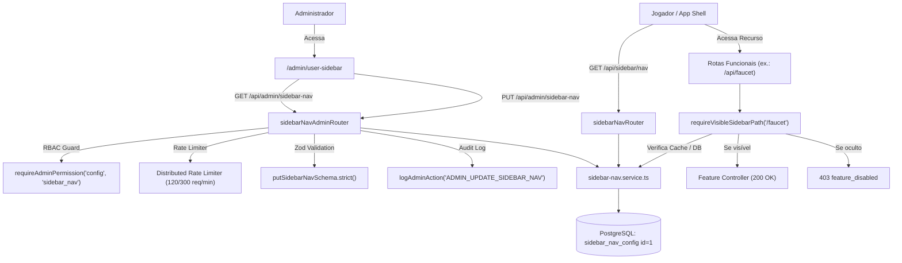

# Documentação Técnica: Gestão da Sidebar do Usuário & Kill Switch Operacional (`/admin/user-sidebar`)

## 1. Visão Geral e Arquitetura do Domínio

O módulo de navegação da barra lateral (`sidebar-nav`) cumpre dois papéis fundamentais na plataforma BlockMiner:
1. **Configuração Dinâmica de Menu (UX)**: Gerencia as rotas, seções (`main`, `earn`, `social`), ordenação (`sortOrder`), agrupamentos (como `rewards_group`) e visibilidade dos módulos disponíveis para os jogadores no frontend.
2. **Kill Switch Operacional no Backend (Segurança & Disponibilidade)**: Através da middleware `requireVisibleSidebarPath`, quando um administrador oculta um item na barra lateral do usuário (ex.: `/faucet`, `/shortlinks`, `/read-earn`, `/youtube`, `/auto-mining`), as rotas de API daquela funcionalidade passam imediatamente a responder com **`403 Forbidden` (`code: "feature_disabled"`)**. Isso permite desabilitar rapidamente um módulo sob manutenção, ataque ou falha de provedor terceiro sem necessidade de restart de container ou redeploy de código.



---

## 2. Modelo de Dados Prisma (`SidebarNavConfig`)

A configuração é persistida no PostgreSQL através da tabela `sidebar_nav_config` (`prisma/schema.prisma`):

```prisma
/// Singleton (id = 1): user app sidebar visibility, order, and nesting under Rewards group.
model SidebarNavConfig {
  id        Int      @id @default(1)
  entries   Json
  updatedAt DateTime @updatedAt @map("updated_at")

  @@map("sidebar_nav_config")
}
```

### Regras de Coerção e Resiliência (Auto-Healing)
Mesmo que um payload de banco contenha estados legados ou ausência de itens recém-lançados, o serviço aplica transformações seguras e automáticas:
- **`coerceParentLockedSidebarEntries`**: Garante que itens com parentesco travado (`checkin`, `mini_pass`, `daily_tasks`, `games`, `social_feed`, `creator`, `referrals`, `tournaments`, `burn`) mantenham `parentItemId: null`.
- **`coerceInternalOfferwallEarnRoot`**: Garante que o offerwall interno permaneça aninhado em `rewards_group`.
- **`coerceZeradsHidden`**: Força `zerads` permanentemente oculto (`visible: false`), já que está integrado na página de Offerwalls.
- **`coerceGamesInEarnSection` & `coerceYoutubeInEarnRewardsGroup`**: Garante a seção correta e aninhamento adequado de jogos e YouTube.
- **`mergeMissingSidebarRegistryEntries`**: Garante que novos módulos adicionados ao `SIDEBAR_ITEM_REGISTRY` em código sejam automaticamente inseridos com valores padrão se não existirem na linha do banco, sem perda de customizações anteriores.

---

## 3. Especificação OpenAPI 3.0

```yaml
openapi: 3.0.3
info:
  title: BlockMiner User Sidebar Navigation & Kill Switch API
  version: 1.0.0
  description: Endpoints administrativos e públicos para governança da navegação do usuário e kill switch operacional.

paths:
  /api/admin/sidebar-nav:
    get:
      summary: Obter configuração administrativa da sidebar
      description: Retorna a lista completa de entradas persistidas, categorias resolvidas e metadados de cada item do catálogo.
      security:
        - AdminCookieAuth: []
      responses:
        '200':
          description: Configuração carregada com sucesso
          content:
            application/json:
              schema:
                type: object
                properties:
                  ok:
                    type: boolean
                    example: true
                  entries:
                    type: array
                    items:
                      $ref: '#/components/schemas/SidebarPersistedEntry'
                  categories:
                    type: array
                    items:
                      $ref: '#/components/schemas/SidebarCategory'
                  itemMeta:
                    type: object
                    additionalProperties:
                      $ref: '#/components/schemas/SidebarAdminItemMeta'
        '401':
          $ref: '#/components/responses/Unauthorized'
        '403':
          $ref: '#/components/responses/Forbidden'
        '429':
          $ref: '#/components/responses/TooManyRequests'

    put:
      summary: Atualizar configuração da sidebar do usuário
      description: Atualiza ordenação, visibilidade e parentesco dos itens. Valida com Zod estrito e grava log de auditoria administrativa.
      security:
        - AdminCookieAuth: []
      requestBody:
        required: true
        content:
          application/json:
            schema:
              type: object
              required:
                - entries
              properties:
                entries:
                  type: array
                  items:
                    $ref: '#/components/schemas/SidebarPersistedEntry'
              additionalProperties: false
      responses:
        '200':
          description: Sidebar atualizada com sucesso
          content:
            application/json:
              schema:
                type: object
                properties:
                  ok:
                    type: boolean
                    example: true
                  entries:
                    type: array
                    items:
                      $ref: '#/components/schemas/SidebarPersistedEntry'
                  categories:
                    type: array
                    items:
                      $ref: '#/components/schemas/SidebarCategory'
        '400':
          description: Erro de validação ou payload incompatível
        '401':
          $ref: '#/components/responses/Unauthorized'
        '403':
          $ref: '#/components/responses/Forbidden'
        '429':
          $ref: '#/components/responses/TooManyRequests'

  /api/sidebar/nav:
    get:
      summary: Obter categorias visíveis para o menu do jogador
      description: Endpoint público consumido pelo shell do aplicativo para montar a navegação lateral visível.
      responses:
        '200':
          description: Categorias visíveis retornadas com sucesso
          content:
            application/json:
              schema:
                type: object
                properties:
                  ok:
                    type: boolean
                    example: true
                  categories:
                    type: array
                    items:
                      $ref: '#/components/schemas/SidebarCategory'

components:
  schemas:
    SidebarSection:
      type: string
      enum: [main, earn, social]

    SidebarPersistedEntry:
      type: object
      required:
        - itemId
        - visible
        - sortOrder
        - section
        - parentItemId
      properties:
        itemId:
          type: string
          example: dashboard
        visible:
          type: boolean
          example: true
        sortOrder:
          type: integer
          example: 10
        section:
          $ref: '#/components/schemas/SidebarSection'
        parentItemId:
          type: string
          nullable: true
          example: null
      additionalProperties: false

    SidebarAdminItemMeta:
      type: object
      properties:
        labelKey:
          type: string
          example: sidebar.dashboard
        icon:
          type: string
          example: LayoutDashboard
        section:
          $ref: '#/components/schemas/SidebarSection'
        parentLocked:
          type: boolean
          example: true
        defaultParentItemId:
          type: string
          nullable: true
        isGroup:
          type: boolean
          example: false

    SidebarCategory:
      type: object
      properties:
        section:
          $ref: '#/components/schemas/SidebarSection'
        titleKey:
          type: string
          example: sidebar.categories.main
        items:
          type: array
          items:
            type: object
            properties:
              itemId:
                type: string
              labelKey:
                type: string
              icon:
                type: string
              path:
                type: string
                nullable: true

  responses:
    Unauthorized:
      description: Não autenticado ou sessão inválida
    Forbidden:
      description: Permissão insuficiente (exige config ou sidebar_nav)
    TooManyRequests:
      description: Limite de taxa excedido
```

---

## 4. Segurança, RBAC & Rate Limiting

| Endpoint | Método | Limite Rate Limit | Permissões RBAC Aceitas | Auditoria (`admin_audit_logs`) |
|---|---|---|---|---|
| `/api/admin/sidebar-nav` | `GET` | 120 req / 60s (`sidebar_nav_admin_read`) | `config.view`, `config`, `sidebar_nav.view`, `sidebar_nav`, `*` | Não |
| `/api/admin/sidebar-nav` | `PUT` | 300 req / 60s (`sidebar_nav_admin_write`) | `config`, `sidebar_nav`, `*` | **Sim** (`ADMIN_UPDATE_SIDEBAR_NAV`) |
| `/api/sidebar/nav` | `GET` | Global Express Limiter | Público (Livre) | Não |
