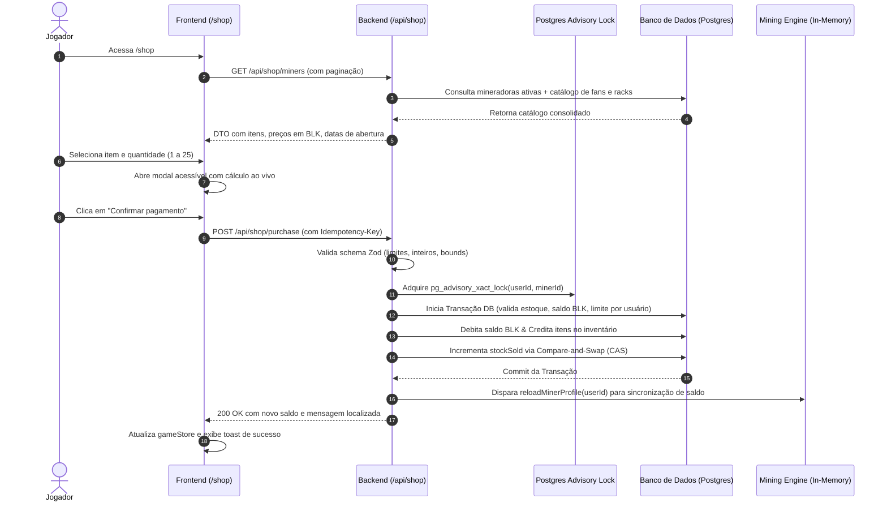

# Loja de Equipamentos (Shop)

Documentação técnica e arquitetural da Loja de Equipamentos do BlockMiner (`https://blockminer.space/shop`).

A Loja é o módulo central de expansão de poder computacional do jogador: nela são adquiridas **Mineradoras** (equipamentos com hashrate em GH/s que ocupam slots), **Sistemas de Refrigeração** (ventiladores para controle térmico de racks) e **Racks de Mineração** (prateleiras de 8 slots para instalação de máquinas no data center).

- **Client**: `client/src/features/shop/`
  - Rota SPA: `/shop` (registrada em [`App.tsx`](file:///home/gustavo/Documentos/BlockMiner2.1/current/client/src/app/App.tsx#L116))
  - Componentes modulares: [`ShopMinerCard.tsx`](file:///home/gustavo/Documentos/BlockMiner2.1/current/client/src/features/shop/components/ShopMinerCard.tsx), [`ShopFanCard.tsx`](file:///home/gustavo/Documentos/BlockMiner2.1/current/client/src/features/shop/components/ShopFanCard.tsx), [`ShopRackCard.tsx`](file:///home/gustavo/Documentos/BlockMiner2.1/current/client/src/features/shop/components/ShopRackCard.tsx), [`ShopSectionHeader.tsx`](file:///home/gustavo/Documentos/BlockMiner2.1/current/client/src/features/shop/components/ShopSectionHeader.tsx), [`ShopPurchaseModal.tsx`](file:///home/gustavo/Documentos/BlockMiner2.1/current/client/src/features/shop/components/ShopPurchaseModal.tsx), [`ShopLoadingState.tsx`](file:///home/gustavo/Documentos/BlockMiner2.1/current/client/src/features/shop/components/ShopLoadingState.tsx), [`ShopEmptyState.tsx`](file:///home/gustavo/Documentos/BlockMiner2.1/current/client/src/features/shop/components/ShopEmptyState.tsx)
  - Hooks desacoplados: [`useShopCatalog.ts`](file:///home/gustavo/Documentos/BlockMiner2.1/current/client/src/features/shop/hooks/useShopCatalog.ts), [`useShopPurchase.ts`](file:///home/gustavo/Documentos/BlockMiner2.1/current/client/src/features/shop/hooks/useShopPurchase.ts)
  - Tipos e chamadas API: [`shop.types.ts`](file:///home/gustavo/Documentos/BlockMiner2.1/current/client/src/features/shop/lib/shop.types.ts), [`shop.api.ts`](file:///home/gustavo/Documentos/BlockMiner2.1/current/client/src/features/shop/lib/shop.api.ts)
- **Server**: `server/modules/shop/`
  - Rotas: [`shop.routes.ts`](file:///home/gustavo/Documentos/BlockMiner2.1/current/server/modules/shop/shop.routes.ts)
  - Validação Zod: [`shop.schemas.ts`](file:///home/gustavo/Documentos/BlockMiner2.1/current/server/modules/shop/shop.schemas.ts)
  - Controller: [`shop.controller.ts`](file:///home/gustavo/Documentos/BlockMiner2.1/current/server/modules/shop/shop.controller.ts)
  - Regras de Negócio & Transação: [`shop.service.ts`](file:///home/gustavo/Documentos/BlockMiner2.1/current/server/modules/shop/shop.service.ts)
  - Repositório & CAS: [`shop.repository.ts`](file:///home/gustavo/Documentos/BlockMiner2.1/current/server/modules/shop/shop.repository.ts)
  - Configuração de Moeda: [`shop.config.ts`](file:///home/gustavo/Documentos/BlockMiner2.1/current/server/modules/shop/shop.config.ts) (`SHOP_CURRENCY = "BLK"`)
  - Erros e Códigos Estáveis: [`shop.errors.ts`](file:///home/gustavo/Documentos/BlockMiner2.1/current/server/modules/shop/shop.errors.ts)
- **Moeda de Compra**: Todos os itens da Loja são precificados e debitados exclusivamente em **BLK** (`blkBalance` do usuário).

---

## 1. Fluxo de Negócio

---

## 2. Endpoints da API

Todas as rotas exigem sessão autenticada (`requireAuth`). Todas as mutações POST aplicam rate limit distribuído e verificação estrita de idempotência.

| Método | Caminho | Proteções | Descrição |
|---|---|---|---|
| `GET` | `/api/shop/miners` | `requireAuth` | Lista o catálogo unificado da loja (mineradoras ativas, ventiladores, racks, moeda e datas de abertura de vendas). Suporta paginação (`page`, `pageSize`). |
| `POST` | `/api/shop/purchase` | `requireAuth` + Rate Limit (10/min) + `requireCriticalIdempotency` | Compra mineradora(s) em lote (1 a 25). Bloqueio por `pg_advisory_xact_lock(userId, minerId)`. |
| `POST` | `/api/shop/purchase-fan` | `requireAuth` + Rate Limit (10/min) + `requireCriticalIdempotency` | Compra sistema(s) de refrigeração para inventário. |
| `POST` | `/api/shop/purchase-rack` | `requireAuth` + Rate Limit (10/min) + `requireCriticalIdempotency` | Compra rack(s) de mineração para inventário. |

---

## 3. Segurança e Robustez Financeira

O módulo implementa defesas rigorosas contra as principais classes de vulnerabilidades do checklist OWASP/CWE:

### A. Prevenção de Concorrência e Double-Spending (Item 20 & 24)
- **Postgres Advisory Lock**: `SELECT pg_advisory_xact_lock(${userId}::int, ${minerId}::int)` serializa requisições concorrentes disparadas pelo **mesmo usuário** para a **mesma máquina**. Isso elimina race conditions de limite de compra (`maxPerUser`) e múltiplos débitos inadvertidos.
- **Compare-and-Swap no Estoque**: Para máquinas com estoque limitado (`stockTotal`), o incremento de `stockSold` é executado através de uma cláusula atômica com checagem de versão `WHERE stockSold = currentStockSold`, acompanhado de um retry loop de até 10 tentativas. Isso impede overselling mesmo quando múltiplos usuários distintos compram a última unidade no mesmo milissegundo.

### B. Proteção contra Idempotência e Replay (Item 21 & 25)
- O middleware `requireCriticalIdempotency({ scope: "shop_purchase" })` valida chaves `Idempotency-Key` (8 a 128 caracteres).
- Caso o usuário reenvie a requisição (duplo clique rápido ou instabilidade de rede), a resposta original gravada em cache seguro é devolvida sem reprocessar débito no saldo ou criação de máquinas duplicadas.

### C. Validação de Fronteira e Sanitização Zod (Item 3 & 22)
- Schemas Zod (`shop.schemas.ts`) garantem coerção e tipagem estrita antes que os parâmetros alcancem camadas internas:
  - `minerId`: Inteiro positivo obrigatório (rejeita strings arbitrárias, SQL injection e payloads nulos).
  - `quantity`: Inteiro estritamente no intervalo `[1, maxBulk]` (padrão 25). Rejeita valores negativos, zero, decimais (`1.5`), `NaN`, `Infinity` e notação científica (`1e10`).
  - `sku`: String com tamanho 1..100, sanitizada com trim.

### D. Redação Automática de Segredos em Logs (Item 44)
- Todo o logging de erro do controller utiliza a camada [`reportError`](file:///home/gustavo/Documentos/BlockMiner2.1/current/server/core/errors/error-reporter.ts).
- Chaves como `password`, `token`, `secret`, `apiKey`, `privateKey`, `cvv`, `card`, `2fa` são automaticamente mascaradas como `[REDACTED]` antes de serem persistidas em log.

---

## 4. Observabilidade e Coleta de Erros

O módulo adota o padrão de observabilidade estruturada com:
1. **Códigos de Erro Estáveis**:
   - `SHOP_LIST_ERROR`
   - `SHOP_INVALID_MINER_ID`
   - `SHOP_INVALID_QUANTITY`
   - `SHOP_MINER_UNAVAILABLE` (404)
   - `SHOP_OUT_OF_STOCK` (400)
   - `SHOP_PURCHASE_LIMIT_REACHED` (400)
   - `SHOP_INSUFFICIENT_BALANCE` (400)
   - `RACE_CONDITION_DETECTED` (409)
   - `SHOP_PURCHASE_ERROR` (500)
   - `FAN_INVALID_SKU` / `RACK_INVALID_SKU`
   - `FAN_INVALID_QUANTITY` / `RACK_INVALID_QUANTITY`
   - `FAN_NOT_AVAILABLE_YET` / `RACK_NOT_AVAILABLE_YET` (403)
   - `FAN_INSUFFICIENT_BALANCE` / `RACK_INSUFFICIENT_BALANCE` (400)
2. **Fingerprint SHA-1**:
   Agrupamento de ocorrências do mesmo defeito através de `fp_<hash>` para deduplicação em painéis de monitoramento.
3. **Correlation / Request ID**:
   Extração e propagação de cabeçalhos `X-Request-Id` para rastreamento ponta a ponta.
4. **Filtragem de Telemetria no Cliente**:
   Códigos operacionais esperados do fluxo de usuário (`SHOP_INSUFFICIENT_BALANCE`, `SHOP_OUT_OF_STOCK`, etc.) foram registrados em `EXPECTED_CLIENT_UX_CODES` em [`clientErrorTelemetry.ts`](file:///home/gustavo/Documentos/BlockMiner2.1/current/client/src/shared/utils/clientErrorTelemetry.ts#L70), evitando alertas falsos no painel administrativo `/admin/client-errors`.

---

## 5. Suíte de Testes (100% Cobertura)

### Testes de Backend (`node:test`)
Executados via `npx tsx --test tests/shop/**/*.test.mjs tests/security/shop-pentest-hardening.test.mjs`:
- [`shop.schemas.test.mjs`](file:///home/gustavo/Documentos/BlockMiner2.1/current/tests/shop/shop.schemas.test.mjs): 10 testes cobrindo limites, inteiros, formatos de chave idempotente e valores negativos.
- [`shop.controller.test.mjs`](file:///home/gustavo/Documentos/BlockMiner2.1/current/tests/shop/shop.controller.test.mjs): 7 testes validando retornos de catálogo, paginação, rejeição de IDs inválidos e quantidades abusivas.
- [`shop.service.test.mjs`](file:///home/gustavo/Documentos/BlockMiner2.1/current/tests/shop/shop.service.test.mjs): Normalização de campos, moedas e montagem de catálogo unificado.
- [`shop.currency.test.mjs`](file:///home/gustavo/Documentos/BlockMiner2.1/current/tests/shop/shop.currency.test.mjs): Validação da denominação exclusiva em BLK.
- [`shop.errors.test.mjs`](file:///home/gustavo/Documentos/BlockMiner2.1/current/tests/shop/shop.errors.test.mjs): Compatibilidade de strings e herança de `ShopPurchaseRejectedError`.
- [`shop-pentest-hardening.test.mjs`](file:///home/gustavo/Documentos/BlockMiner2.1/current/tests/security/shop-pentest-hardening.test.mjs): 7 testes de pentest cobrindo injeção SQL, poluição de protótipo, redação de credenciais e integridade de fingerprints.

### Testes de Frontend (`vitest` + `@testing-library/react`)
Executados via `npm run test` no diretório `client/`:
- [`ShopMinerCard.test.tsx`](file:///home/gustavo/Documentos/BlockMiner2.1/current/client/src/features/shop/__tests__/ShopMinerCard.test.tsx): Renderização de hashrate, preço formatado, callback de clique e desativação em preço inválido.
- [`ShopFanCard.test.tsx`](file:///home/gustavo/Documentos/BlockMiner2.1/current/client/src/features/shop/__tests__/ShopFanCard.test.tsx): Arte animada do ventilador, status de abertura e bloqueio em pré-venda.
- [`ShopRackCard.test.tsx`](file:///home/gustavo/Documentos/BlockMiner2.1/current/client/src/features/shop/__tests__/ShopRackCard.test.tsx): Arte do rack, prateleiras de 8 slots e status de disponibilidade.
- [`ShopPurchaseModal.test.tsx`](file:///home/gustavo/Documentos/BlockMiner2.1/current/client/src/features/shop/__tests__/ShopPurchaseModal.test.tsx): Acessibilidade do diálogo modal (ARIA, tecla Escape), cálculo de total ao vivo, botões de incremento/decremento e estados de loading.
- [`ShopPage.test.tsx`](file:///home/gustavo/Documentos/BlockMiner2.1/current/client/src/features/shop/__tests__/ShopPage.test.tsx): Integração completa de renderização de seções, estado vazio e disparo de modal.

### Auditoria em Container Kali Linux
- Script automatizado: [`run-kali-shop-audit.sh`](file:///home/gustavo/Documentos/BlockMiner2.1/current/tests/security/run-kali-shop-audit.sh)
- Executa testes de penetração dentro do container `kali-pentest:latest` / `kali-arsenal:latest`, simulando:
  - Ataques de SQL Injection (dicionário de payloads pentest).
  - Tentativas de XSS e Cross-Site Scripting.
  - Path Traversal e Command Injection em parâmetros textuais.
  - Testes de limite numérico e integer underflow/overflow.
  - Mascaramento e proteção contra vazamento de credenciais.
